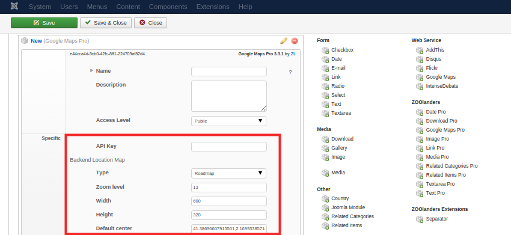

GoogleMapsPro is a standard ZOO element, you can follow the [extending type](http://yootheme.com/zoo/documentation/advanced/extend-pre-build-types) guide to integrate the element into your existent Apps. Once the element is set in the Type there are several configuration params that do differ from the ZOO ones, lets see what is all that about.

The Basic set are ZOOlanders common [Configuration fields](/extensions/zoolanders/elements/fields#configuration). The Specific one set are GoogleMapsPro related fields:

| Field       | Description |
| :---------- | :---------- |
| API Key | The Google API key, necessary for high traffic sites. |
| Type | The initial Map Type. |
| Zoom level | The initial Map Zoom level. |
| Width | The initial Map width. |
| Height | The initial Map height. |
| Default center | The initial Map center location. |

>>>>> These map settings are for the backend map displayed for selecting the location.

## Assignment

The Element is set now but is not rendering at all, let's fix that. Assign the element to the position of your choice following the [assign elements](http://yootheme.com/zoo/documentation/advanced/assign-elements-to-layout-positions) guide. Once assigned there will be another set of fields requiring attention.

The Basic set are ZOOlanders common [Assignment fields](/extensions/zoolanders/elements/fields#assignment). The Layout set displays the fields related to GoogleMapsPro layouts, which is the topic of the next page.
