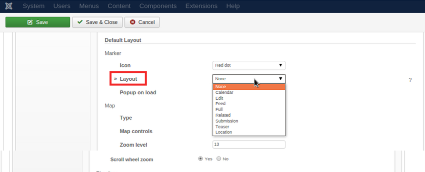

GoogleMapsPro has several layouts which can be used right away, but make sure to check the [customizations](/elements/googlemapspro/advanced/customizations) guide if your project requires some specific output.

## Default

Renders a Google Maps map with the single Item location centered in the map as a marker. It supports the following configurations.

**Marker**

| Field       | Description |
| :---------- | :---------- |
| **Icon** | The marker icon. |
| **Layout** | The Item layout that will be used to render the Marker content. |
| **Popup on load** | If enabled the Marker will popup on load. |

It is possible to display any elements values in the marker by choosing any item layout in the **Layout** field with previously assigned elements: 
 

**Map**

| Field       | Description |
| :---------- | :---------- |
| **Type** | The default map type. |
| **Type Controls** | If enabled the map would display an control to change the map type. |
| **Map Controls** | Allows choosing if the map controls should be displayed and if so its size. |
| **Zoom Level** | The map zoom level, from 1 to 20. |
| **Scroll Wheel Zoom** | Toggles the map scroll wheel zooming. |

**Directions**

| Field       | Description |
| :---------- | :---------- |
| **Directions** | Toggle the directions map option. |
| **Language** | The directions language. Leave empty to use users preferred site language. |
| **Information** | Allows displaying the entered content above the map. |

**Dimensions**

| Field       | Description |
| :---------- | :---------- |
| **Width Unit** | The map width unit, pixel or percentage. |
| **Map Width** | The map width value. |
| **Map Height** | Set the map height value in pixels. |

## Address

Renders the Address information set in the Item.

## Widgetkit

Widgetkit layout is a integration layer between the element and [Widgetkit](http://yootheme.com/widgetkit) allowing to render a Widget using the element data as content. For details about configuration options visit the [Widgetkit documentation](http://yootheme.com/widgetkit/documentation).

>>> GoogleMapsPro Widgetkit integration was tested with Map Widget, even though any Widget can be used the location data would not make much sense anywhere else.
