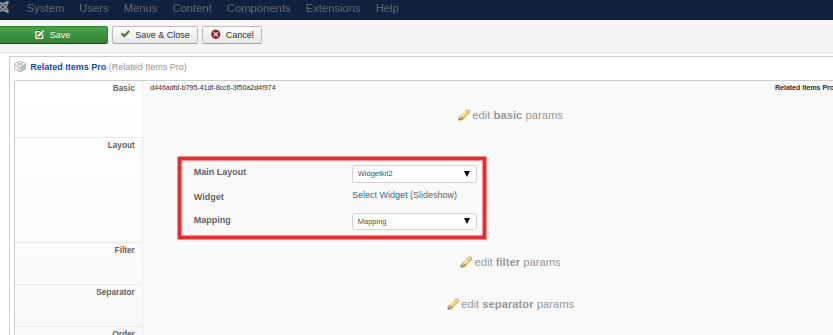
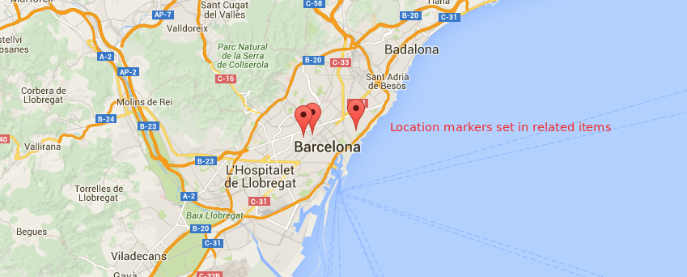

RelatedItemsPro has several layouts which can be used right away, but make sure to check the [customizations](/elements/relateditemspro/advanced/customizations) guide if your project requires some specific output.

## Default_default

Renders the related items with the following settings.

| Field       | Description |
| :---------- | :---------- |
| **Related Layout** | Allows choosing the layout that will be used for rendering the Items. |
| **Link to Item** | When **Related Layout** is set to **Item Name** allows linking the name to the Item full view. |
| **Subrelated Element** | It allows rendering the relations from the related Items. E.g. If a Car item is related to Concessionary Item it would allow rendering all the Cars from that Concessionary. |
| **Exclude it Self** | When rendering subrelations allows excluding the current Item. |

The **Order** set of fields allows choosing the rendered Items order.

## Widgetkit

Widgetkit layout is an integration layer between the element and [Widgetkit](http://yootheme.com/widgetkit) allowing to render a Widget using the element data as content. Therefore it is possible to render the related items data set in Widgetkit widget:

For example, it could be several locations on one map, related item images galleries etc. on any item layout type:
 

For Widgetkit 2 Main Layout **Mapping** layout should be configured for the **related item type**, not for the parent item type of the related items.

For details about configuration options visit the [Widgetkit documentation](http://yootheme.com/widgetkit/documentation).

