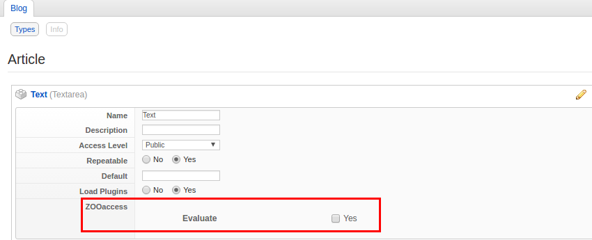
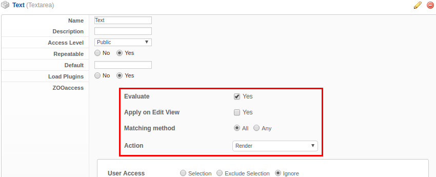
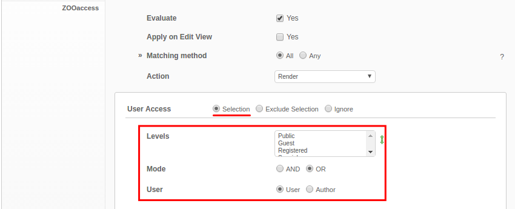

Once **ZOOaccess** is installed all ZOO elements will have a new section available in the configuration for access managing. It allows to set access rules to control when that specific element will be displayed.

## 1. Enable ZOOaccess for element

The access can be set on the element **Configuration** and/or **Assignment** allowing to set a base restriction in the Configuration and override it in the layout positions assignment:
 

 
Check **Evaluate** checkbox to enable evaluating of element access. 
  
## 2. Settings

When the **Evaluate** checkbox is enabled the setting fields will appear:

| Field       | Description |
| :---------- | :---------- |
| **Evaluate** | Toggles the access evaluation. |
| **Apply on Edit View** | When enabled the same access evaluation will apply to the **Edit** view. |
| **Matching method** | Choose if the rule should be applied when **ALL** or **ANY** (one or more) of the assignments are matched. |
| **Action** | The action that will be performed for the matched evaluations, **render if match** or **not render if match**. |

## 3. Setup rule

By default the rules are ignored and the access will be no evaluated. In order to start the rule evaluation, it state must be changed:

In the next page will be reviewing how and all the rules configurations.
