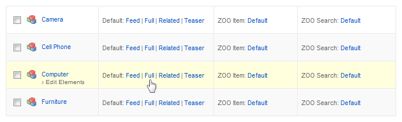
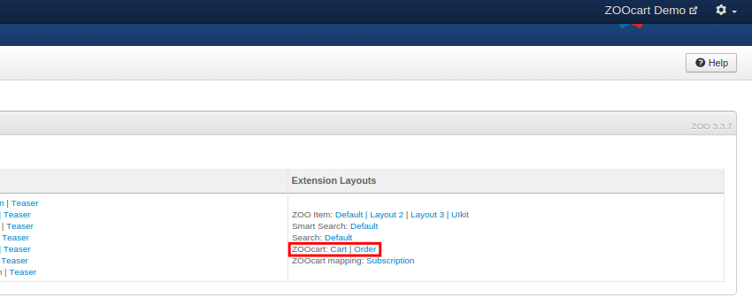

Unless your **App** has been created using our demo site, few integrations steps are required. No matter if you are extending an existing **Item Type** or creating a new one, add to it the ZOOcart basic elements **PricePro**, **Quantity**, **ZOOcart** and optionally the **Variations** and **Measures Pro** from the **ZOOcart Element Library** block. You can leave the configuration and other elements for later, will be reviewing them in detail in the following sections.

>>> More information about Extending Types can be found at [ZOO documentation](http://yootheme.com/zoo/documentation/advanced/extend-pre-build-types).

## Elements Assignment

Now that the elements are part of the product type we can assign them to a rendering position. Assuming we want to render the three of them in the Item full view, access the Full layout edit view and assign each element to one position. Again, leave the configuration as default.

>>> More information about Element assigning can be found at [ZOO documentation](http://yootheme.com/zoo/documentation/advanced/assign-elements-to-layout-positions).

## Store Layouts

**ZOOcart** has it's own **Cart** and **Order** render layouts that allows to fine tune the Item row rendering in the Cart/Order table. As you would do with any other render layout, just Drag and Drop the desired elements to the appropriate position.

>>>>> You can optionally skip this configuration and the default row would be rendered instead.

## Subscriptions

A **Subscription** is a product for which, after the Order has been completed, a subscription will be created and associated. You can choose the product type under the [ZOOcart element configuration](/zoocart/basics/configuration#zoocart).

A Subscription product requires a duration, which could be set with a **Text/Pro** or **Select/Radio** elements and then mapped for letting know ZOOcart where to get the value from. The mapping can be set on the **ZOOcart mapping: Subscription** layout under the Type views configuration.

>>>>> You can override the Subscription duration with [Variations](/zoocart/advanced/variations) if the product has several subscription options.

## Menu Assignment

There are several store views that you can assign to a **Joomla! Menu** and make your store easily accessible. The process is very simple:

1. Start by adding a new Menu Item as usual in Joomla.
2. From the available Menu Types select **ZOOladers / Extension View**.
3. In the **Params** tab choose one of the views:
  * **Cart** - displays the Checkout view.
  * **Orders** - displays the Orders Manager view.
  * **Addresses** - displays the Address Manager view.
  * **Subscriptions** - displays the Subscriptions Manager view.

## Cart and Minicart

**ZOOcart Module** can optionally be set to display the **Cart** (default layout) or **Minicart**. Both ajax ready carts that can be rendered anywhere showing the Cart products and related information. Find more about its options in the [configuration](/zoocart/basics/configuration#zoocart-module) section.
