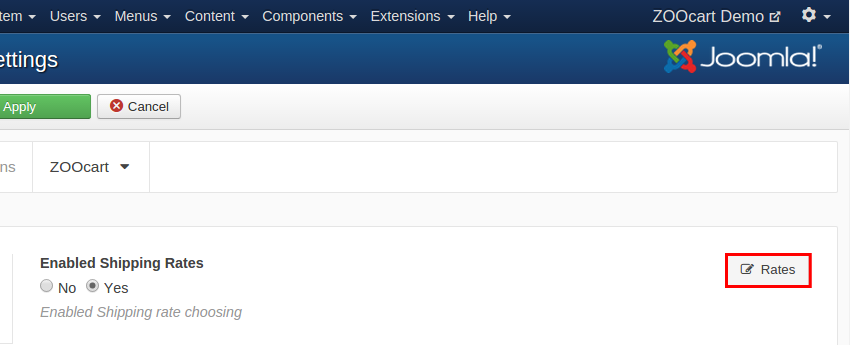

## Shipping

These options apply if your store ships physical products.

| Field       | Description |
| :---------- | :---------- |
| **Enabled Shipping Rates** | The Shipping status. When enabled the shipping information will be required and processed during checkout. This options requires at least one shipping plugin to be installed and enabled. |
| **Assign shipping automatically** | When enabled and only one shipping rate available, it will be auto selected during checkout. |
| **Filter considering with taxes** | When enabled the shipping filter will consider the rates with item taxes included. Recommended when Show Prices with tax is enabled. |

### Shipping Rates Manager

In the Settings Shipping tab upper right corner is the **Shipping Rates Manager** button, leading to the view where you can create new shipping rates or manage existing ones with the following options:

| Field       | Description | Element value |
| :---------- | :---------- | :---------- |
| **Name** | To rate name that will be displayed during checkout. ||
| **Status** | The shipping rate status. ||
| **Price** | The rate price. ||
| **Type** | The rate type, based on ordered items or entire order. ||
| **Price From** | The left price margin. | PricePro |
| **Price To** | The right price margin. | PricePro |
| **Quantity From** | The left quantity margin. | Quantity |
| **Quantity To** | The right quantity margin. | Quantity |
| **Weight From** | The left weight margin. | MeasurePro |
| **Weight To** | The right weight margin. | MeasurePro |
| **Countries** | The countries on which the shipping rate could be applied to. | Address field marked as 'Country' |
| **States** | The countries states on which the shipping rate could be applied to. | Address field marked as 'State' |
| **Cities** | The countries cities on which the shipping rate could be applied to. | Address field marked as 'City' |
| **ZIP Codes** | The ZIP coes (comma separated) on which the shipping rate could be applied to. | Address field marked as 'ZIP code' |
| **User Groups** | The User Groups on which the shipping rate could be applied to. ||

>>> _Countries_, _States_, _Cities_, _ZIP Codes_ and _User Groups_ fields will limit the shipping rates availability. If you don't want to apply any limit leave these options empty.
