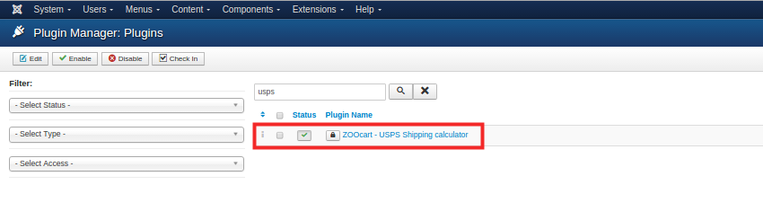
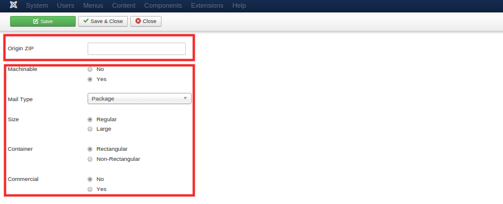
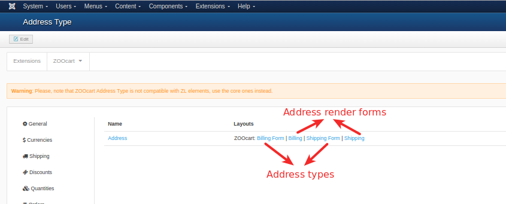
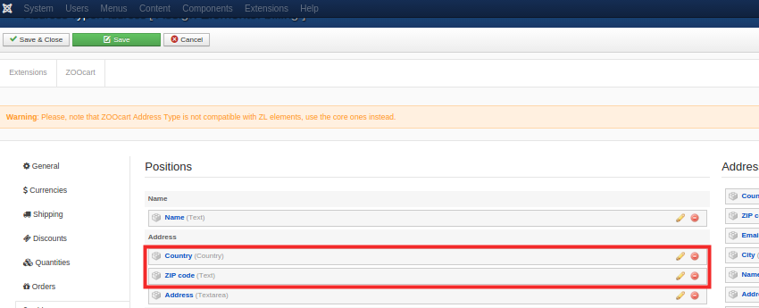

**Shipping Plugins** process the shipping calculations during the checkout and the shipping itself after the payment has been processed. There are several available by default and you can choose which one to use by enable/disabling them in the **Joomla! Plugin Manager**, where you would also find any shipping related setting.

* Standard
* USPS

>>> If you miss some and end up creating a custom plugin that you are willing to share with the community, make a pull request updating the list.

## USPS shipping calculation plugin

The plugin "ZOOcart - USPS Shipping calculator" should be enabled in Joomla! Plugin Manager to work. Switch to the edit mode by clicking plugin name:

## Plugin configuration

### API Credentials tab

Switch to “API Credentials” tab and set API dev account credentials (1) and (2). To get that data you need to be registered as USPS dev at the USPS dev center [here](https://registration.shippingapis.com).

### Preferences tab

On this tab the rest of parameters according to [USPS shipping API requirements](https://www.usps.com/business/web-tools-apis/price-calculators.htm) should be configured.

**Dimensions block**

USPS shipping calculation API requires the dimensions to be defined. So you need to configure one or few typical package dimension sets to be available for choosing. To add several dimension set, click "Add" link.

**Origin ZIP and other Parameters**

Shipping rate price calculations depends on distance, so it requires source and destination ZIP codes to be predefined. Destination ZIP code will be specified by the buyer in the address form, so you need to set **Origin ZIP** in this field. Origin ZIP may be your store location ZIP or nearest Post service ZIP code.

The other parameters are also required by USPS Shipping calc APIs. They describe shipping package, parcel type. You can specify Package type/size, mailing. The details are available [here](http://postcalc.usps.com/).

## Address configuration check

USPS plugin requires ZOOcart addresses to be configured to work properly. To configure addresses go to `Components > ZOOlanders > ZOOcart > Settings`:

1) Set **Default Country** param to your country (appropriate to Origin ZIP in USPS plugin), where your store or source Post department is located:

2) Go to the `Address tab > Address Types` and check that **Country** and **ZIP** fields exist. **Billing Info** properties of these fields should be specified as ZIP and Country appropriately:

Address type and render forms should contain that fields, so the clients could specify their ZIP codes and Countries:

Then USPS plugin will receive the data from that fields as destination ZIP and destination Country. The request to USPS shipping calculation server will be sent with that data.

## Checkout

If USPS plugin is configured in correct way and buyer specified his address data, he will be able to choose USPS rate from available rates in the **Shipping method** select area.