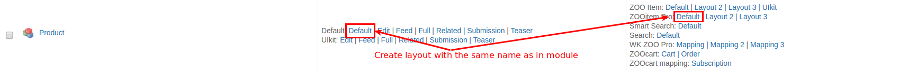

## ZOOcart + ZOOaccess

[ZOOaccess](/extensions/zooaccess) focus on Element access rules and it integrates natively with ZOOcart. Once installed on each element configuration a new access parameter will be available under ZOOaccess fields allowing many awesome new features. Those are just few example of what you could accomplish:

* Show/hide specific information after product purchase.
* Show/hide content if the user has a valid Subscription.
* Show a coupon code if user bought some specific items.
* Hide the Subscribe button if the user already has a subscription.
* Give access to download a file only after payment received.
* ...

## ZOOcart + ZOOitemPro

It is possible to display the products with variations and add to cart button, but there some additional steps are required
 
1. Configure ZOOitemPro module and layout
2. Create the new layout for item type (like teaser, full) with the name of the layout used in ZOOitem Pro module: 

For example, if you are using Default layout in ZOOitem Pro, create Default layout in ZOO item type.

3. Ensure that ZOOcart elements (Variations, Add to Cart and PricePro) position are wrapped into element with `class="element"` in the new created item type layout, the other classes can be after the `element` class.
It can require a new style for element position in the layout to achieve it.
  
Then the items data in module view will be updated when change its variations.

## ZOOcart + ZOOItem Pro Widgetkit2 layout

ZOOcart and ZOOItem Pro Widgetkit 2 layout currently is not supported.