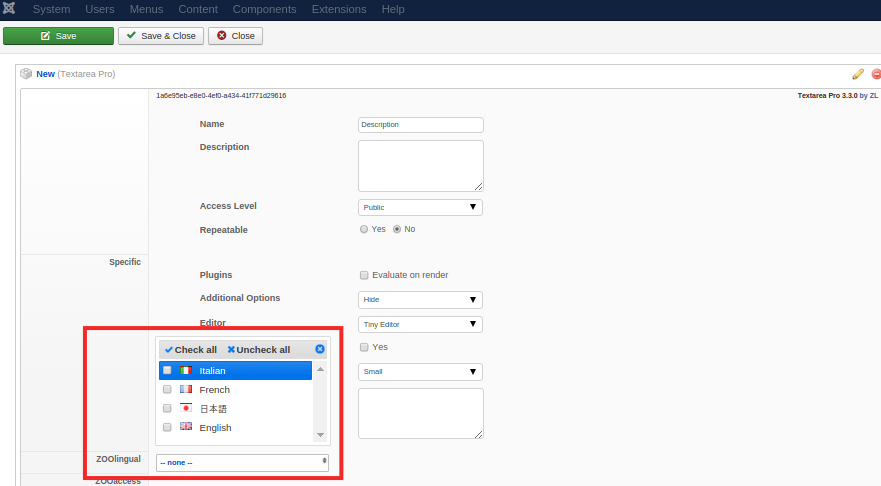
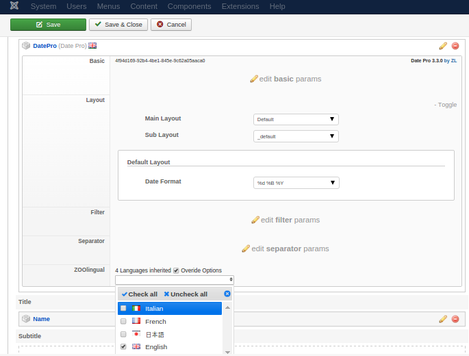
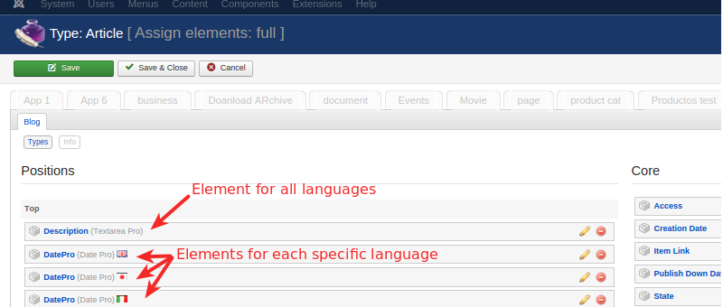
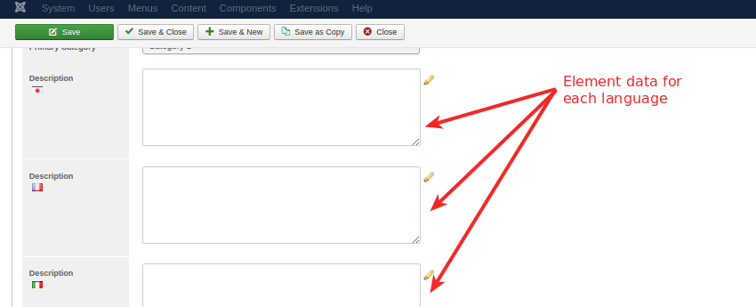

Once **ZOOlingual** is installed all ZOO elements will have a new section available in the configuration for language managing:

It allows to set on which language/s that specific element will be displayed. If no particular language is selected, the element will be displayed for all languages.

The language can be set in two ways:

* on the element **Configuration** - allows to set a base restriction
* on the layout positions **Assignment** - allows to override the language from the configuration.

For example, this powerful feature is specially handy when dealing with number/date values elements, like a Birthday, which value requires no translation, but rather display localization:

Assigning the element on the same position once for each language and adjusting its display options for it, will do the trick!

>>> Tag translation and translation through Submission is currently unsupported.

## Content

For those elements that do require a translation you would duplicate it for each language and set that specific language in the Element Configuration. That way, that element becomes language specific and you can start inputing the translated content right away while editing the Items as usual.

On the **Item Edit** page the element value for each language could be filled in:

>>>>> ZOOlingual will automatically add **Name, Alias, Meta Title, Meta Description** and other related inputs in the **Items/Categories** Content Tab in order to allow translating core fields.

Item Content Tab:

Category Content Tab:

## Language Switcher

ZOOlingual does not provide its own language switcher, instead relies on the Joomla! inbuilt one or 3rd party language managers. For more info on setting a multi-lingual site with Joomla! check this [guide](http://help.joomla.org/files/EN-GB_multilang_tutorial.pdf).
