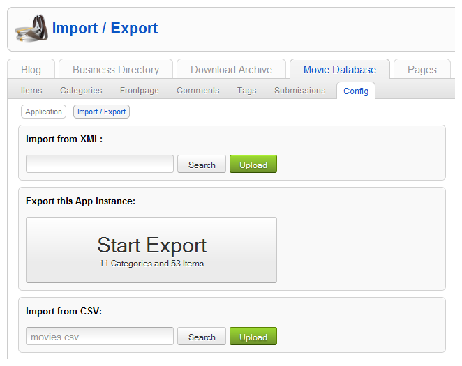
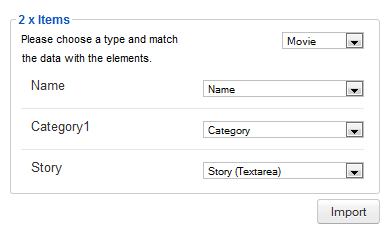
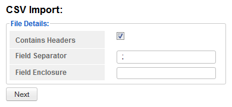

When importing ZOO data there are two supported formats, **JSON** and **CSV**, both are executed the same way, through the ZOO App Config **Import/Export** section.

>>>>> ZOOport extends ZOO native importation providing an transparent experience. If you want to get back to ZOO import just disable ZOOport plugin.

## Import JSON

Select the file using the **JSON** import form and click on the import button in order to start the assistant. In the next view you can choose if the **Frontpage** and **Categories** should be imported and map the elements for each one of the imported Types.

>>> Only JSON files generated by ZOOport are supported.

## Import CSV

Select the file using the **CSV** import form and click on the import button in order to start the assistant. In the next view you can choose if the CSV file contains column headers or not and type in the field separator and field enclosure.

Finally map the elements for the Type being imported and start the process by clicking the Import button. Repeat for each CSV file.

>>>>> To avoid format mismatches be sure that the CSV file is UTF-8 encoded.
