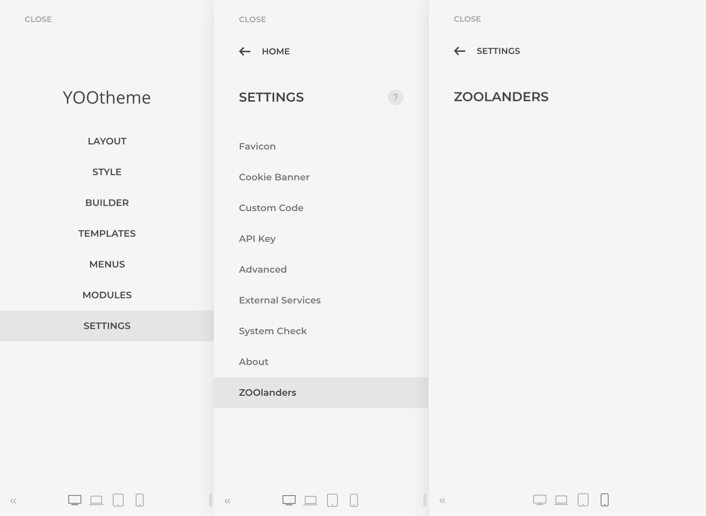

# Getting Started

Essential Addons for YOOtheme Pro is a set of features and enhancements for the YOOtheme Pro Page Builder by [YOOtheme](https://yootheme.com/). It provides free and premium addons for both WordPress and Joomla which full features set can be explored at the [ZOOlanders](https://www.zoolanders.com/essentials-for-yootheme-pro) site.

It requirements and browser support are the same as the [YOOtheme Pro](https://yootheme.com/support/yootheme-pro/joomla/introduction#requirements) ones, except for:

- PHP 7.2+

## Installation

Download the Free or Premium `Essentials_YOOthemePro_{version}_{platform}.zip` package from [ZOOlanders Downloads](https://www.zoolanders.com/downloads).

> A Premium version will be available only if you have a valid subscription and are logged in.

### Joomla

Follow the official [Joomla](https://docs.joomla.org/Installing_an_extension) plugin installation guide and make sure a plugin named `Essential Addons for YOOtheme Pro` is listed and enabled in the Joomla Plugins control panel, if not, enabled it manually.

> The plugin installs under the `plugins/system/yooessentials` directory.

### WordPress

Follow the official [WordPress](https://wordpress.org/support/article/managing-plugins/) plugin installation guide and make sure a plugin named `Essential Addons for YOOtheme Pro` is listed and enabled in the WordPress Plugins control panel, if not, enabled it manually.

> The plugin installs under the `wp-contents/plugins/yooessentials` directory.

## Addons

Addons are encapsulated features that enhance or add new functionalities to the YOOtheme Pro builder. They are enabled by default, but if required can be individually disabled in the `Theme -> Settings -> ZOOlanders` panel.

