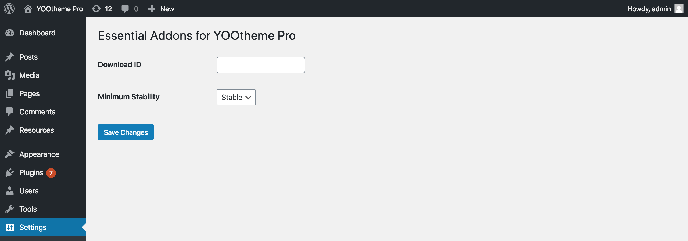

# Getting Started

## Joomla

### Installation

Download the Free or Premium `Essentials_YoothemePro_version_j3.zip` package from [ZOOlanders Downloads](https://www.zoolanders.com/downloads) and follow the official [Joomla](https://docs.joomla.org/Installing_an_extension) plugin installation guide.

> A Premium version will be available only if you have a valid subscription and are logged in.

At this point a plugin named `Essential Addons for Yootheme Pro` should be listed and enabled, if is not, enabled it manually.

> The plugin installs under the `plugins/system/yooessentials` directory.

### Updates

Whenever a new version is available, you will receive a notification in the Joomla Extensions Update control panel. From there you can update the selected plugins with a one click action.

> Before being able to update the Premium version, you will have to add your ZOOlanders Download ID key.

::: tip
You can always update manually by downloading the latest package version from the [Downloads](https://www.zoolanders.com/downloads) section and installing it over using the Joomla Installer control panel.
:::

::: warning Don't upload by FTP
Even if technically possible, we strongly discourage this method as update scripts will be omited, resulting on unexpected outcomes.
:::

### Download ID

A ZOOlanders Download ID is an alphanumeric code created in the [ZOOlanders Download IDs section](https://www.zoolanders.com/download-ids), without it you won't be able to update the Premium version. You can create as many IDs as necessary.

Once you have created and copied the Download ID go to the Joomla Plugins control panel and find the ZOOlanders Installer plugin. Access it settings and paste the Download ID into the field.

## WordPress

### Installation

Download the Free or Premium `Essentials_YoothemePro_version_wp.zip` package from [ZOOlanders Downloads](https://www.zoolanders.com/downloads) and follow the official [WordPress](https://wordpress.org/support/article/managing-plugins/) plugin installation guide.

> A Premium version will be available only if you have a valid subscription and are logged in.

At this point a plugin named `Essential Addons for Yootheme Pro` should be listed and enabled, if is not, enabled it manually.

> The plugin is installed under the `wp-contents/plugins/yooessentials` directory.

### Updates

Whenever a new version is available, you will receive a notification in the WordPress Plugins control panel. From there you can update the selected plugins with a one click action.

> Before being able to update the Premium version, you will have to add your ZOOlanders Download ID key.

::: warning Don't upload by FTP
Even if technically possible, we strongly discourage this method as update scripts will be omited, resulting on unexpected outcomes.
:::

### Download ID

A ZOOlanders Download ID is an alphanumeric code created in the [ZOOlanders Download IDs section](https://www.zoolanders.com/download-ids), without it you won't be able to update the Premium version. You can create as many IDs as necessary.

Once you have created and copied the Download ID go to the WordPress control panel and find the ZOOlanders settings under the Global Settings menu. Access it and paste the Download ID into the field.

## Changelog

To get an overview of new additions and changes, take a look at the [changelog](https://www.zoolanders.com/essentials-for-yootheme-pro#changelog).
