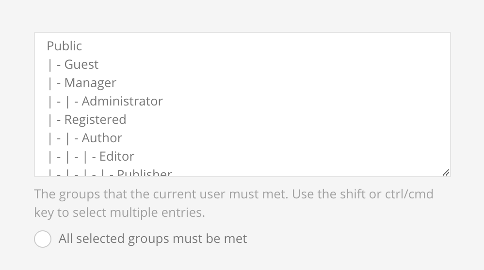
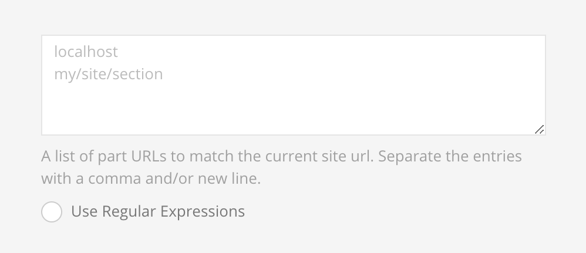
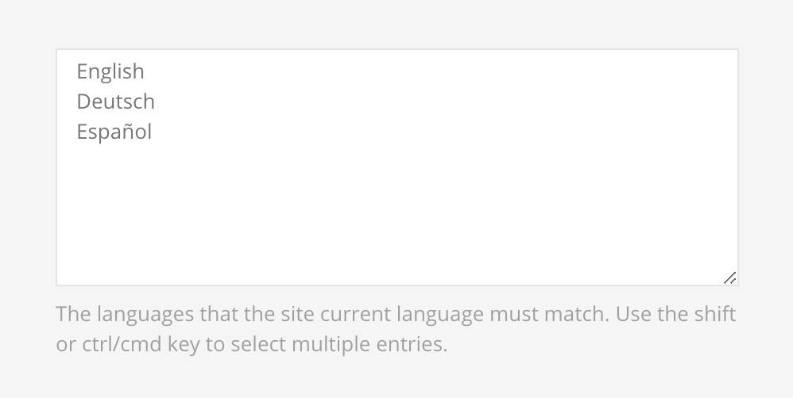
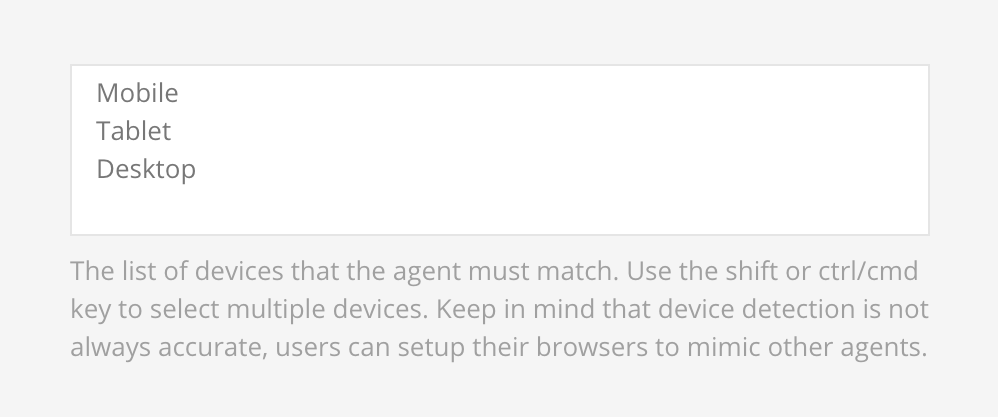
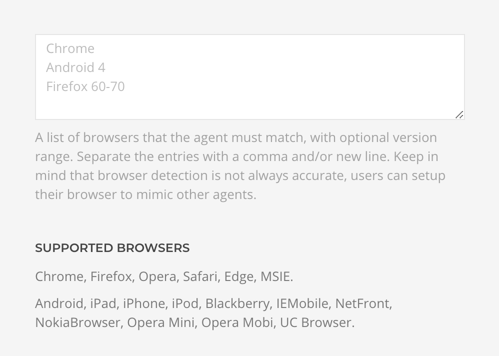
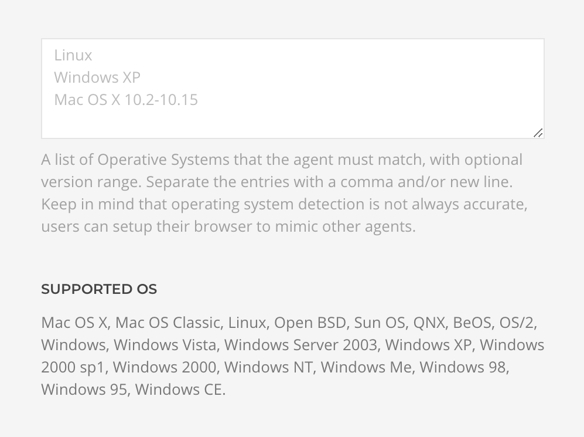

# Rules

## User

### Group

Validates if the `user` is part of at least one of the selected `Groups` or to all of them when `All selected groups must be met` is enabled.

> Note that this rule is only available for Joomla.

### Access Level

Validates if the `user` is part of at least one of the selected `Access Levels` or to all of them when `All selected levels must be met` is enabled.

> Note that this rule is only available for Joomla.

### Access Role

Validates if the `user` is part of at least one of the selected `Access Roles` or to all of them when `All selected roles must be met` is enabled.

> Note that this rule is only available for WordPress.

## Date & Time

For all time related rules the timezone from the site configuration is automatically applied.

### Date

Validates if the `current date` is in the specified range.

::: tip
In case the browser doesn't support the HTML date input, a text input will be used instead where the date is expected in the format of `Y-m-d`.
:::

### Time

Validates if the `current time` is in the specified range.

::: tip
In case the browser doesn't support the HTML time input, a text input will be used instead where the time is expected in the format of `H:i`.
:::

### Day

Validates if the `current date` weekday matches the selection.

### Month

Validates if the `current date` month matches the selection.

### Season

Validates if the `current date` season matches the selection. Supported hemispheres are Northern, Southern and Australia.

## Site

### URL

Validates if the site `current url` matches the pattern.

### Language

Validates if the site `current language` matches the selection.

## Device

### IP Address

Validates if the device `IP address` matches the selection.

### Device

Validates if the `agent device` matches the selection.

### Browser

Validates if the `agent browser` matches the selection.

### Operative System

Validates if the `agent operative system` matches the selection.

