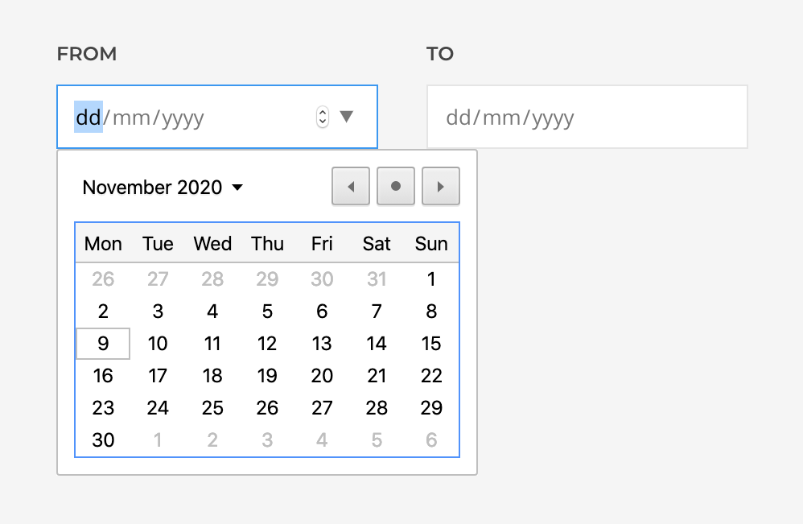
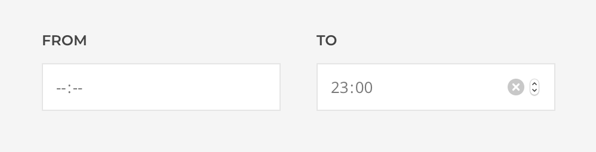
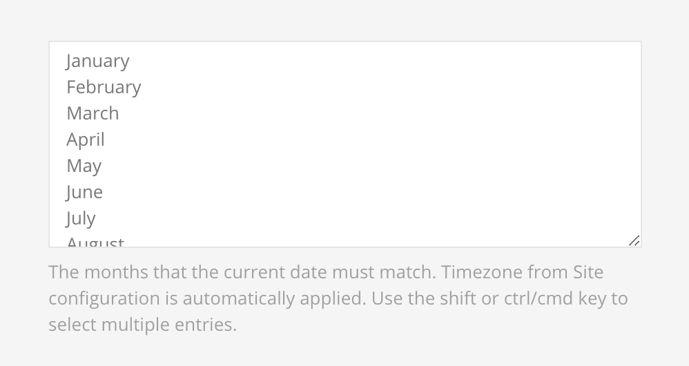
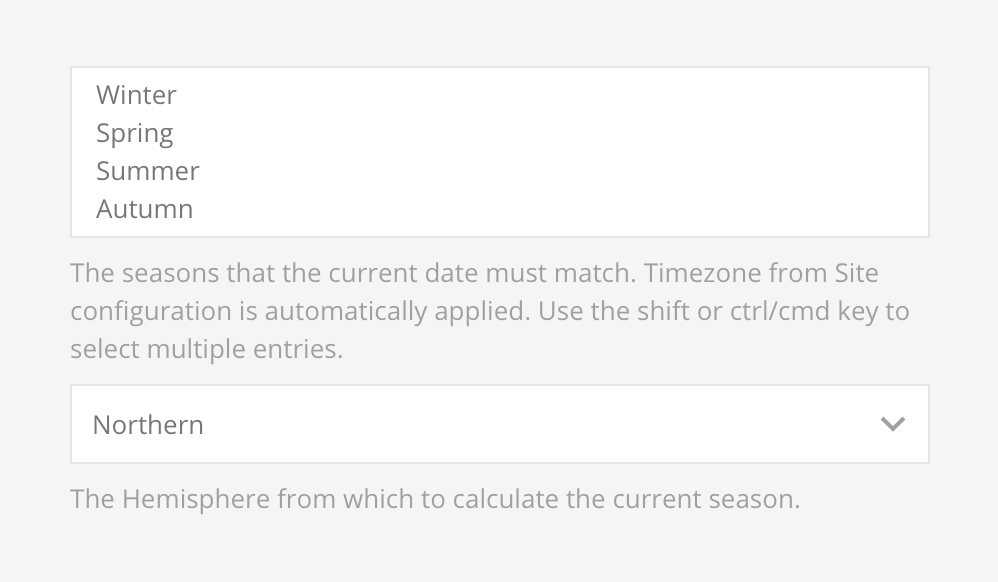

# Date Time

## Date

Validates if the `current date` is in the specified range.

::: tip
In case the browser doesn't support the HTML date input, a text input will be used instead where the date is expected in the format of `Y-m-d`.
:::

## Time

Validates if the `current time` is in the specified range.

::: tip
In case the browser doesn't support the HTML time input, a text input will be used instead where the time is expected in the format of `H:i`.
:::

## Datetime

Validates if the `current date & time` are in the specified range.

::: tip
In case the browser doesn't support the HTML date input, a text input will be used instead where the date is expected in the format of `Y-m-d`.
:::

## Day

Validates if the `current date` weekday matches the selection.

## Month

Validates if the `current date` month matches the selection.

## Season

Validates if the `current date` season matches the selection. Supported hemispheres are Northern, Southern and Australia.

