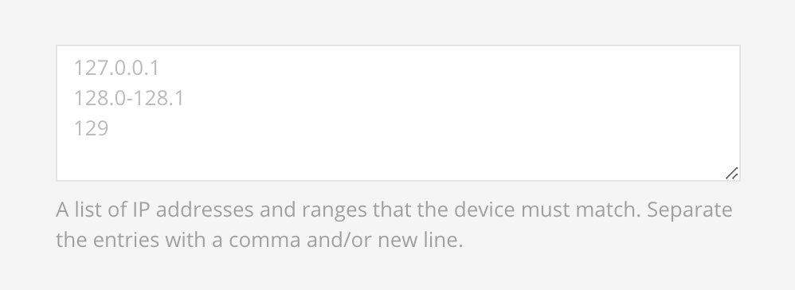

# Device

## IP Address

Validates if the device `IP address` matches the selection.

## Device

Validates if the `agent device` matches the selection.

## Browser

Validates if the `agent browser` matches the selection.

## Operative System

Validates if the `agent operative system` matches the selection.

