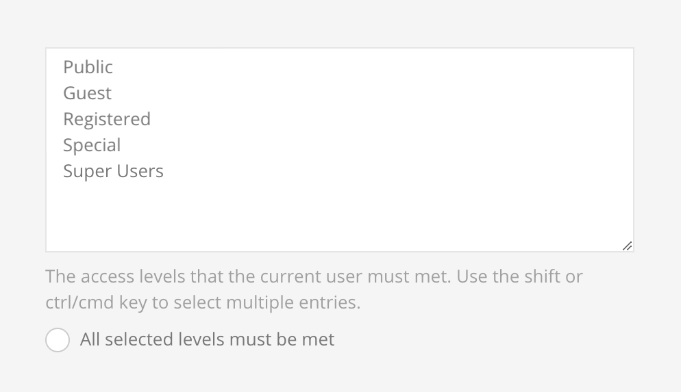

# User

## User Group

Validates if the `user` is part of at least one of the selected `Groups` or to all of them when `All selected groups must be met` is enabled.

> Note that this rule is only available for Joomla.

## User Access Level

Validates if the `user` is part of at least one of the selected `Access Levels` or to all of them when `All selected levels must be met` is enabled.

> Note that this rule is only available for Joomla.

## User Access Role

Validates if the `user` is part of at least one of the selected `Access Roles` or to all of them when `All selected roles must be met` is enabled.

> Note that this rule is only available for WordPress.

For all time related rules the timezone from the site configuration is automatically applied.

