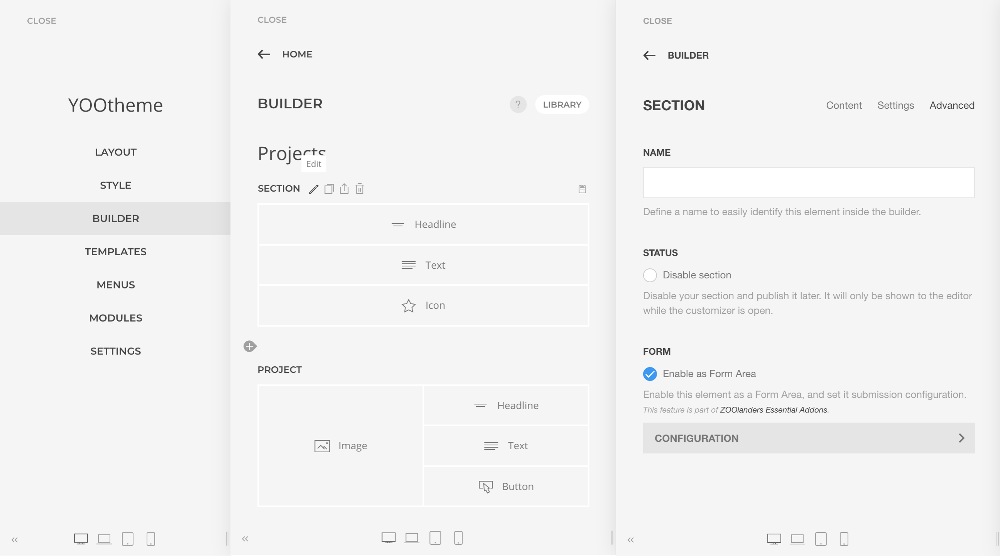
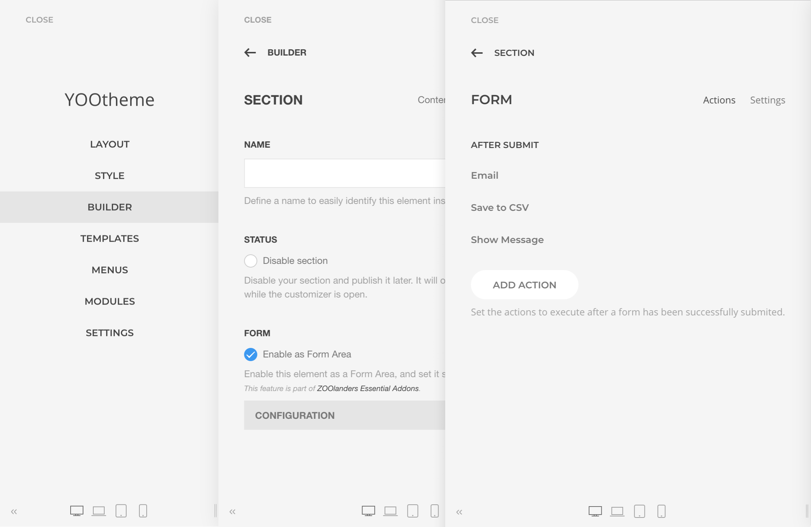
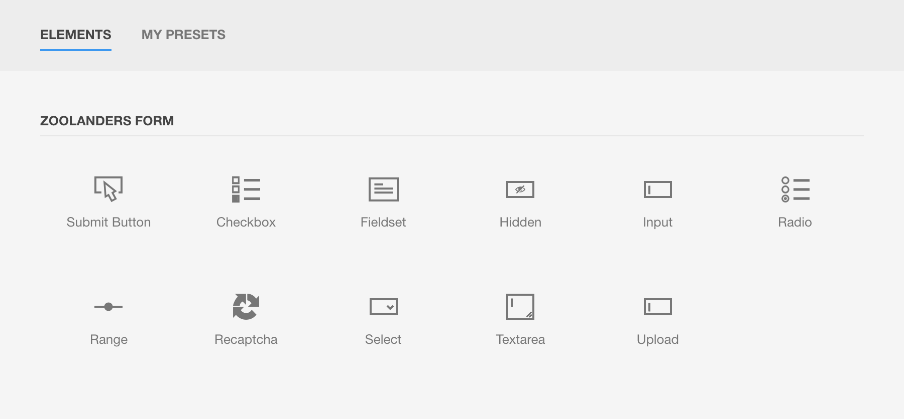
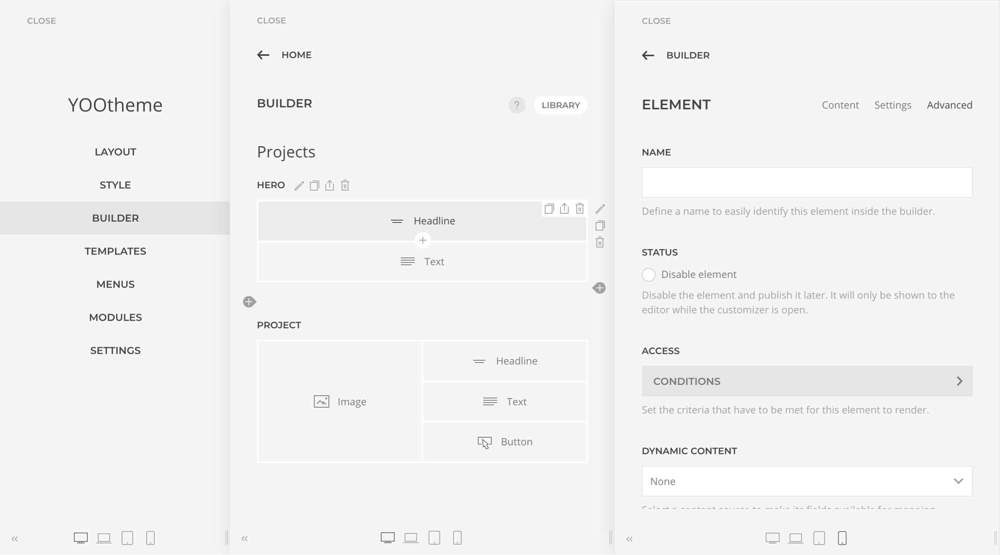
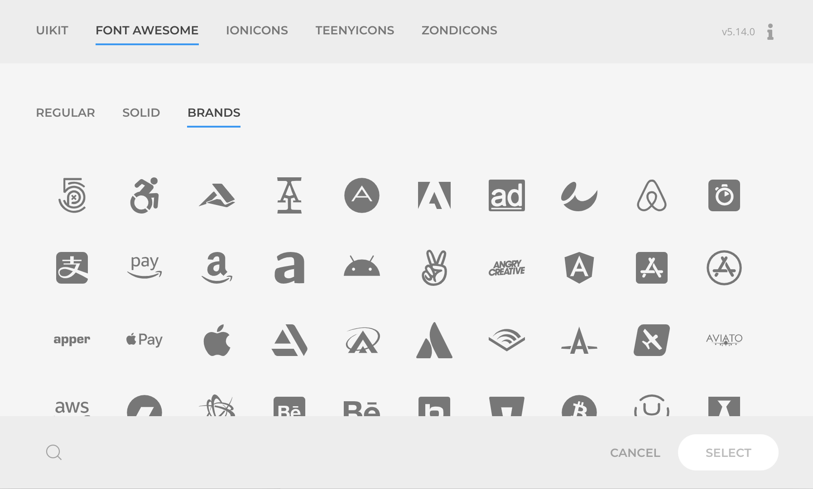

# Addons

Addons are encapsulated features that enhance or add new functionalities to the YOOtheme Pro builder. They are enabled by default, but if required can be individually disabled in the `Theme -> Settings -> ZOOlanders` panel.

## Forms

Forms addon extends YOOtheme Pro builder with a form build and submission workflow, allowing for any `section`, `column`, or `row` to become a submittable Form Area. The form configuration is located for those elements in the Advanced Tab settings, under the Form field.

An icon will be displayed in the Builder Element field giving you a hint about the form configuration. If there is any error the icon will turn red and indicate one of the [possible configuration errors](../in-depth/forms.html#configuration-errors).

The most important form configuration is the [Actions](../in-depth/forms.html#actions), those allow to further process the submitted data or simply show a message of a successful submission.

The form fields are represented by the [Form Elements](../in-depth/forms.html#elements) under the group _ZOOlanders Form_, and as long as they are inside the Form Area the inputted data will be picked up and processed.

Not all elements are meant for inputting data, the _Form Fieldset_ element allows to group fields into a fieldset, while the _Form Submit Button_ element allows the user to submit the form. Be sure to explore them all for composing the perfect form for your project.

At this point, the form should be successfully processing submissions! To further learn and deep into the subject please refer to the [Forms In-Depth](../in-depth/forms.html) section.

## Access

**Access** addon extends YOOtheme Pro Builder elements with rendering conditions, located on each element _Advanced Tab_ settings, under the _Access_ -> _Conditions_ panel.

Access conditions are composed of core and custom [rules](../in-depth/access.html#rules), when a rule is enabled it options will reveal, and the element rendering will be evaluated against the logic and configuration set by it.

An icon will be displayed in the Builder Element field giving you a hint about the access evaluation.

To further learn and deep into the subject please refer to the [Access In-Depth](../in-depth/access.html) section.

## Icons

**Icons** addon extends YOOtheme Pro Builder with core and custom icon [collections](../in-depth/icons.html#collections) like Font Awesome, Ionicons, and others. The icons are natively integrated and accessible in the icon picker Modal when requested from any icon field.

Each collection will be displayed on its own Tab with sub-tabs separating the groups. Being all GPL, MIT, or Creative Commons licensed, you can use them in personal as commercial projects.

Additionally, the modal is enhanced with a Search field that also extends the core UIkit icons making it possible to easily find an icon by it name.

To further learn and deep into the subject please refer to the [Icons In-Depth](../in-depth/icons.html) section.

## Elements

A collection of elements available under the group ZOOlanders. Their integration with the Builder is as native, using the YOOtheme Pro [elements settings](https://yootheme.com/support/yootheme-pro/joomla/element-settings) and other conventions.

To further learn and deep into the subject please refer to the [Elements In-Depth](../in-depth/elements.html) section.
