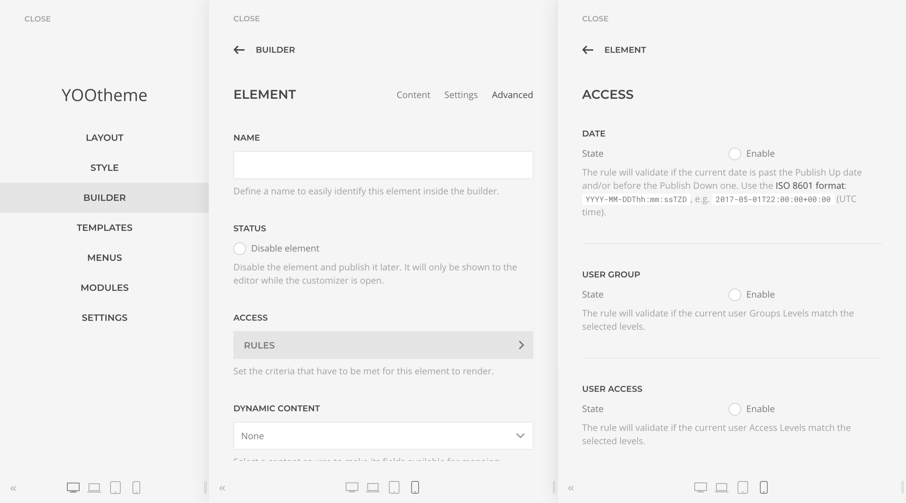
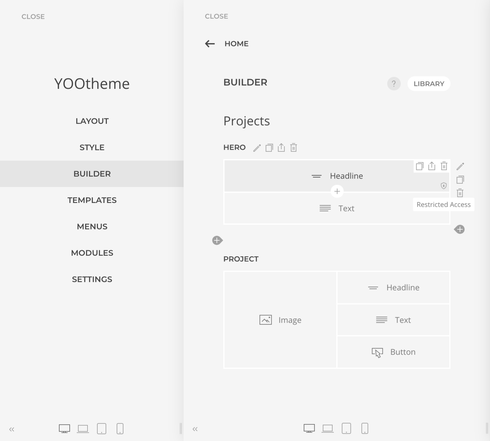

# Access

## Integration

The Access Addon will extend the YOOtheme Pro Builder with rendering conditions, specified by core or custom rules, for any element. The rules will be accessible in the element `Advanced Tab` settings, under the `Access Rules` configuration panel.



The addon is enabled by default, but you can completely disable it in the `Theme -> Settings -> ZOOlanders` panel.


## Rules

When a rule is enabled the element rendering will be evaluated against it logic and configuration. An access icon will be displayed in the Builder warning about the evaluation.



### Date

Validates if the `current date` is past the `Publish Up` and/or before the `Publish Down` specified dates. Currently the date must be entered manually in a ISO 8601 format: `YYYY-MM-DDThh:mm:ssTZD`, e.g. `2017-05-01T22:00:00+00:00` (UTC time).

### Language

Validates if the site `current language` matches any of the selected languages.

### Joomla Specific

#### User Group

Validates if the `current user` is part of at least one of the selected `Groups Levels`. If `strict` mode is enabled, the user must be part of All groups.

#### User Access

Validates if the `current user` is part of at least one of the selected `Access Levels`. If `strict` mode is enabled, the user must be part of All groups.

### WordPress Specific

#### User Access

When the `guest` option is enabled, validates if the `current user` is not logged in. Otherwise validates if the `current user` is logged in and has at least one of the selected `Roles`. If `strict` mode is enabled, the user must have All roles.

## Custom Rules

Adding custom access rules it's a strightforward process consisting of creating a Custom Rule Provider class and declare it at the Access service.

Before proceeding make sure to be familiar with the [YOOtheme Pro modules](https://yootheme.com/support/yootheme-pro/joomla/modules-and-events)

### Creating a Custom Rule Provider class

This is the class that will represents a rule, create one file for each and store them in your ChildTheme or custom plugin. The class has to implement the `ProvidesAccessRule` and declare the `resolve` and `fields` functions.

::: tip
A Child Theme is a good place to store your custom rules, but if you have plans to reuse them a plugin would be a better fit.
:::

```php
use ZOOlanders\YOOessentials\Access\ProvidesAccessRule;

class MyCustomRuleProvider implements ProvidesAccessRule
{
  /**
   * Preflight actions, Dependency Injectable
   */
  public function __construct() {}

  /**
   * @param $node The element node currently being evaluated
   * @return Boolean
   *
   * Resolves to a truthy or falsy value to indicate if the current
   * element should be rendered.
   */
  public function resolve($node)
  {
    return true;
  }

  /**
   * @return array
   *
   * An array of fields configuration for the rule that will
   * be displayed in the Builder panel.
   */
  public function fields()
  {
    return [
      [
        'label' => 'My Custom Rule',
        'type' => 'group',
        'divider' => true,
        'description' => 'The rule will validate if...',
        'fields' => [
          'yooessentials_access_mycustomrule.state' => [
            'label' => 'State',
            'description' => 'The rule will only take effect if is enabled.',
            'text' => 'Enable',
            'type' => 'checkbox'
          ],
          'yooessentials_access_mycustomrule.condition' => [
            'label' => 'Condition'
          ]
        ]
      ]
    ];
  }
}
```

### Declaring the custom class

Each rule class has to be declared by extending the Access service.

```php
use ZOOlanders\YOOessentials\Access;

require 'dir/to/MyCustomRuleProvider.php';
require 'dir/to/MyOtherCustomRuleProvider.php';

return [

  'extend' => [

    Access::class => function (Access $access) {
      $access->addProvider(MyCustomRuleProvider::class);
      $access->addProvider(MyOtherCustomRuleProvider::class);
    }

  ],

];
```
