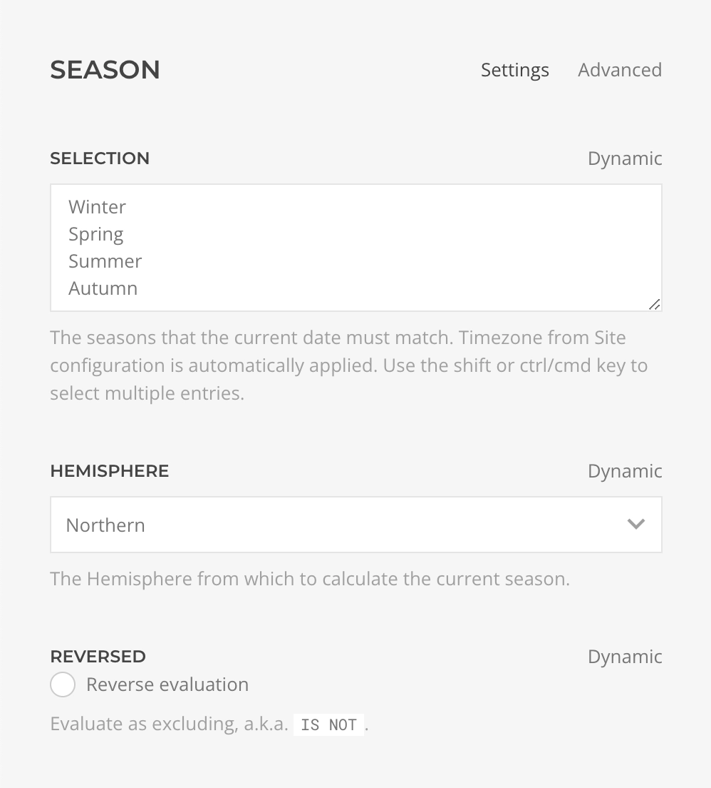

<!--@include: ./_partials/intro-->

The Season Access Rule evaluates whether the current season matches one of the selected seasons.

## Settings

| Setting | Description | Required | Dynamic |
| --- | --- | :---: | :---: |
| *Selection* | The seasons that the current season must match, at least one, for the condition to be considered valid. Timezone from Site configuration is automatically applied. | &#x2713; | &#x2713; |
| *Hemisphere* | The hemisphere from which to calculate the current season. | &#x2713; | &#x2713; |
| *Reversed* | Whether the evaluation result should be returned reversed. Use it to set a condition as `IS NOT`. | | &#x2713; |

::: details Advanced Settings

<!--@include: ./_partials/advanced-settings-->

:::
