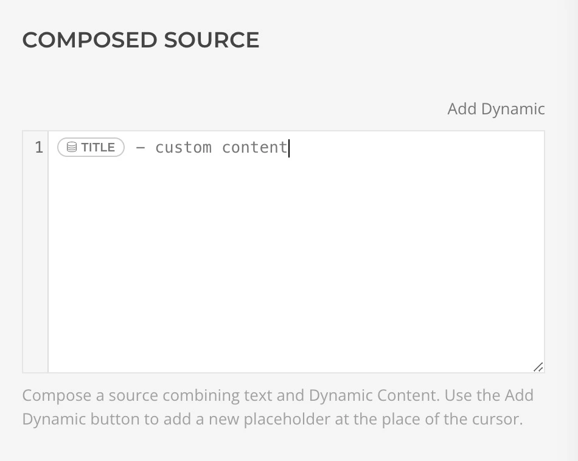

# Composable Sources

[Dynamic Content](https://yootheme.com/support/yootheme-pro/joomla/dynamic-content) workflow allows you to extend the way you assign content to an element. In any field with a dynamic content assigned, a new icon will appear. Once clicked, it will open a new panel with a dedicated editor that can be used to compose a source by combining static text with values from dynamic content sources.

## Compose Content

Once you are inside the editor you will see that the dynamic content you previously set in the field is already inserted into the content. Now you can just start typing any additional content you may want to add, or even add new dynamic content to it.

To do so, just press the `Add Dynamic` button on the top right of the editor, and choose any field of the current dynamic content. You can also choose any other dynamic content from any other source, by pressing the 3 dots icon on the top right. Check the dedicated documentation for more information on how to use our Advanced Dynamic Content Workflow.

## Filters and Arguments

Once a dynamic content placeholder has been added to the content, you can click on it to show the editing interface that you're already used to from the dynamic workflow. As usual you can set filters, arguments if available, and the changes will be reflected immediately.

## Set an Alias

Sometimes the placeholder name can get too long or not really meaningful for you usage. For these cases, you can set an alias by clicking on the placeholder, and then click on the `Set alias` link near the name of the source. Fill in any name there, and it will be used in the placeholder tag instead of the default one. Don't worry, this has no impact at all on the rendering of the page, it's just an editing utility!

