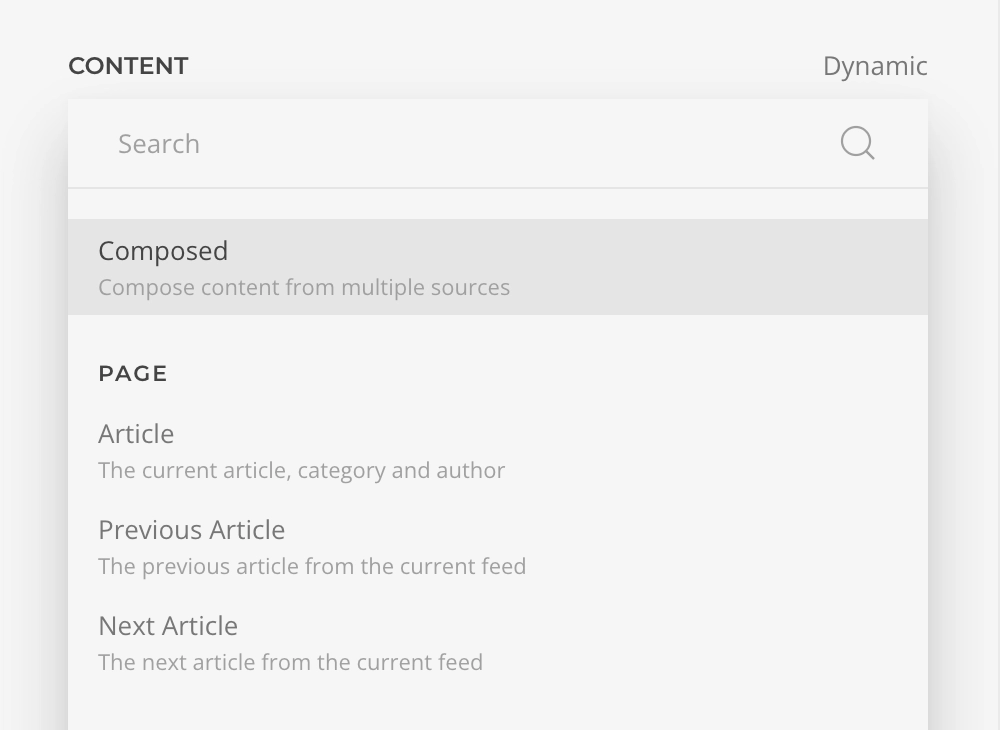
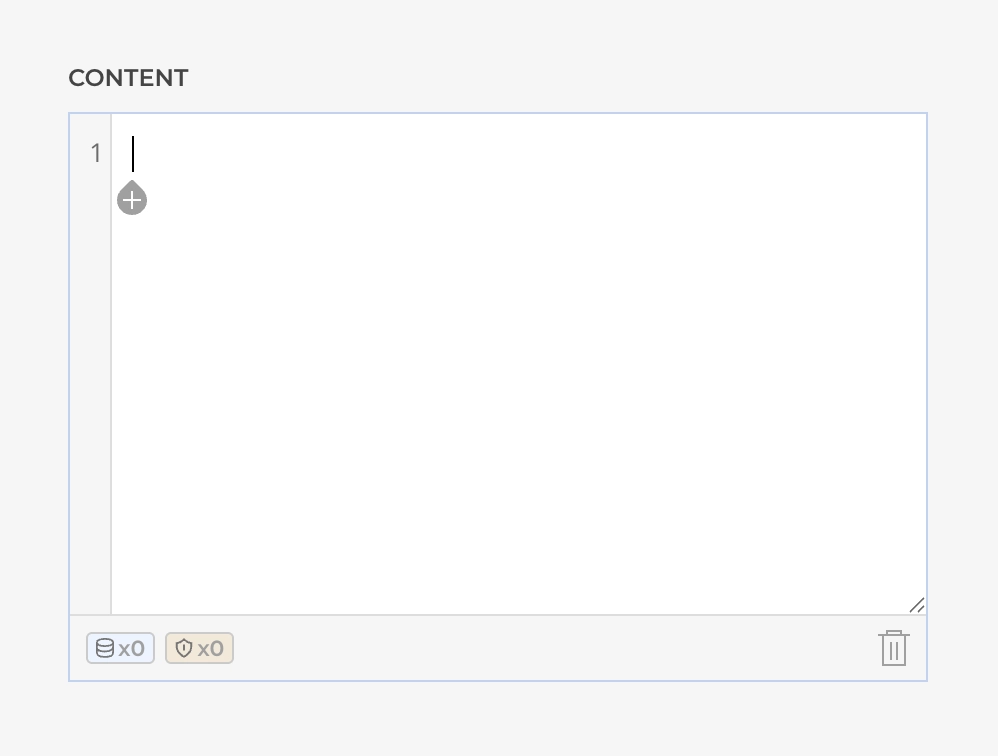
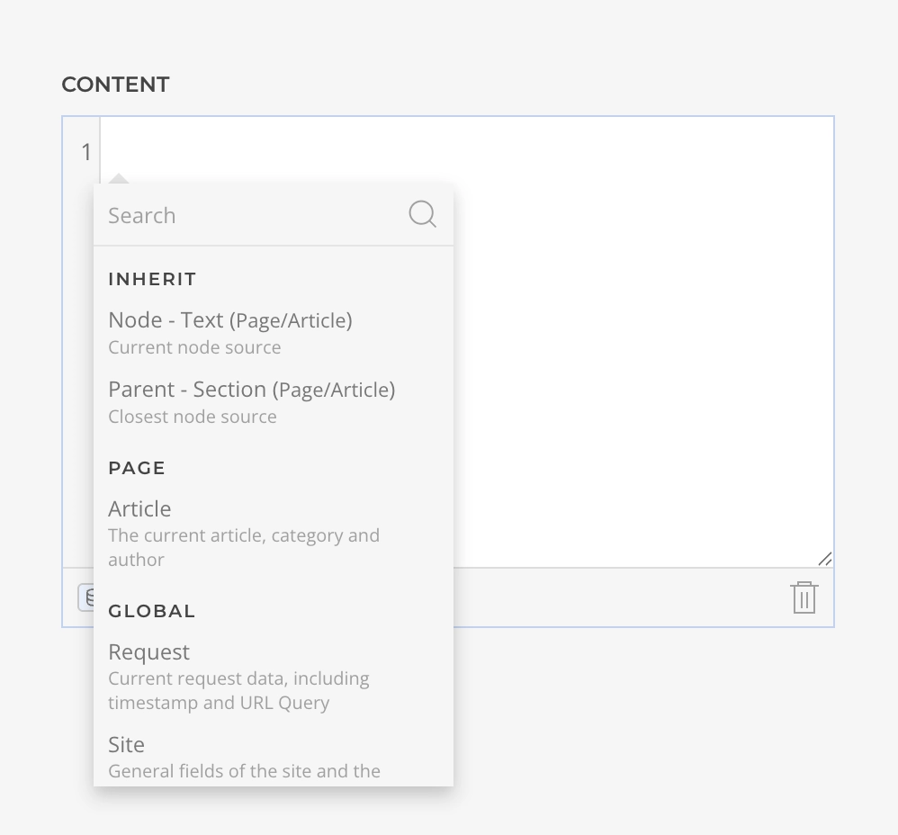
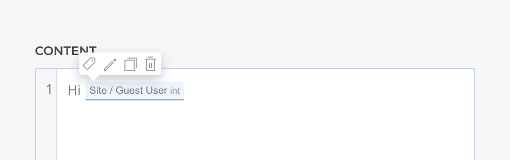
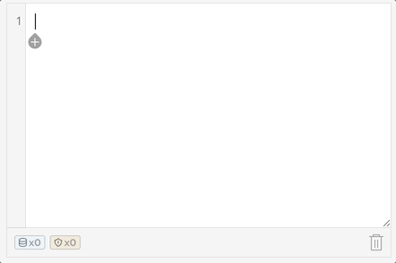
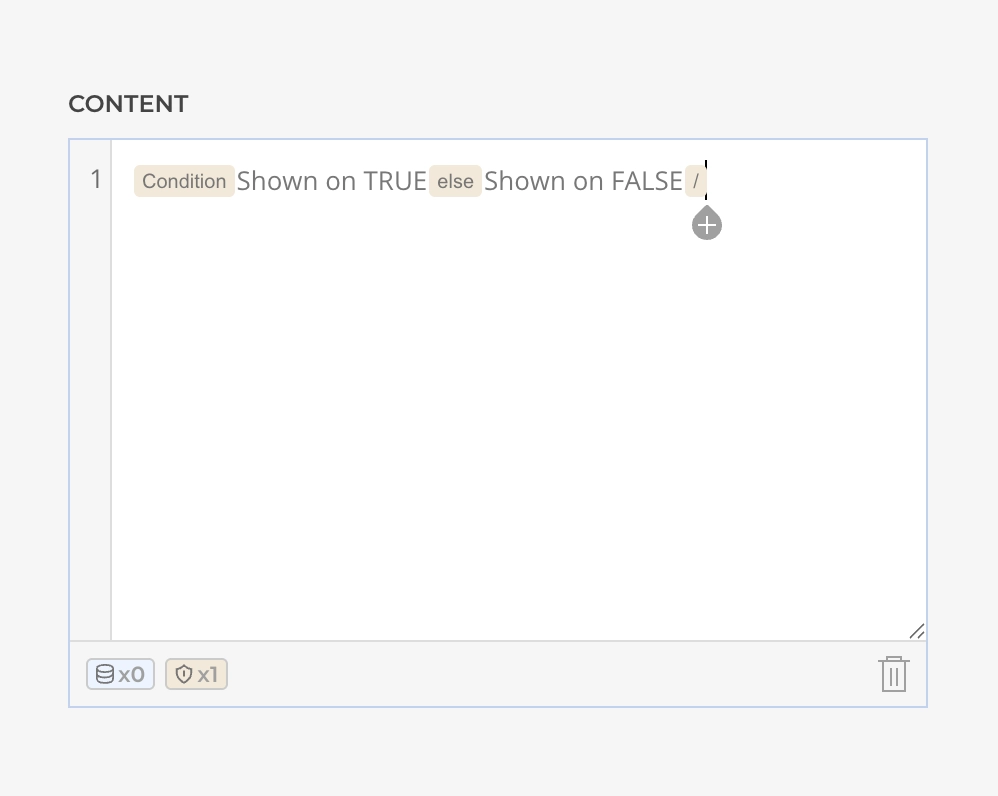
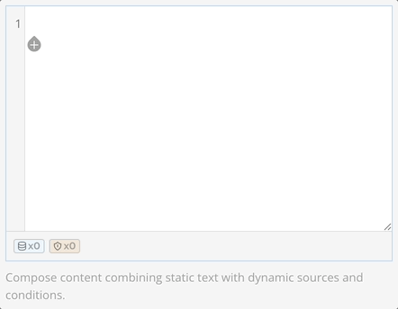

# Composed Sources

**Composed Sources** lets you compose content freely by writing text and seamlessly inserting dynamic content from any source directly within your text. This approach gives you complete flexibility to mix static and dynamic content in a single field, enabling more expressive and personalized content compositions.

To assign a field as composer, choose the _Composed_ option when assigning a Dynamic Content option.

::: tip
If a field already has dynamic content assigned, a `compose` icon will appear. If clicked, the source will be migrated to a composed source.
:::

## Composed Content

When a field has been assigned as composed, an inline editor will replace the field allowing you to mix static with dynamic content. To insert dynamic content, press the `insert` button. A dropdown will appear allowing you to choose the source, similarly as when assigning Dynamic Content to a field.

Once a source has been inserted, a block will appear representing it. You can click on it to see the available actions.

| Action      | Description                                                         |
|-------------|---------------------------------------------------------------------|
| **Alias**   | Assign a custom name to the block for easier identification         |
| **Edit**    | Modify the source's filters, arguments, and other settings          |
| **Copy**    | Duplicate the block to reuse it elsewhere in the composition        |
| **Delete**  | Remove the block from the composition                               |

::: tip
When the block options are visible, click the block again to reassign a different source field.
:::

## Conditional Compositions

Conditional Compositions allow you to wrap parts of your composed content within condition blocks, making specific content display only when certain criteria are met. This feature leverages [Essentials Access Conditions](/essentials-for-yootheme-pro/addons/access/), providing the same familiar interface for controlling content visibility based on condition rules.

To add conditions, click the `insert` button in the editor and choose _Condition_ or _Condition/Else_. Input the content that should display when the condition evaluates as _true_. If you choose _Condition/Else_, add content after the `else` that displays when the condition evaluates as _false_.

To configure conditions for a block, click on the block and select _Edit_, or simply double-click the block. This opens a panel where you can define Condition Rules using the same flexible criteria as in Access Conditions, allowing you to precisely control when the enclosed content is shown.

::: tip
You can always add an else block later if not needed right away.
:::

## Nested Compositions

Nested Compositions enable you to place one composed source inside another, creating modular and reusable content blocks. Within your main composed source, reference another composed source by adding it as a block.

::: tip
Give your nested sources meaningful names, e.g., _User Info_, _Product Details_, to make them easy to identify and reuse.
:::

::: tip
You can combine nested compositions with conditions for even more powerful content control. This modular approach allows you to break down complex content into smaller, manageable pieces that can be reused and updated independently.
:::
