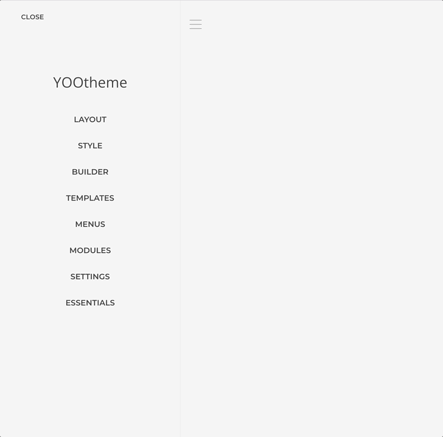

# Global Queries

A Global Query is a custom query composed from a global source which is then made available as Dynamic Content option globally. When used wisely it can help speed up the creation of layouts that use the same complex queries over and over.

## Global Queries Manager

The Global Queries Manager can be accessed at `Customizer -> Essentials -> Global Queries` section. There you can manage the queries for any source that is globally available.

