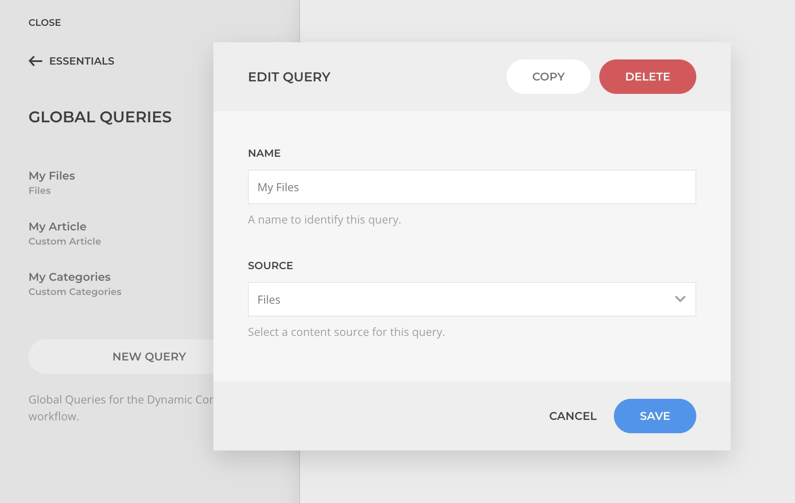

# Global Queries

A global query is a custom source query made available as a global dynamic source option. It can help speed up the creation of layouts that use complex queries over and over. Those can be managed within the [Global Queries Manager](/essentials-for-yootheme-pro/settings#global-queries).

