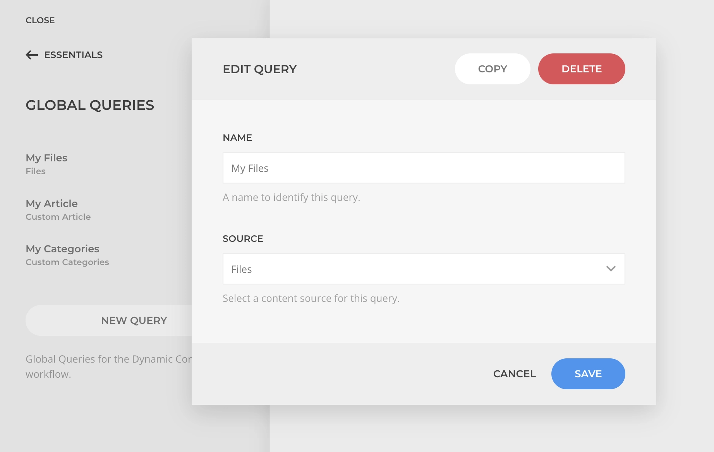

# Dynamic Content

Essentials significantly expands upon [YOOtheme Pro's core dynamic workflow](https://yootheme.com/support/yootheme-pro/joomla/dynamic-content) by introducing powerful enhancements including granular field-level control, source instantiation, advanced inheritance patterns, and dynamic source composition.

<!--@include: ../_partials/enable-addon.md-->

## Field-Level Assignments

In YOOtheme Pro, dynamic content sources are assigned at the node level, for example, to a Text element. Essentials extends this by allowing you to set a dynamic source directly at the individual field level, independent of the element's overall source configuration.

As a result, a Dynamic option is always present above the element fields—enabling you to map any available source to any field at any time.

Once assigned, the field is visually highlighted to indicate dynamic content is active.

If the assigned source is a mult-value content, those will be joined with a custom separator, or optionally left as is for the underlying element to deal with the content instead.

::: warning
While field-level source assignment offers great flexibility, use it thoughtfully to avoid performance penalties. Prefer inheriting from the current or parent node when possible, as this reuses existing queries rather than creating new ones.
:::

## Source Inheritance

When a source is set at the element level, the options _Inherit Current Node_ and/or _Inherit Parent Node_ will appear based on the source relationship.

### Inherit Current Node

This option is available when the source is set in the same node where the field is being mapped. If the source is multi-item the node will be multiplied and the fields will inherit the data from the current iteration.

### Inherit Parent Node

This option is available when there is a source set in a higher-level node from where the field is being mapped. You can inherit from a parent node even while a source is set in the current node.

## Query Arguments

YOOtheme Pro Dynamic source queries arguments are limited to static configuration. Essentials breakes through that limitation and allows setting dynamic arguments opening the door for even more advanced dynamic workflows.

::: warning Mapping Limitations
The arguments dynamic options might not show _Inherit Node_ as a dynamic option as it would not be possible to inherit from a node which source hasn't been set yet.
:::

::: tip
If you want your custom sources to support this feature, add `'source' => 'true'` property to your source query aguments configuration.
:::

## Global Queries

A global query is a custom source query made available as a global dynamic source option. It can help speed up the creation of layouts that use complex queries over and over. Those can be managed within the [Global Queries Manager](../../settings#global-queries).

