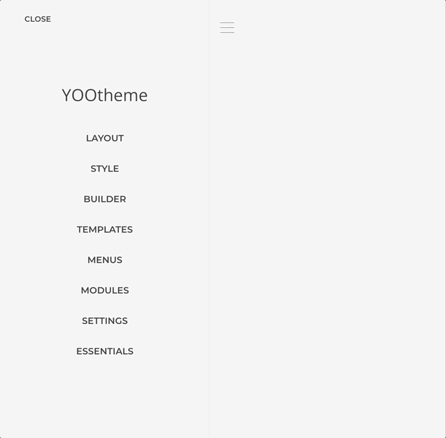
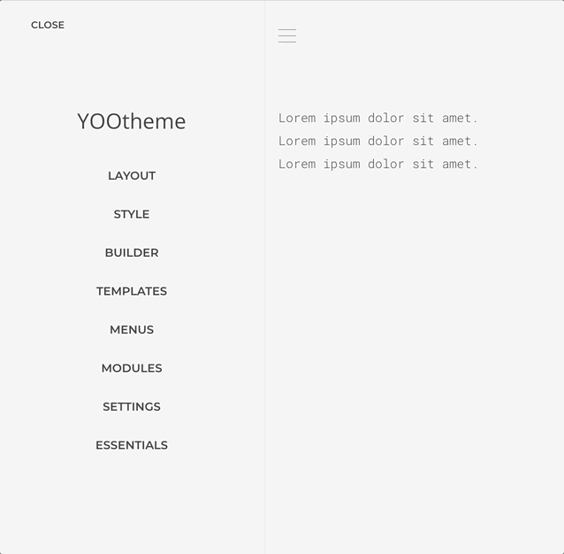

# Dynamic Content

Generate dynamic sources from local data or 3rd-party APIs, such as database tables, CSV files, Instagram media, Google Spreadsheets, and more. Extend YOOtheme Pro [Dynamic Content](https://yootheme.com/support/yootheme-pro/joomla/dynamic-content) with advanced features that integrates natively into the builder.

<!--@include: ../_partials/enable-addon.md-->

## What is Dynamic Content?

**Dynamic Content** automatically updates based on external data sources, unlike static content that you manually type and edit. For example:

- **Static**: You manually type "Check out our latest blog post" and update it each time
- **Dynamic**: Your page automatically shows your latest blog post title from an RSS feed

### Key Concepts

**Source**: A connection to where your data comes from (like an RSS feed, Instagram account, or database).

**Source Instance**: Your specific configured source. For example, "My Instagram Feed" or "Company Blog RSS" are instances of Instagram and RSS sources.

**Schema**: The structure of data your source provides (automatically generated). This defines what fields are available for mapping (like title, description, image, date, etc.).

**Field Mapping**: Connecting data from your source to elements on your page. For example, mapping an RSS feed's "title" field to a Text element.

::: tip Prerequisites
This guide assumes you're familiar with:

- YOOtheme Pro's Builder and how to add elements
- What the Customizer is and how to access it
- Basic understanding of YOOtheme Pro's [Dynamic Content feature](https://yootheme.com/support/yootheme-pro/joomla/dynamic-content)
:::

## Create a Source Instance

Before being able to use a source we must first create an instance of it within the [Sources manager](/essentials-for-yootheme-pro/settings#sources).

1. Open the Sources manager panel and click on _Add Source_.
2. Choose the source you want to make an instance from, e.g. [RSS](./sources/rss).
3. Set the source name and the configuration basics, e.g. _My Feed_ and `https://www.theverge.com/rss/reviews/index.xml`.
4. Leave the rest as is and save.

### Map the Source Content

Once the source instance has been created it schema will be generated based on it configuration and it content made available for mapping as any other dynamic core source. Lets map it content to the layout.

1. Open the builder layout where you want to map the source.
1. Add a new _Text Element_ and open it _Advanced Tab_ settings.
1. Finde the _Dynamic Content_ select field and open it.
1. From the _RSS_ group choose the _My Feed Entries_ option.
1. Open the element _Content Tab_ settings and click on the _Dynamic_ button above the content field.
1. Choose the data you want to map from the dropdown options.

A list of the feed entries should be rendered! For more insights about [YOOtheme Dynamic Content](https://yootheme.com/support/yootheme-pro/joomla/dynamic-content) workflow, consult the corresponding documentation.

## What You Learned

Congratulations! You've successfully created and displayed your first dynamic content source. You learned how to:

✓ Access the Sources manager in the Customizer
✓ Create a source instance (RSS feed)
✓ Map source content to page elements
✓ Use the Dynamic button to select specific fields

## What to Learn Next

### Try Other Simple Sources

- **[CSV Source](./sources/csv)**: Display data from spreadsheet files
- **[YouTube Source](./sources/youtube)**: Show your YouTube videos
- **[Vimeo Source](./sources/vimeo)**: Display Vimeo videos

### Explore Social Media (Requires Authentication)

- **[Instagram Source](./sources/instagram)**: Display Instagram posts and photos
- **[Facebook Source](./sources/facebook)**: Show Facebook page content
- **[Twitter Source](./sources/twitter)**: Display tweets

### Advanced Features

- **[Database Source](./sources/database)**: Connect to custom databases
- **[Global Queries](./global-queries)**: Create reusable query configurations
- **[Custom Providers](./custom-provider)**: Build your own source types (developers)

### Get Help

- **[Browse All Sources](/essentials-for-yootheme-pro/glossary#dynamic-content)**: Complete list in the glossary
- **[Troubleshooting](./troubleshooting)**: Solutions to common dynamic content issues

## Extended Dynamic Workflow

In YOOtheme Pro a dynamic content source is set on a node level, e.g. a Text element, in which case the elements fields will be enhanced with an option to map a dynamic content from the node source. Essentials expands on that notion adding the option to choose a source on an element field level regardless of the element source configuration.

With that in mind is expected that a Dynamic option will always be present above the element fields allowing to map to those any source directly.

If the mapped source content results in multiple values, those will be joined with a custom separator, or optionally left as is for the underlying element to deal with the content instead.

::: warning
Fetching sources on a field level might affect performance as more queries would be executed for each node. To mitigate those inherit from the current or parent node instead of making direct queries.
:::

### Inherit Source

When a source is set at the element level, the options _Inherit Current Node_ and/or _Inherit Parent Node_ will appear based on the source relationship.

#### Inherit Current Node

This option is available when the source is set in the same node where the field is being mapped. If the source is multi-item the node will be multiplied and the fields will inherit the data from the current iteration.

#### Inherit Parent Node

This option is available when there is a source set in a higher-level node from where the field is being mapped. It is possible to inherit from a parent node while there is a source set in the current node, and even mix both using [composed sources](composed-sources).

