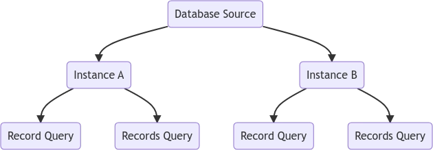

# Source Provider

An Essentials Source Provider is a [YOOtheme Pro Dynamic Content Source](https://yootheme.com/support/yootheme-pro/joomla/dynamic-content) extended with the capacity to run multiple instances in parallel. New instances schema are stored in the builder GraphQL Schema, being the final result and performance identical as of a standard source.

