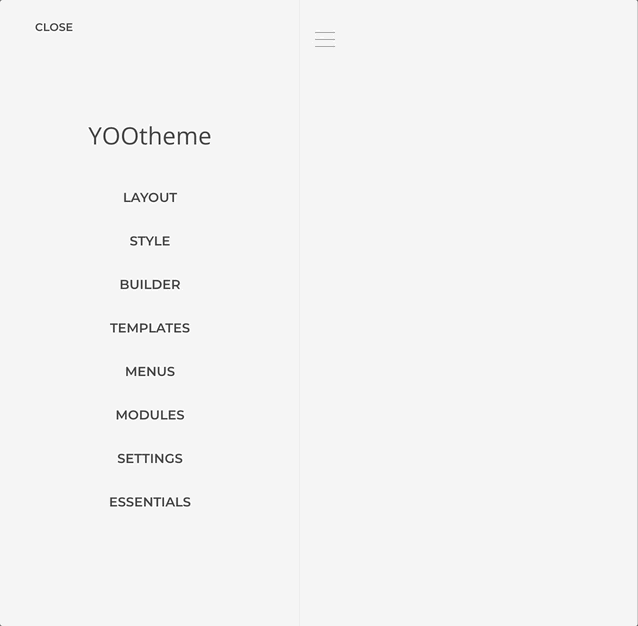
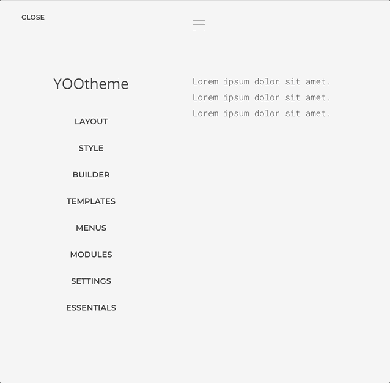

# Source Instances

Source instances are individual configurations of a dynamic content source. Essentials lets you create multiple named instances from available Source Providers, each with different configurations. For example, you might create one RSS instance for "Latest News" and another for "Product Updates"—both pulling from different feeds using the same source provider.

## Source Provider

An Essentials Source Provider is a [YOOtheme Pro Dynamic Content Source](https://yootheme.com/support/yootheme-pro/joomla/dynamic-content) extended to run multiple instances in parallel. Instance configurations are stored in the builder's GraphQL schema, delivering identical performance and functionality to standard sources.

## Create a Source Instance

To use a source, you must first create an instance of it within the [Sources manager](/essentials-for-yootheme-pro/settings#sources).

1. Open the Sources manager panel and click on _Add Source_.
2. Choose the source you want to make an instance from, e.g. [RSS](./sources/rss).
3. Set the source name and the configuration basics, e.g. _My Feed_ and `https://www.theverge.com/rss/reviews/index.xml`.
4. Leave the rest as is and save.

### Map the Source Content

Once a source instance is created, its schema is automatically generated based on the configuration. The content is then available for mapping like any other dynamic source.

1. Open the builder layout where you want to map the source.
2. Add a new _Text Element_ and open its _Advanced Tab_ settings.
3. Find the _Dynamic Content_ select field and open it.
4. From the _RSS_ group, choose the _My Feed Entries_ option.
5. Open the element's _Content Tab_ settings and click the _Dynamic_ button above the content field.
6. Choose the data you want to map from the dropdown options.

A list of feed entries should render. For more information about [YOOtheme Dynamic Content](https://yootheme.com/support/yootheme-pro/joomla/dynamic-content) workflows, see the YOOtheme Pro documentation.
