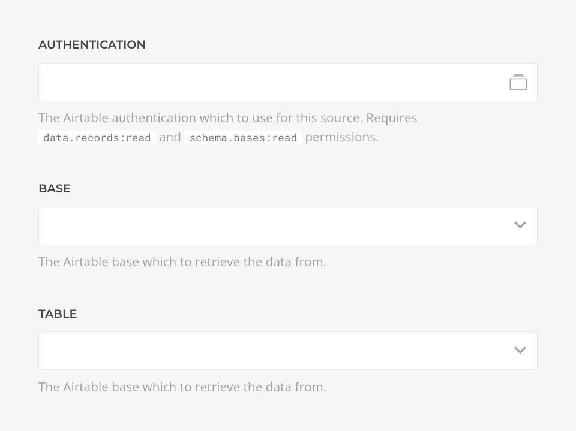

# Airtable Source Provider

    <!--@include: @essentials-for-yootheme-pro/assets/brands/airtable.svg-->

The **Airtable Source** feeds data from [Airtable](https://airtable.com/) bases supporting [Record](#record-query) and [Records](#records-query) queries.

## Settings

<!--@include: ./_partials/common-provider-settings.md-->

| Setting   | Description                                                   |
| --------- | ------------------------------------------------------------- |
| _Account_ | The Airtable Account which to authenticate with.              |
| _Base_    | The Airtable base which to retrieve the data from.            |
| _Table_   | The Airtable base table which data to create the source with. |

## Record Query

Fetches a single record from an Airtable base and resolves to [Record Type](#record-type).

| Setting     | Description                                                                        | Default | Dynamic  |
| ----------- | ---------------------------------------------------------------------------------- | ------- | :------: |
| _Record ID_ | The ID of the record to query.                                                     |         | &#x2713; |
| _Cache_     | The duration in seconds before the cache is invalidated and the query re-executed. | `3600`  |

## Records Query

Fetches records from an Airtable base and resolves to a list of [Record Type](#record-type).

| Setting    | Description                                                                        | Default | Dynamic  |
| ---------- | ---------------------------------------------------------------------------------- | ------- | :------: |
| _View_     | Optional table view to use instead of a raw query.                                 |
| _Start_    | The offset applied to the query.                                                   | `1`     | &#x2713; |
| _Quantity_ | The limit applied to the query.                                                    | `20`    | &#x2713; |
| _Cache_    | The duration in seconds before the cache is invalidated and the query re-executed. | `3600`  |

## Record Type

The record type will be dynamically generated based on the Airtable base table schema by mapping [field types](https://airtable.com/developers/web/api/field-model) with GraphQL types as follows.

| Airtable Field Types                                               | Type                           | Filters |
| ------------------------------------------------------------------ | ------------------------------ | ------- |
| Number, Count, Currency, Duration, Percent, Rating, Auto number    | _Int_                          |
| AI Text, Long Text, Rich text, Single line text                    | _String_                       | _Limit_ |
| Date, Date and time, Created time, Last modified time              | _String_                       | _Date_  |
| Multiple select                                                    | _String_ with separator        |
| Created by, Last modified by, Collaborator, Multiple collaborators | [User](#user-type)             |
| Multiple attachments                                               | [Attachment](#attachment-type) |

Every record has the following fields available regardless of it schema.

| Field          | Description                                 | Type     | Filters |
| -------------- | ------------------------------------------- | -------- | ------- |
| _ID_           | The unique identifier of this record.       | _String_ |
| _Created Time_ | The unixstamp when this record was created. | _String_ | _Date_  |

## User Type

| Field   | Description                 | Type     |
| ------- | --------------------------- | -------- |
| _Email_ | The user email.             | _String_ |
| _Name_  | The user name.              | _String_ |
| _ID_    | The user unique identifier. | _String_ |

## Attachment Type

| Field       | Description                                                                                                                                                       | Type     |
| ----------- | ----------------------------------------------------------------------------------------------------------------------------------------------------------------- | -------- |
| _URL_       | The attachment url, e.g. `https://v5.airtableusercontent.com/foo`.  <small>Notice that URLs expire 2 hours after being returned from the Airtable API.</small> | _String_ |
| _Filename_  | The attachment filename, e.g. `foo.jpg`.                                                                                                                          | _String_ |
| _Type_      | The attachment content type, e.g. `image/jpeg`.                                                                                                                   | _String_ |
| _Size_      | The attachment file size, in bytes.                                                                                                                               | _Int_    |
| _Width_     | The attachment width in pixels, if attachment is an image.                                                                                                        | _Int_    |
| _Height_    | The attachment height in pixels, if attachment is an image.                                                                                                       | _Int_    |
| _Thumbnail_ | The attachment thumbnail, if attachment is an image.                                                                                                              | _String_ |
| _ID_        | Unique attachment id.                                                                                                                                             | _String_ |
