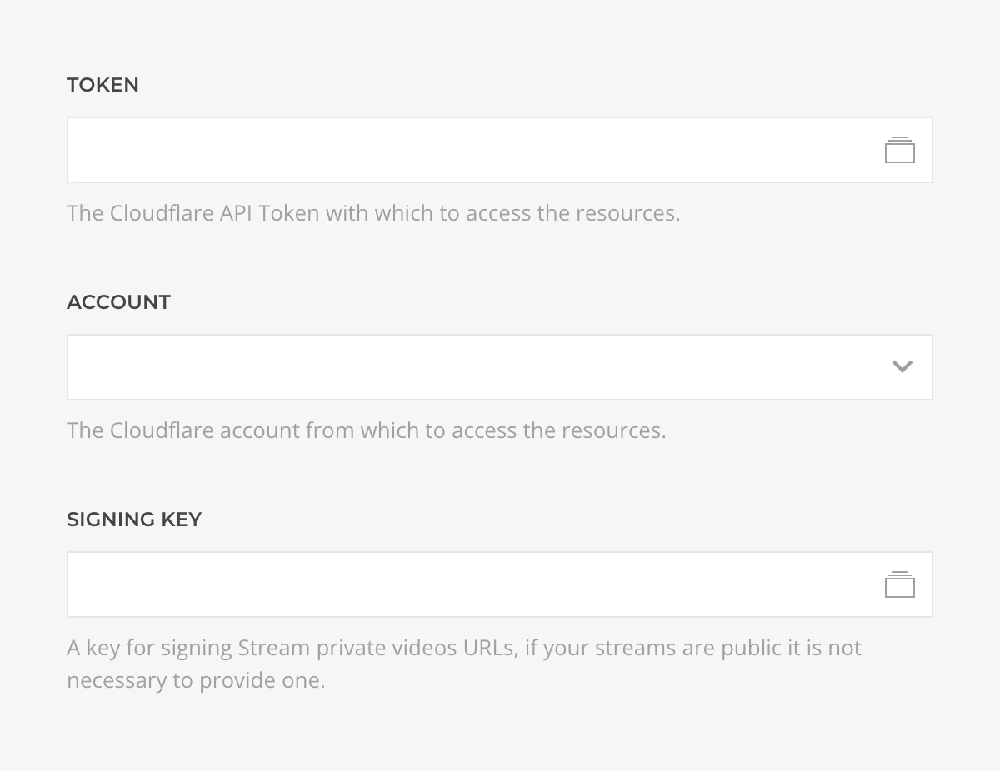
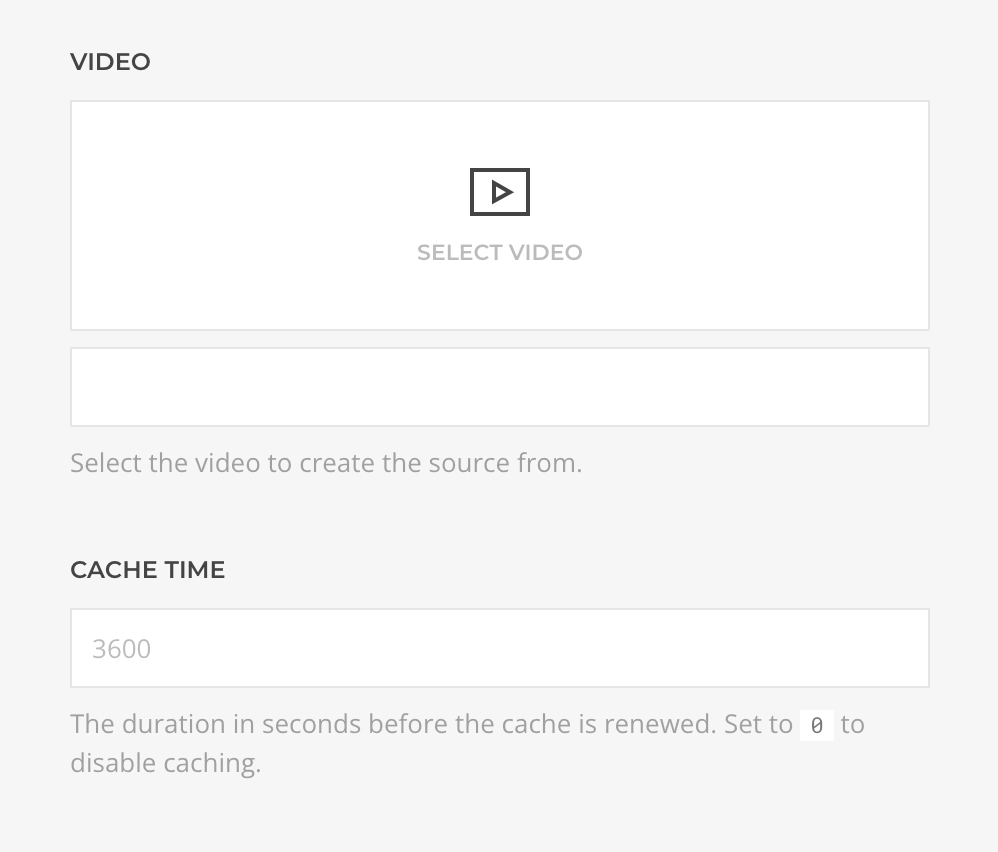
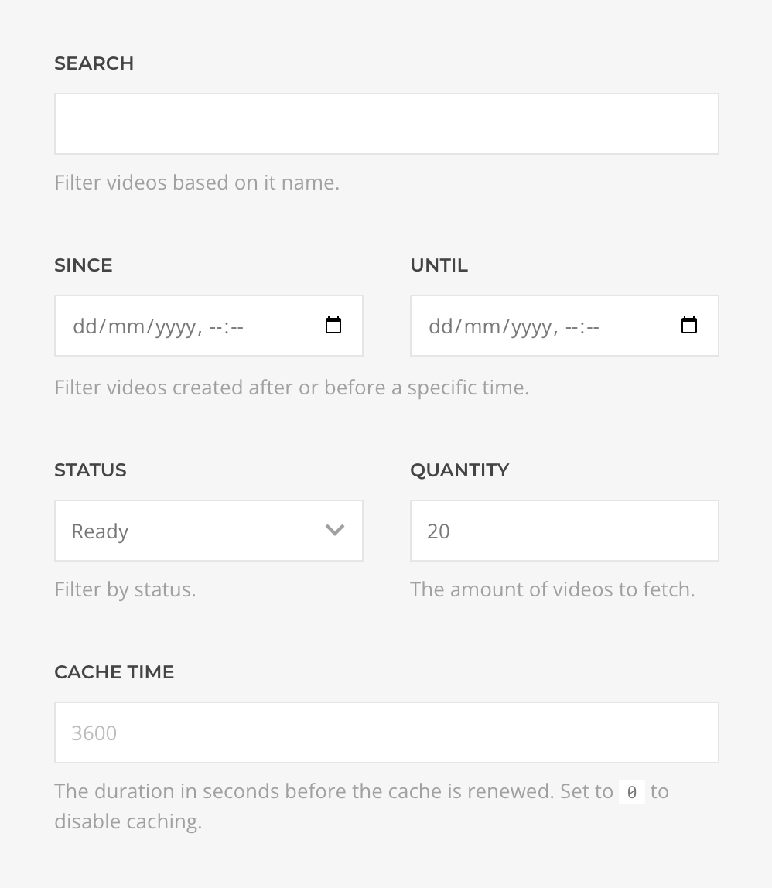
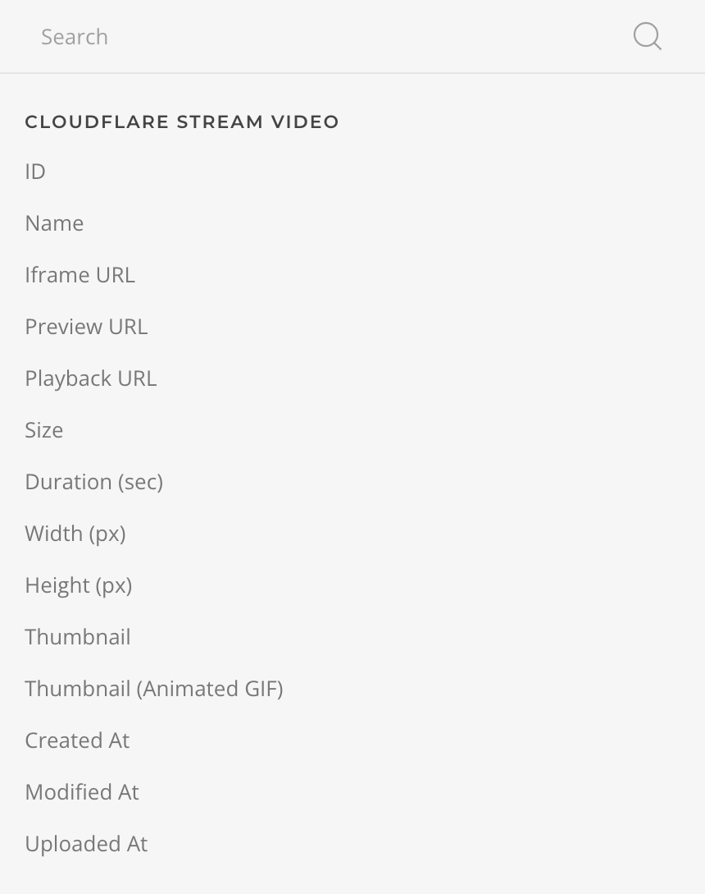

# Cloudflare Stream Source Provider

    <!--@include: @essentials-for-yootheme-pro/assets/brands/cloudflare.svg-->

The **Cloudflare Stream Source** feeds data from [Cloudflare Stream](https://www.cloudflare.com/products/cloudflare-stream/) supporting [Video](#video-query) and [Videos](#videos-query) queries.

## Settings

<!--@include: ./_partials/common-provider-settings.md-->

| Setting       | Description                                                                            |
| ------------- | -------------------------------------------------------------------------------------- |
| _Token_       | The Cloudflare API Token which to authenticate with.                                   |
| _Account_     | The Cloudflare account which to connecto to.                                           |
| _Signing Key_ | An auto-generated key used to signing private videos. Not necessary for public videos. |

## Video Query

Fetches a single video from the authenticated account and resolves to a [Video Type](#video-type).

| Setting | Description                                                                        | Default | Dynamic  |
| ------- | ---------------------------------------------------------------------------------- | ------- | :------: |
| _Video_ | The Cloudflare Stream video to create the source from.                             |         | &#x2713; |
| _Cache_ | The duration in seconds before the cache is invalidated and the query re-executed. | `3600`  |

## Videos Query

Fetches videos from the authenticated account and resolves to a list of [Video Type](#video-type).

| Setting       | Description                                                                                                    | Default | Dynamic  |
| ------------- | -------------------------------------------------------------------------------------------------------------- | ------- | :------: |
| _Search_      | The video name search term by which to filter the results.                                                     |         | &#x2713; |
| _Since/Until_ | Restricts the results to videos that have been published within the specified range of dates.                  |         | &#x2713; |
| _Status_      | The status by whic to filter the results, within _Ready_, _Queued_, _In Progress_, _Downloading_, and _Error_. | `Ready` |
| _Quantity_    | The amount of videos to fetch.                                                                                 | `20`    | &#x2713; |
| _Cache_       | The duration in seconds before the cache is invalidated and the query re-executed.                             | `3600`  |

## Video Type

Defines the mapping options of a Cloudflare Stream Video object.

| Option                 | Description                                                                                                                                     | Type     | Filters |
| ---------------------- | ----------------------------------------------------------------------------------------------------------------------------------------------- | -------- | ------- |
| _ID_                   | The unique identifier of this video.                                                                                                            | _String_ |
| _Title_                | The title of this video.                                                                                                                        | _String_ | _Limit_ |
| _Iframe URL_           | Generates an iframe URL with _Autoplay_, _Loop_, _Muted_, _Controls_, and _Time_ arguments.                                                     | _String_ |
| _Preview URL_          | The preview URL of this video.                                                                                                                  | _String_ |
| _Playback URL_         | The streaming playback URL of this video.                                                                                                       | _String_ |
| _Size_                 | The formated size of this video.                                                                                                                | _String_ |
| _Duration_             | The duration of this video in seconds.                                                                                                          | _Int_    |
| _Width_                | The width of this video in pixels.                                                                                                              | _Int_    |
| _Height_               | The height of this video in pixels.                                                                                                             | _Int_    |
| _Thumbnail_            | The path to the dynamically generated and locally cached thumbnail of this video, with _Time_, _Height_, _Width_, and _Fit_ arguments.          | _String_ |
| _Thumbnail (animated)_ | The path to the dynamically generated and locally cached animated thumbnail of this video, with _Time_, _Height_, _Width_, and _Fit_ arguments. | _String_ |
| _Created At_           | The time this video was created.                                                                                                                | _String_ | _Date_  |
| _Modified At_          | The time this video was last modified.                                                                                                          | _String_ | _Date_  |
| _Uploaded At_          | The time this video was uploaded.                                                                                                               | _String_ | _Date_  |
