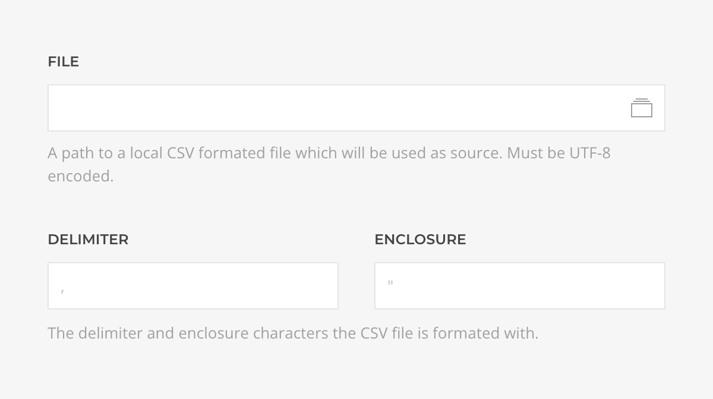

# CSV Source Provider

    <!--@include: ../assets/provider-csv.svg-->

The **CSV Source** feeds data from local [CSV](https://en.wikipedia.org/wiki/Comma-separated_values) or [TSV](https://en.wikipedia.org/wiki/Tab-separated_values) files supporting [Records](#records-query) query with dynamic filtering and/or ordering.

## Settings

<!--@include: ./_partials/common-provider-settings.md-->

| Setting     | Description                                                             | Default |
| ----------- | ----------------------------------------------------------------------- | ------- |
| _File_      | The relative or absolute local path to the file which to use as source. |
| _Delimeter_ | The delimiter character the content is formated with.                   | `,`     |
| _Enclosure_ | The enclosure character the content is formated with.                   | `"`     |

## Records Query

Fetches records from the file and resolves to a list of dynamically generated CSV record type based on the file schema.

| Setting    | Description                                                                        | Default | Dynamic  |
| ---------- | ---------------------------------------------------------------------------------- | ------- | :------: |
| _Filters_  | The list of filter conditions applied to the query.                                | `[]`    | &#x2713; |
| _Ordering_ | The list of ordering conditions applied to the query.                              | `[]`    | &#x2713; |
| _Start_    | The offset applied to the query.                                                   | `1`     | &#x2713; |
| _Quantity_ | The limit applied to the query.                                                    | `20`    | &#x2713; |
| _Cache_    | The duration in seconds before the cache is invalidated and the query re-executed. | `3600`  |
