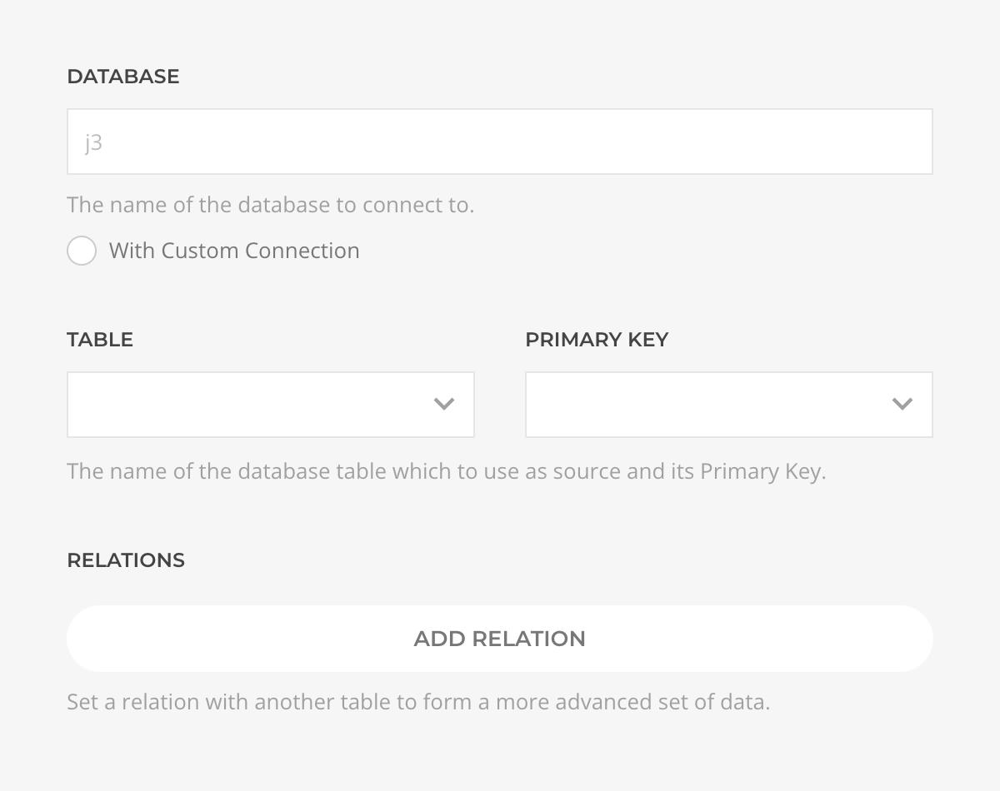
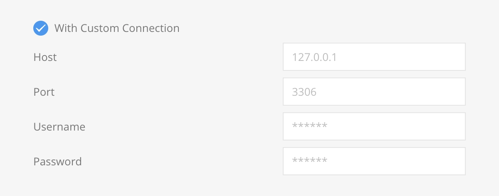
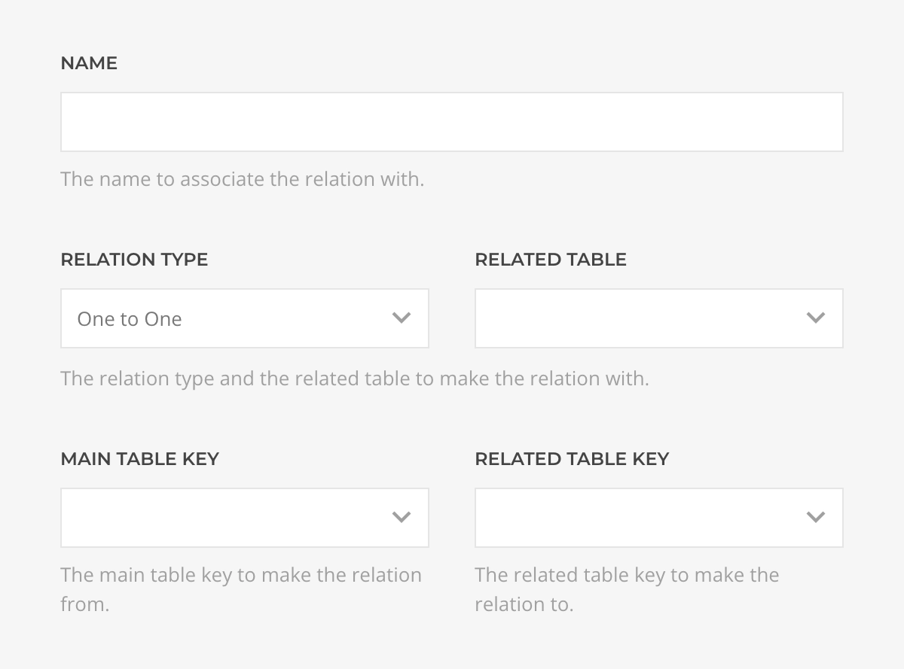
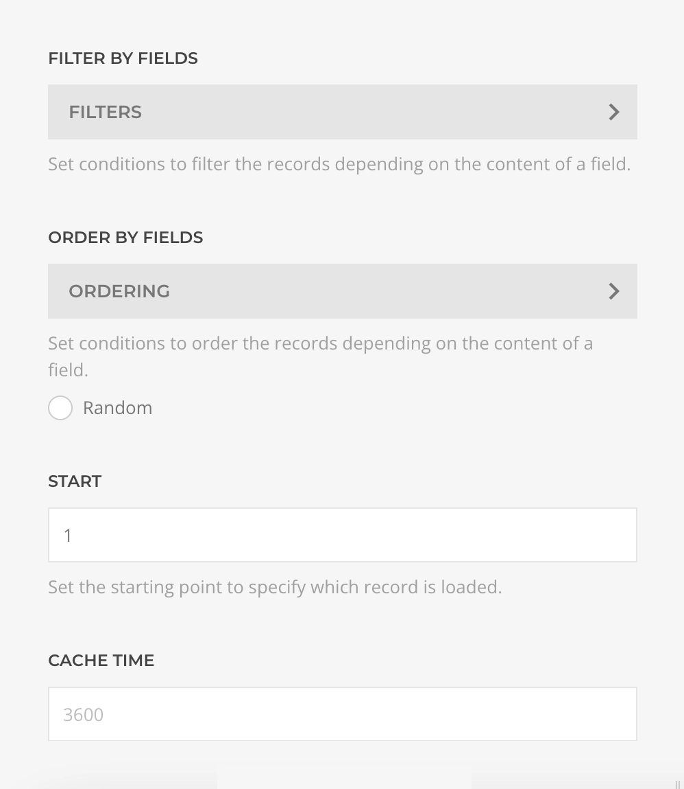
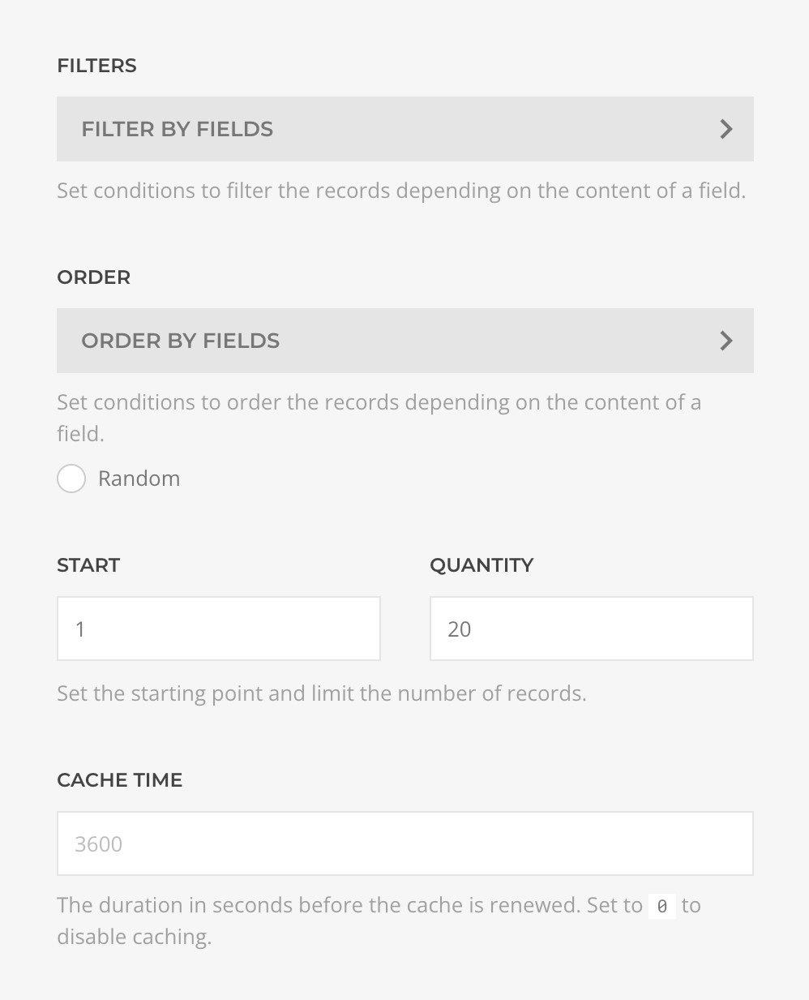

# Database Source provider

    <!--@include: ../assets/provider-database.svg-->

The **Database Source** feeds data from local or external MySQL Database Tables, supporting [Record](#record-query) and [Records](#records-query) queries with relations and dynamic filtering and/or ordering.

## Settings

<!--@include: ./_partials/common-provider-settings.md-->

| Setting             | Description                                                                              | Required |
| ------------------- | ---------------------------------------------------------------------------------------- | :------: |
| _Database_          | The name of the database to which to connect to. Defaults to the site database.          |
| _Table_             | The table from which to create the source.                                               | &#x2713; |
| _Primary Key_       | The primary key of the selected table, this is specially important when using relations. | &#x2713; |
| _Custom Connection_ | Should the connection to the database use custom connection instead of the site one.     |
| _Relations_         | The list of relations and their configuration.                                           |

The connection to the database will use the site configuration, but if _Custom Connection_ is enabled the settings inputs will be used instead with support for local as remote servers.

| Setting               | Description                                            | Required |
| --------------------- | ------------------------------------------------------ | :------: |
| _Host_                | The IP or domain of the database server.               | &#x2713; |
| _Port_                | The port which to use to connect to the server.        | &#x2713; |
| _Username / Password_ | The credentials which to use to connect to the server. | &#x2713; |

Complex data structures typically involve several tables related between them, if that's the case you can set as many relations as needed of the type:

| Type          | Description                                                                                                                 |
| ------------- | --------------------------------------------------------------------------------------------------------------------------- |
| _One to One_  | Also known as _BelongsTo_, where a single entry relates with another single entry, e.g. _Article belongs to an Author_.     |
| _One to Many_ | Also known as _HasMany_, where a single entry relates with multiple entries, e.g. _Article is assigned to many Categories_. |

| Setting             | Description                                                                    |
| ------------------- | ------------------------------------------------------------------------------ |
| _Name_              | The name to associate the relation with. Should be meaningfull, e.g. _Author_. |
| _Relation Type_     | The relation type, _One to One_ or _One to Many_.                              |
| _Related Table_     | The table that is being related with the main table.                           |
| _Main Table Key_    | The column key from the main table to use for the relation.                    |
| _Related Table Key_ | The column key from the related table to use for the relation.                 |

::: tip MySQL Views
Relations can get complex and difficult to debug, an alternative simpler approach is to create a [MySQL View](https://dev.mysql.com/doc/refman/8.0/en/view-syntax.html) with the relations solved and use that view as the main table.
:::

## Record Query

Fetches a single record from the table and resolves to a dynamically generated record type based on the table schema.

| Setting    | Description                                                                        | Default | Dynamic  |
| ---------- | ---------------------------------------------------------------------------------- | ------- | :------: |
| _Filters_  | The list of filter conditions applied to the query.                                | `[]`    | &#x2713; |
| _Ordering_ | The list of ordering conditions applied to the query.                              | `[]`    | &#x2713; |
| _Random_   | Should the ordering be randomized ignoring any ordering condition.                 | `false` |
| _Start_    | The offset applied to the query.                                                   | `1`     | &#x2713; |
| _Cache_    | The duration in seconds before the cache is invalidated and the query re-executed. | `3600`  |

## Records Query

Fetches records from the table and resolves to a dynamically generated list of record type based on the table schema.

| Setting    | Description                                                                        | Default | Dynamic  |
| ---------- | ---------------------------------------------------------------------------------- | ------- | :------: |
| _Filters_  | The list of filter conditions applied to the query.                                | `[]`    | &#x2713; |
| _Ordering_ | The list of ordering conditions applied to the query.                              | `[]`    | &#x2713; |
| _Random_   | Should the ordering be randomized ignoring any ordering condition.                 | `false` |
| _Start_    | The offset applied to the query.                                                   | `1`     | &#x2713; |
| _Quantity_ | The limit applied to the query.                                                    | `20`    | &#x2713; |
| _Cache_    | The duration in seconds before the cache is invalidated and the query re-executed. | `3600`  |
