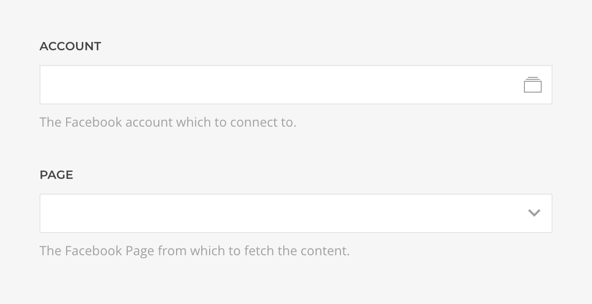
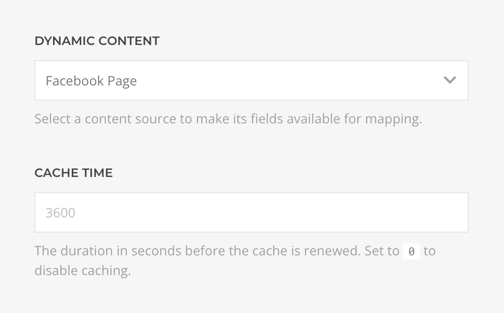
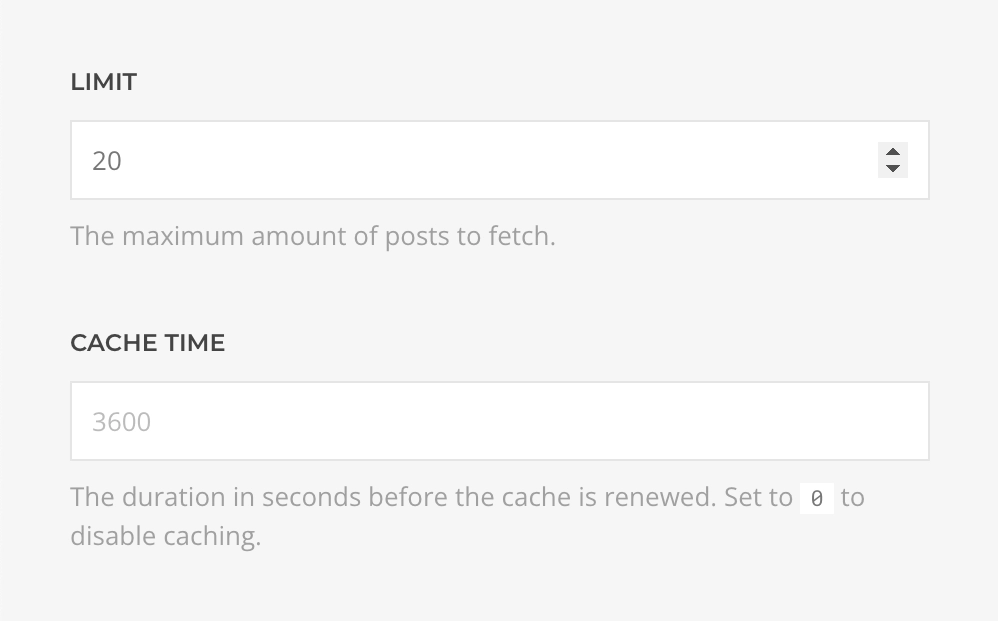
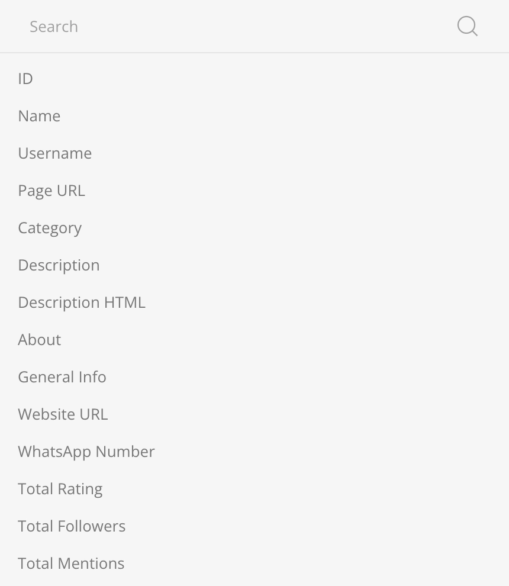
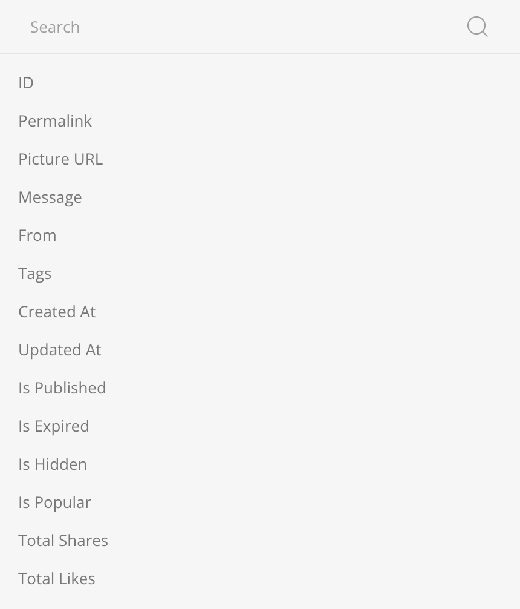

# Facebook Source Provider

    <!--@include: @essentials-for-yootheme-pro/assets/brands/facebook.svg-->

The **Facebook Source** feeds data from [Facebook](https://www.facebook.com/) supporting [Page](#page-query) and [Page Posts](#page-posts-query) queries.

## Settings

<!--@include: ./_partials/common-provider-settings.md-->

| Setting   | Description                                                |
| --------- | ---------------------------------------------------------- |
| _Account_ | The Facebook Account which to authenticate with.           |
| _Page_    | The Facebook page from which to create the source content. |

## Page Query

Fetches the content from the page resolving to a list of [Page Type](#page-type).

| Setting | Description                                                                        | Default |
| ------- | ---------------------------------------------------------------------------------- | ------- |
| _Cache_ | The duration in seconds before the cache is invalidated and the query re-executed. | `3600`  |

## Page Posts Query

Fetches the posts from the page resolving to a list of [Page Post Type](#page-post-type).

| Setting | Description                                                                        | Default | Dynamic  |
| ------- | ---------------------------------------------------------------------------------- | ------- | :------: |
| _Limit_ | The maximum amount of posts to fetch.                                              | `20`    | &#x2713; |
| _Cache_ | The duration in seconds before the cache is invalidated and the query re-executed. | `3600`  |

## Page Type

Defines the mapping options of a Facebook Page object.

| Option             | Description                                                                             | Type     | Filters |
| ------------------ | --------------------------------------------------------------------------------------- | -------- | ------- |
| _ID_               | Unique identifier of this Page.                                                         | _String_ |
| _Name_             | The name of this Page.                                                                  | _String_ |
| _Username_         | The alias of this Page, e.g for `www.facebook.com/platform` the username is `platform`. | _String_ |
| _Link_             | The Page's Facebook URL.                                                                | _String_ |
| _Category_         | The Page's category, e.g. _Product/Service_, _Computers/Technology_.                    | _String_ |
| _Description_      | The description of this Page.                                                           | _String_ | _Limit_ |
| _Description HTML_ | The description of this Page in raw HTML.                                               | _String_ |
| _About_            | Information about this Page.                                                            | _String_ | _Limit_ |
| _General Info_     | General information provided by this Page.                                              | _String_ | _Limit_ |
| _Website_          | The URL of this Page's website.                                                         | _String_ |
| _WhatsApp Number_  | The WhatsApp number of this Page.                                                       | _String_ |
| _Total Ratings_    | Number of public ratings for this Page.                                                 | _Int_    |
| _Total Followers_  | Number of page followers.                                                               | _Int_    |
| _Total Mentions_   | Number of people talking about this Page.                                               | _Int_    |

| Page Person Options  | Description                                 | Type     | Filters |
| -------------------- | ------------------------------------------- | -------- | ------- |
| _Birthday_           | The birthday of this Person Page.           | _String_ | _Date_  |
| _Personal Info_      | The personal info of this Person Page.      | _String_ | _Limit_ |
| _Personal Interests_ | The personal interests of this Person Page. | _String_ | _Limit_ |
| _Affiliation_        | The affiliation of this Person Page.        | _String_ | _Limit_ |

## Page Post Type

Defines the mapping options of a Facebook Page Post object.

| Option            | Description                                                                                                                     | Type      | Filters |
| ----------------- | ------------------------------------------------------------------------------------------------------------------------------- | --------- | ------- |
| _ID_              | Unique identifier of this post.                                                                                                 | _String_  |
| _Permalink_       | The permanent static URL of this post, e.g `www.facebook.com/.../posts/10153449196`.                                            | _String_  |
| _Picture URL_     | The full size picture attached to this post.                                                                                    | _String_  |
| _Message_         | The message written in this post.                                                                                               | _String_  | _Limit_ |
| _From_            | The name of the user, page, group, or event that published this post.                                                           | _String_  |
| _Tags_            | The profiles tagged in post message as a custom formated string with _Separator_, _Show Link_ and _Link Style_ arguments.       | _String_  |
| _Created At_      | The time this post was published.                                                                                               | _String_  | _Date_  |
| _Updated At_      | The time this post was last updated, which occurs when a user comments on this post.                                            | _String_  | _Date_  |
| _Is Published_    | Whether this post was published.                                                                                                | _Boolean_ |
| _Is Expired_      | Whether this post has expiration time that has passed.                                                                          | _Boolean_ |
| _Is Hidden_       | Whether this post has been set to hidden.                                                                                       | _Boolean_ |
| _Is Popular_      | Whether this post is currently popular based on whether the total actions as a percentage of reach exceeds a certain threshold. | _Boolean_ |
| _Total Shares_    | Number of times this post has been shared.                                                                                      | _Int_     |
| _Total Likes_     | Number of times this post has been liked.                                                                                       | _Int_     |
| _Total Comments_  | Number of comments made on this post.                                                                                           | _Int_     |
| _Total Reactions_ | Number of times people reacted to this post.                                                                                    | _Int_     |
| _Parent ID_       | Unique identifier of a parent post for this post, if it exists.                                                                 | _String_  |
