# Google Business Profile Source Provider

    <!--@include: @essentials-for-yootheme-pro/assets/brands/google-business-profile.svg-->

The **Google Business Profile Source** feeds data from [Google Business Profile](https://business.google.com/) supporting [Location](#location-query), [Review](#review-query), [Reviews](#reviews-query), [Media](#media-query) and [Posts](#posts-query) queries.

## Settings

<!--@include: ./_partials/common-provider-settings.md-->

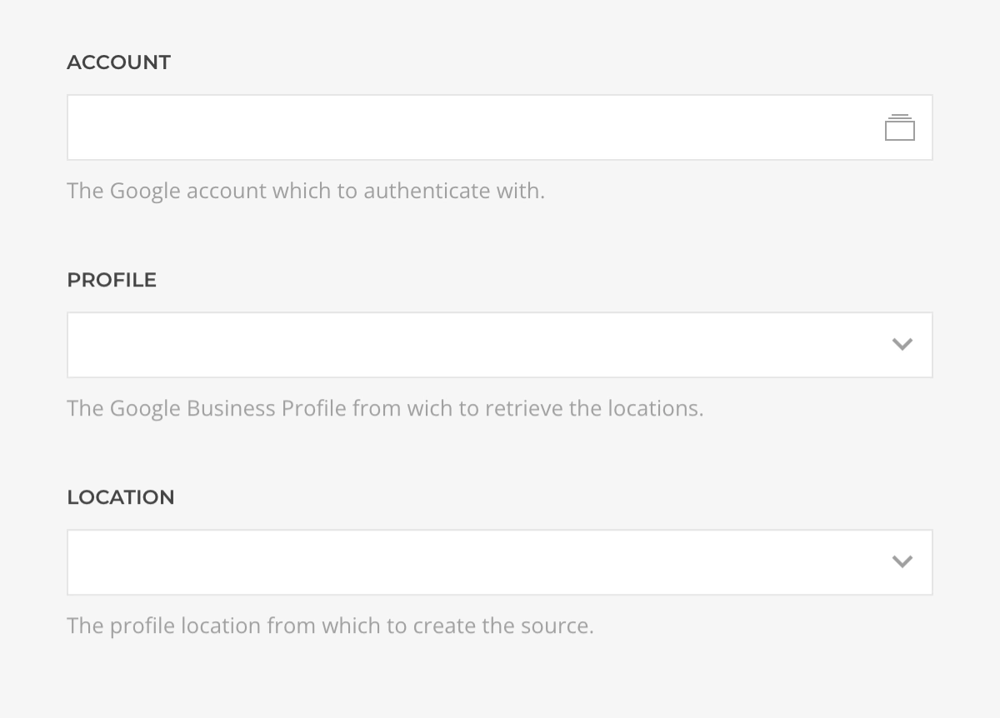

| Setting    | Description                                                           |
| ---------- | --------------------------------------------------------------------- |
| _Account_  | The Google Account which to authenticate with.                        |
| _Profile_  | The Google Business Profile from which to retrieve the locations.     |
| _Location_ | The Google Business Profile location from which to create the source. |

## Location Query

Fetches a single location from the profile resolving to a [Location Type](#location-type).

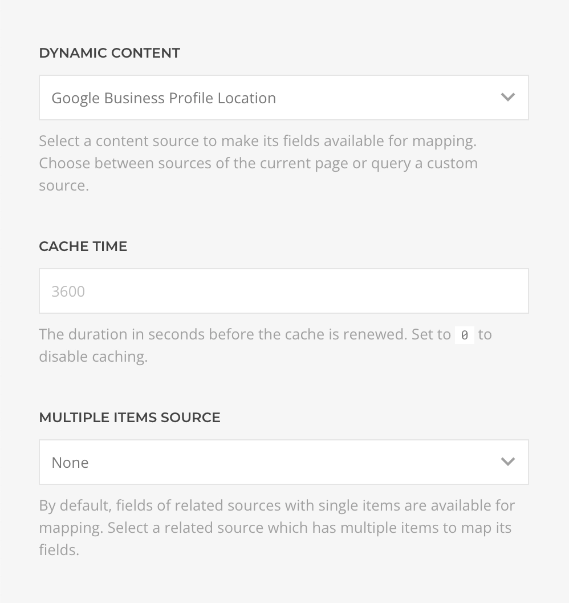

| Setting                           | Description                                                                        | Default |
| --------------------------------- | ---------------------------------------------------------------------------------- | ------- |
| _Cache_                           | The duration in seconds before the cache is invalidated and the query re-executed. | `3600`  |
| _Multiple Items_                  |
| -- [Business Hours](#period-type) | A subquery fetching this location open hours.                                      |
| -- [Special Hours](#period-type)  | A subquery fetching this location special hours.                                   |

## Review Query

Fetches a single review from the profile location resolving to a [Review Type](#review-type).

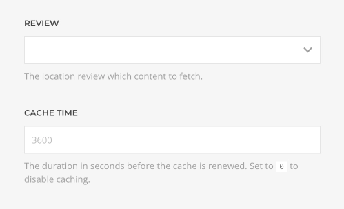

| Setting  | Description                                                                        | Default | Dynamic  |
| -------- | ---------------------------------------------------------------------------------- | ------- | :------: |
| _Review_ | The location review which content to fetch.                                        |         | &#x2713; |
| _Cache_  | The duration in seconds before the cache is invalidated and the query re-executed. | `3600`  |

## Reviews Query

Fetches reviews from the profile location resolving to a list of [Review Type](#review-type).

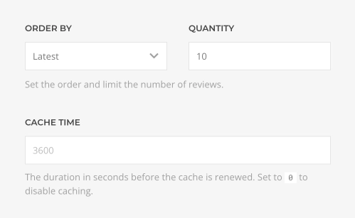

| Setting    | Description                                                                                    | Default  | Dynamic  |
| ---------- | ---------------------------------------------------------------------------------------------- | -------- | :------: |
| _Order By_ | The order by which to fetch the reviews, _Latest_, _Rating Ascending_, or _Rating Descending_. | `Latest` |
| _Quantity_ | The maximum amount of reviews to fetch.                                                        | `10`     | &#x2713; |
| _Cache_    | The duration in seconds before the cache is invalidated and the query re-executed.             | `3600`   |

## Media Query

Fetches media from the profile location resolving to a list of [Media Type](#media-type).

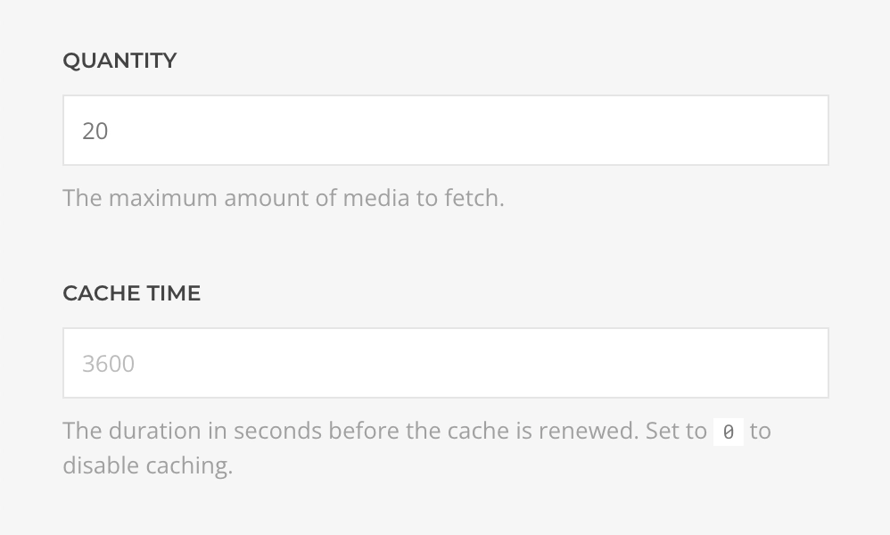

| Setting    | Description                                                                        | Default | Dynamic  |
| ---------- | ---------------------------------------------------------------------------------- | ------- | :------: |
| _Quantity_ | The maximum amount of media to fetch.                                              | `20`    | &#x2713; |
| _Cache_    | The duration in seconds before the cache is invalidated and the query re-executed. | `3600`  |

## Posts Query

Fetches posts from the profile location resolving to a list of [Post Type](#post-type).

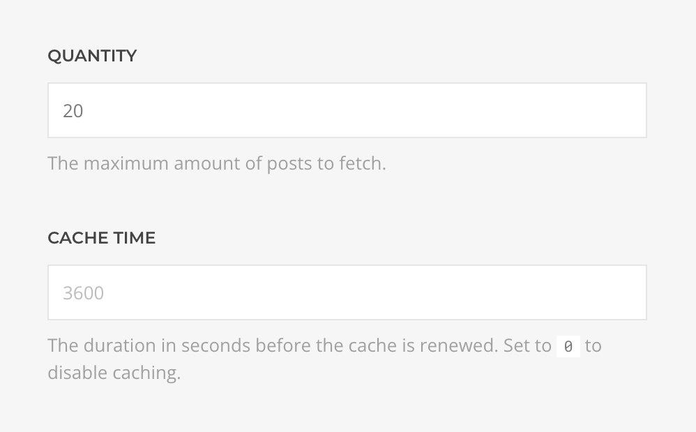

| Setting    | Description                                                                        | Default | Dynamic  |
| ---------- | ---------------------------------------------------------------------------------- | ------- | :------: |
| _Quantity_ | The maximum amount of posts to fetch.                                              | `20`    | &#x2713; |
| _Cache_    | The duration in seconds before the cache is invalidated and the query re-executed. | `3600`  |

## Location Type

Defines the mapping options of a Google Business Profile Location object.

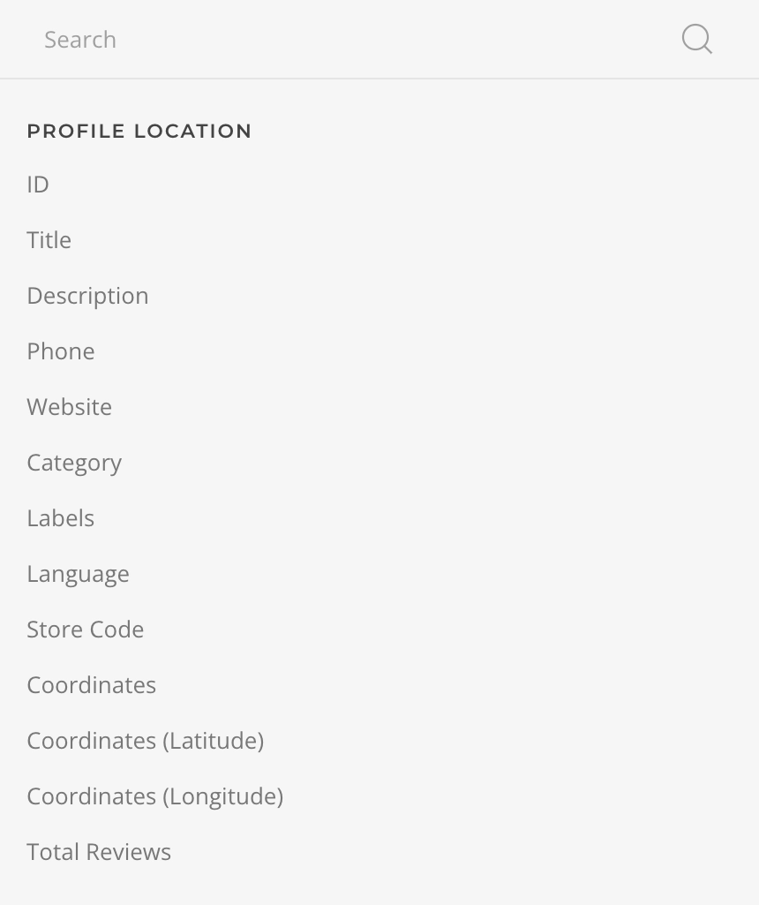

| Option                 | Description                                                                                                   | Type                                   | Filters |
| ---------------------- | ------------------------------------------------------------------------------------------------------------- | -------------------------------------- | ------- |
| _ID_                   | The unique identifier of this location.                                                                       | _String_                               |
| _Title_                | The title of this location.                                                                                   | _String_                               | _Limit_ |
| _Description_          | The description of this location.                                                                             | _String_                               | _Limit_ |
| _Phone_                | The primary phone number of this location.                                                                    | _String_                               |
| _Website_              | The website of this location.                                                                                 | _String_                               |
| _Category_             | The primary category that describes this location business.                                                   | _String_                               |
| _Labels_               | The free-form tags of this location, separated by a comma.                                                    | _String_                               |
| _Language_             | The language of this location.                                                                                | _String_                               |
| _Store Code_           | The external identifier for this location.                                                                    | _String_                               |
| _Coordinates_          | The latitude and longitude for this location, separated by a comma.                                           | _String_                               |
| _Latitude_             | The latitude for this location.                                                                               | _String_                               |
| _Longitude_            | The longitude for this location.                                                                              | _String_                               |
| _Total Reviews_        | The number of reviews for this location.                                                                      | _Int_                                  |
| _Average Rating_       | The average star rating of all reviews for this location on a scale of 1 to 5, where 5 is the highest rating. | _Int_                                  |
| _Reviews URI_          | The Google URI pointing to this location reviews.                                                             | _String_                               |
| _New Review URI_       | The Google URI pointing to a form where a new review for this location can be posted.                         | _String_                               |
| _Google Maps URI_      | The Google Maps URI pointing to this location.                                                                | _String_                               |
| _Google Maps Place ID_ | The Google Maps Place ID for this location.                                                                   | _String_                               |
| _Address_              | The address for this location.                                                                                | [Postal Address](#postal-address-type) |

## Review Type

Defines the mapping options of a Google Business Profile Location Review object.

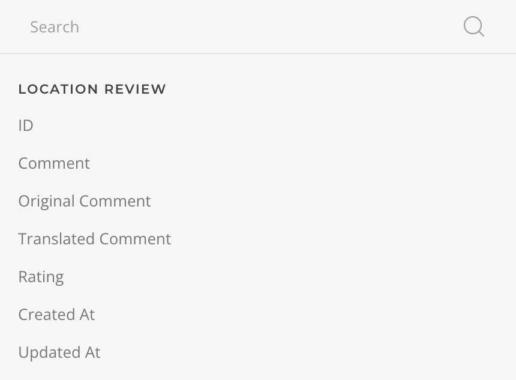

| Option               | Description                                                           | Type                                    | Filters |
| -------------------- | --------------------------------------------------------------------- | --------------------------------------- | ------- |
| _ID_                 | The unique identifier of this location.                               | _String_                                |
| _Comment_            | The body of this review comment as plain text with markups.           | _String_                                | _Limit_ |
| _Original Comment_   | The comment of this review without translation.                       | _String_                                | _Limit_ |
| _Translated Comment_ | The translated comment of this review.                                | _String_                                | _Limit_ |
| _Star Rating_        | The star rating given by this review where five is the highest rated. | _Int_                                   |
| _Created At_         | The date this review was created.                                     | _String_                                | _Date_  |
| _Updated At_         | The date this review was last modified.                               | _String_                                | _Date_  |
| _Reply_              | The owner/manager of this location's reply to this review.            | [Review Reply Type](#review-reply-type) |
| _Reviewer_           | The author of this review.                                            | [Reviewer Type](#reviewer-type)         |

## Review Reply Type

Defines the mapping options of a Google Business Profile Review Reply object.

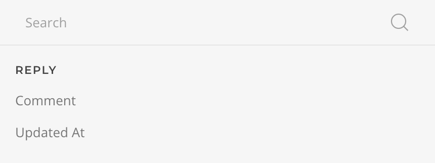

| Option       | Description                                        | Type     | Filters |
| ------------ | -------------------------------------------------- | -------- | ------- |
| _Comment_    | The body of this reply as plain text with markups. | _String_ | _Limit_ |
| _Updated At_ | The date this reply was last modified.             | _String_ | _Date_  |

## Reviewer Type

Defines the mapping options of a Google Business Profile Reviewer object.

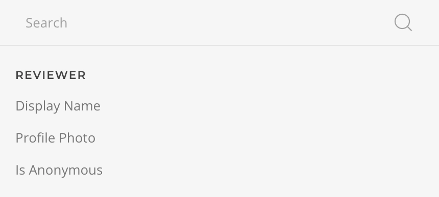

| Option              | Description                                                                                 | Type      |
| ------------------- | ------------------------------------------------------------------------------------------- | --------- |
| _Display Name_      | The name of the reviewer, only populated with the reviewer's real name if is not anonymous. | _String_  |
| _Profile Photo URL_ | The path to the locally cached reviewer profile photo.                                      | _String_  |
| _Is Anonymous_      | Indicates whether the reviewer has opted to remain anonymous.                               | _Boolean_ |

## Post Type

Defines the mapping options of a Google Business Profile Post object.

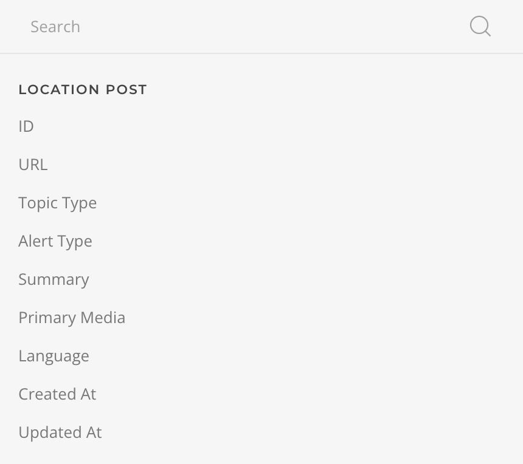

| Option               | Description                                                           | Type     | Filters |
| -------------------- | --------------------------------------------------------------------- | -------- | ------- |
| _ID_                 | The unique identifier of this post.                                   | _String_ |
| _URL_                | The link to the post in Google search.                                | _String_ |
| _Topic Type_         | The topic type of the post, _STANDARD_, _EVENT_, _OFFER_, or _ALERT_. | _String_ |
| _Summary_            | The description/body of the post.                                     | _String_ |
| _Primary Media URL_  | The path to the locally cached post primary media thumbnail.          | _String_ |
| _Language_           | The language of the post.                                             | _String_ |
| _Created At_         | The date this post was created.                                       | _String_ | _Date_  |
| _Updated At_         | The date this post was last modified.                                 | _String_ | _Date_  |
| _Offer_              |
| _Coupon Code_        | Offer code that is usable in store or online.                         | _String_ |
| _Redeem Online URL_  | Online link to redeem this offer.                                     | _String_ |
| _Terms & Conditions_ | Terms and conditions of this offer.                                   | _String_ |

## Media Type

Defines the mapping options of a Google Business Profile Media object.

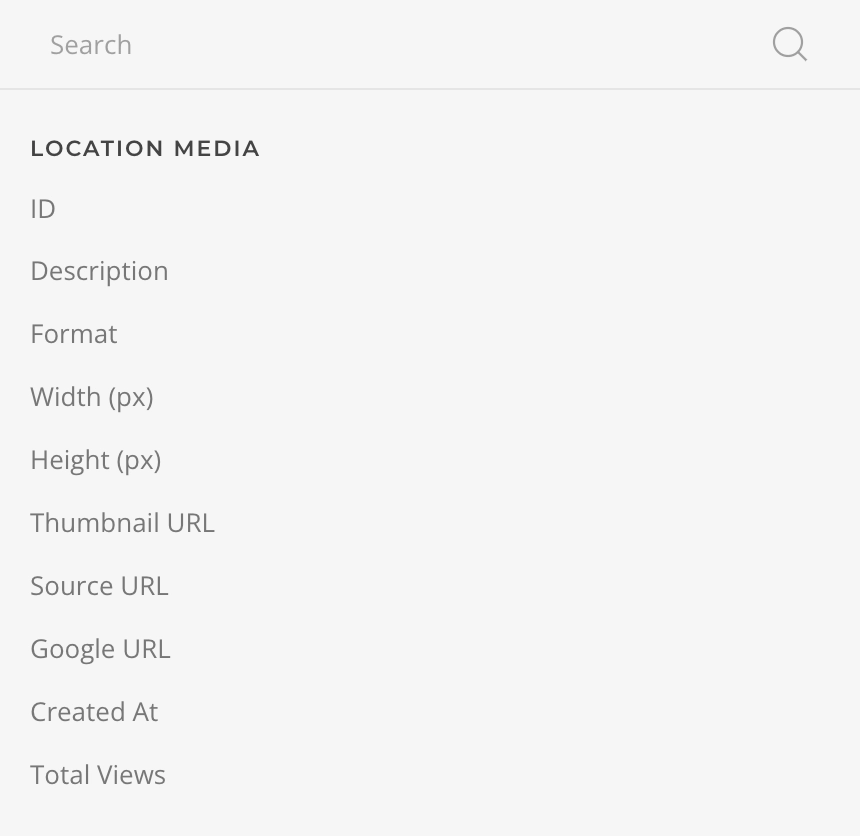

| Option                 | Description                                                                                                                                                  | Type     | Filters |
| ---------------------- | ------------------------------------------------------------------------------------------------------------------------------------------------------------ | -------- | ------- |
| _ID_                   | The unique identifier of this media.                                                                                                                         | _String_ |
| _Description_          | The description of this media.                                                                                                                               | _String_ | _Limit_ |
| _Format_               | The format of this media, _PHOTO_, _VIDEO_, OR _MEDIA_FORMAT_UNSPECIFIED_.                                                                                   | _String_ |
| _Width_                | The width of the media, in pixels.                                                                                                                           | _String_ |
| _Height_               | The height of the media, in pixels.                                                                                                                          | _String_ |
| _Thumbnail URL_        | The path to the locally cached media thumbnail.                                                                                                              | _String_ |
| _Source URL_           | A publicly accessible URL where the media can be retrieved from.                                                                                             | _String_ |
| _Google URL_           | The Google-hosted URL for this media. For video this will be a preview image with an overlaid play icon.                                                     | _String_ |
| _Created At_           | The date this media was created.                                                                                                                             | _String_ | _Date_  |
| _Total Views_          | The number of times this media has been viewed.                                                                                                              | _Int_    |
| _Attribution_          |
| _Profile Name_         | The name of the attributed user.                                                                                                                             | _String_ |
| _Profile URL_          | The URL of the attributed user's Google Maps profile page.                                                                                                   | _String_ |
| _Profile Photo URL_    | The path to the locally cached attributed user's profile photo thumbnail.                                                                                    | _String_ |
| _Location Association_ |
| _Category_             | The [category](https://developers.google.com/my-business/reference/rest/v4/accounts.locations.media#MediaItem.Category) that this location photo belongs to. | _String_ |
| _Price List Item ID_   | The ID of a price list item that this location media is associated with.                                                                                     | _String_ |

## Period Type

Defines the mapping options of a Google Business Profile time period object.

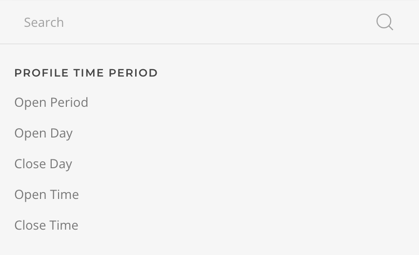

| Option        | Description                                                                                                                      | Type     | Filters |
| ------------- | -------------------------------------------------------------------------------------------------------------------------------- | -------- | ------- |
| _Open Period_ | The current period during which the location is open, formated as `{start time} - {end time}` with a custom time format setting. | _String_ |
| _Open Day_    | The day of the week this period starts on.                                                                                       | _String_ |
| _Close Day_   | The day of the week this period ends on.                                                                                         | _String_ |
| _Open Time_   | The time this period starts on.                                                                                                  | _String_ | _Time_  |
| _Close Time_  | The time this period ends on.                                                                                                    | _String_ | _Time_  |

## Postal Address Type

Defines the mapping options of a Google Business Profile Postal Address object.

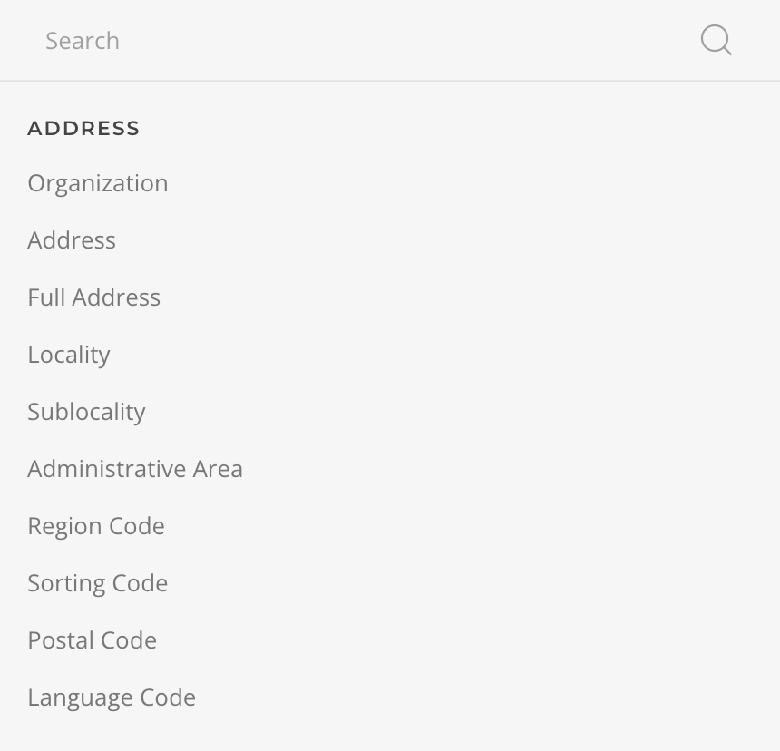

| Option                | Description                                                                                       | Type     |
| --------------------- | ------------------------------------------------------------------------------------------------- | -------- |
| _Organization_        | The name of the organization for this address.                                                    | _String_ |
| _Address_             | The address lines separated by comma.                                                             | _String_ |
| _Address Full_        | The address lines with postal, locality and area separated by comma.                              | _String_ |
| _Locality_            | The city/town portion of this address.                                                            | _String_ |
| _Sublocality_         | The sublocality of this address, this can be neighborhoods, boroughs, districts.                  | _String_ |
| _Administrative Area_ | The highest administrative subdivision which is used for postal addresses of a country or region. | _String_ |
| _Region Code_         | The CLDR region code of the country/region of this address.                                       | _String_ |
| _Sorting Code_        | The country-specific sorting code, if applicable.                                                 | _String_ |
| _Postal Code_         | The postal code of this address, if applicable.                                                   | _String_ |
| _Language Code_       | The BCP-47 language code of the contents of this address.                                         | _String_ |
