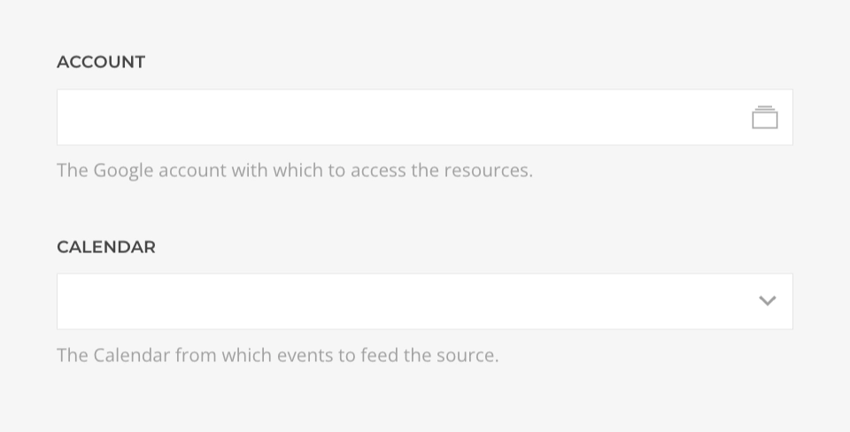

# Google Calendar Source Provider

    <!--@include: @essentials-for-yootheme-pro/assets/brands/google-calendar.svg-->

The **Google Calendar Source** feeds data from [Google Calendar](https://calendar.google.com/) supporting [Calendar](#calendar-query), [Event](#event-query) and [Events](#events-query) queries.

## Settings

<!--@include: ./_partials/common-provider-settings.md-->

| Setting    | Description                                               |
| ---------- | --------------------------------------------------------- |
| _Account_  | The Google account which to authenticate with.            |
| _Calendar_ | The Google calendar which data to create the source with. |

## Calendar Query

Fetches the Calendar data resolving to a [Calendar Type](#calendar-type).

| Setting | Description                                                                        | Default |
| ------- | ---------------------------------------------------------------------------------- | ------- |
| _Cache_ | The duration in seconds before the cache is invalidated and the query re-executed. | `3600`  |

## Event Query

Fetches a single event from the calendar and resolves to a [Event Type](#event-type).

| Setting    | Description                                                                        | Default | Dynamic  |
| ---------- | ---------------------------------------------------------------------------------- | ------- | :------: |
| _Event ID_ | The ID of the event to query.                                                      |         | &#x2713; |
| _Cache_    | The duration in seconds before the cache is invalidated and the query re-executed. | `3600`  |

## Events Query

Fetches events from the calendar and resolves to a list of [Event Type](#event-type).

| Setting          | Description                                                                                                                                                                                                                                                                                | Default   | Dynamic  |
| ---------------- | ------------------------------------------------------------------------------------------------------------------------------------------------------------------------------------------------------------------------------------------------------------------------------------------ | --------- | :------: |
| _Query_          | Optionaly filter matching terms in the summary, description, location, attendee\'s displayName and attendee\'s email fields.                                                                                                                                                               |           | &#x2713; |
| _Time Min / Max_ | Lower and Upper bounds (exclusive) for an event\'s start or end time to filter by. Can be date without time, e.g. 2011-06-03 formated as `Y-m-d`, in which case the current time will be appended, or a timestamp with time zone offset, e.g. `2011-06-03T10:00:00-07:00` formated as `c`. |           | &#x2713; |
| _Order By_       | The order by which to query the events. _Start Time_, by event start date/time (ascending) or _Updated_, by event last modification time (ascending). The default is an unspecified, stable order.                                                                                         | `Default` |
| _Quantity_       | The maximum amount of events to query, cannot be higher than `2500`.                                                                                                                                                                                                                       | `250`     | &#x2713; |
| _Cache_          | The duration in seconds before the cache is invalidated and the query re-executed.                                                                                                                                                                                                         | `3600`    |

## Calendar Type

Defines the mapping options of a Google Calendar object.

| Option        | Description                                         | Type     | Filters |
| ------------- | --------------------------------------------------- | -------- | ------- |
| _ID_          | Unique identifier of the calendar.                  | _String_ |
| _Summary_     | Title of the calendar.                              | _String_ | _Limit_ |
| _Description_ | Description of the calendar.                        | _String_ | _Limit_ |
| _Location_    | Geographic location of the event as free-form text. | _String_ | _Limit_ |
| _Time Zone_   | The calendars default time zone.                    | _String_ |

## Event Type

Defines the mapping options of a Google Calendar Event object.

| Option        | Description                                                                                                   | Type                                | Filters |
| ------------- | ------------------------------------------------------------------------------------------------------------- | ----------------------------------- | ------- |
| _ID_          | Opaque identifier of the event.                                                                               | _String_                            |
| _URL_         | An absolute link to the event in the Google Calendar Web UI.                                                  | _String_                            |
| _Type_        | Specific type of the event, `default`, `outOfOffice`, `focusTime` or `workingLocation`.                       | _String_                            |
| _Status_      | Status of the event, `confirmed`, `tentative` or `cancelled`. -                                               | _String_                            |
| _Visibility_  | Visibility of the event, `default`, `public`, `private`, or `confidential\*                                   | _String_                            |
| _Summary_     | Title of the event.                                                                                           | _String_                            | _Limit_ |
| _Description_ | Description of the calendar.                                                                                  | _String_                            | _Limit_ |
| _Location_    | Geographic location of the event as free-form text.                                                           | _String_                            | _Limit_ |
| _Start_       | The (inclusive) start time of the event. For a recurring event, this is the start time of the first instance. | _String_                            | _Date_  |
| _End_         | The (exclusive) end time of the event. For a recurring event, this is the end time of the first instance.     | _String_                            | _Date_  |
| _Created_     | Creation time of the event.                                                                                   | _String_                            | _Date_  |
| _Updated_     | Last modification time of the event.                                                                          | _String_                            | _Date_  |
| _Creator_     | The creator of the event.                                                                                     | [Profile Type](#profile-type)       |
| _Organizer_   | The organizer of the event.                                                                                   | [Profile Type](#profile-type)       |
| _Attendees_   | The attendees of the event.                                                                                   | [Attendee Type](#attendee-type)     |
| _Attachments_ | File attachments of the event.                                                                                | [Attachment Type](#attachment-type) |

## Profile Type

Defines the mapping options of a Google Calendar Profile object.

| Option  | Description                | Type     | Filters |
| ------- | -------------------------- | -------- | ------- |
| _ID_    | Identifier of the profile. | _String_ |
| _Email_ | The profile's email.       | _String_ |
| _Name_  | The profile's name.        | _String_ | _Limit_ |

## Attendee Type

Defines the mapping options of a Google Calendar Attendee object.

| Option                    | Description                                                                           | Type      | Filters |
| ------------------------- | ------------------------------------------------------------------------------------- | --------- | ------- |
| _ID_                      | Identifier of the attendee.                                                           | _String_  |
| _Email_                   | The attendee's email.                                                                 | _String_  |
| _Name_                    | The attendee's name.                                                                  | _String_  | _Limit_ |
| _Comment_                 | The attendee's name.                                                                  | _String_  | _Limit_ |
| _Response Status_         | The attendee's response status, `needsAction`, `declined`, `tentative` or `accepted`. | _String_  |
| _Is Organizer_            | Whether the attendee is the organizer of the event.                                   | _Boolean_ |
| _Is Resource_             | Whether the attendee is a resource.                                                   | _Boolean_ |
| _Is Optional_             | Whether this is an optional attendee.                                                 | _Boolean_ |
| _Additional Guests Count_ | Number of additional guests.                                                          | _Int_     |

## Attachment Type

Defines the mapping options of a Google Calendar Attachment object.

| Option      | Description                                        | Type     | Filters |
| ----------- | -------------------------------------------------- | -------- | ------- |
| _ID_        | Identifier of the attached file.                   | _String_ |
| _Title_     | Title of the attachment.                           | _String_ | _Limit_ |
| _Mime Type_ | Internet media type (MIME type) of the attachment. | _String_ |
| _File URL_  | URL link to the attachment.                        | _String_ |
| _Icon URL_  | URL link to the attachment's icon.                 | _String_ |
