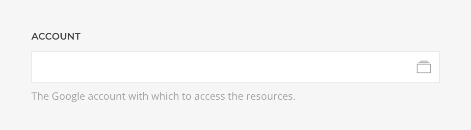

# Google Photos Source Provider

    <!--@include: @essentials-for-yootheme-pro/assets/brands/google-photos.svg-->

The **Google Photos Source** feeds media from [Google Photos](https://photos.google.com/) supporting [Album](#album-query), [Albums](#albums-query) and [Album Media](#album-media-query) queries.

::: warning Deprecated Source
Due to [recent changes](https://developers.google.com/photos/support/updates) in the Google Photos API, third-party access to media is no longer permitted. After evaluating all available options and potential workarounds, we regret to announce that the Google Photos integration is now deprecated and will no longer be maintained.
:::

## Settings

<!--@include: ./_partials/common-provider-settings.md-->

| Setting   | Description                                    |
| --------- | ---------------------------------------------- |
| _Account_ | The Google account which to authenticate with. |

## Album Query

Fetches a single album resolving to a [Album Type](#album-type).

| Setting    | Description                                                                        | Default | Dynamic  |
| ---------- | ---------------------------------------------------------------------------------- | ------- | :------: |
| _Album ID_ | The ID of the album to query.                                                      |         | &#x2713; |
| _Cache_    | The duration in seconds before the cache is invalidated and the query re-executed. | `3600`  |

## Album Media Query

Fetches media from a single album resolving to a list of [Media Type](#media-type).

| Setting    | Description                                                                        | Default       | Dynamic  |
| ---------- | ---------------------------------------------------------------------------------- | ------------- | :------: |
| _Album ID_ | The ID of the album to query.                                                      |               | &#x2713; |
| _Type_     | The media type which to query, _All_, _Images_ or _Videos_.                        | `All`         |
| _Order By_ | The order by which to query the media _Date (desc)_ or _Date (asc)_.               | `Date (desc)` |
| _Start_    | The offset applied to the query.                                                   | `1`           | &#x2713; |
| _Quantity_ | The limit applied to the query.                                                    | `20`          | &#x2713; |
| _Cache_    | The duration in seconds before the cache is invalidated and the query re-executed. | `3600`        |

## Albums Query

Fetches all albums from the library resolving to a list of [Album Type](#album-type).

| Setting | Description                                                                        | Default |
| ------- | ---------------------------------------------------------------------------------- | ------- |
| _Cache_ | The duration in seconds before the cache is invalidated and the query re-executed. | `3600`  |

## Album Type

Defines the mapping options of a Google Photos Album object.

| Option              | Description                      | Type     | Filters |
| ------------------- | -------------------------------- | -------- | ------- |
| _ID_                | Unique identifier of the album.  | _String_ |
| _Title_             | Title of the album.              | _String_ | _Limit_ |
| _Cover Photo URL_   | The album cover photo URL.       | _String_ |
| _Total Media Count_ | The album total amount of media. | _Int_    |

## Media Type

Defines the mapping options of a Google Photos Media object.

| Option        | Description                                                                                              | Type     | Filters |
| ------------- | -------------------------------------------------------------------------------------------------------- | -------- | ------- |
| _ID_          | Opaque identifier of the media.                                                                          | _String_ |
| _URL_         | The path to the locally cached media file, with optionall arguments `Width` and `Height` .               | _String_ |
| _Description_ | Description of the media. This is shown to the user in the item's info section in the Google Photos app. | _String_ | _Limit_ |
| _Filename_    | Filename of the media. This is shown to the user in the item's info section in the Google Photos app.    | _String_ |
| _MIME Type_   | MIME type of the media. For example, `image/jpeg`.                                                       | _String_ |

## Metadata Type

Defines the mapping options of a Google Photos Metadata object.

| Option          | Description                                                                        | Type     |
| --------------- | ---------------------------------------------------------------------------------- | -------- |
| _Width_         | Original width (in pixels) of the media.                                           | _Int_    |
| _Height_        | Original height (in pixels) of the media.                                          | _Int_    |
| _Creation Time_ | Time when the media was first created (not when it was uploaded to Google Photos). | _String_ |
| _Camera Brand_  | Brand of the camera with which the photo was taken.                                | _String_ |
| _Camera Model_  | Model of the camera with which the photo was taken.                                | _String_ |
| _Frame Rate_    | Frame rate of the media in case is a video.                                        | _Int_    |
| _Camera ISO_    | ISO of the camera with which the photo was taken.                                  | _Int_    |
| _Focal Length_  | Focal length of the camera lens with which the photo was taken.                    | _Int_    |
| _Aperture F_    | Aperture f number of the camera lens with which the photo was taken.               | _Int_    |
| _Exposure Time_ | Exposure time of the camera aperture in seconds when the photo was taken.          | _String_ |
