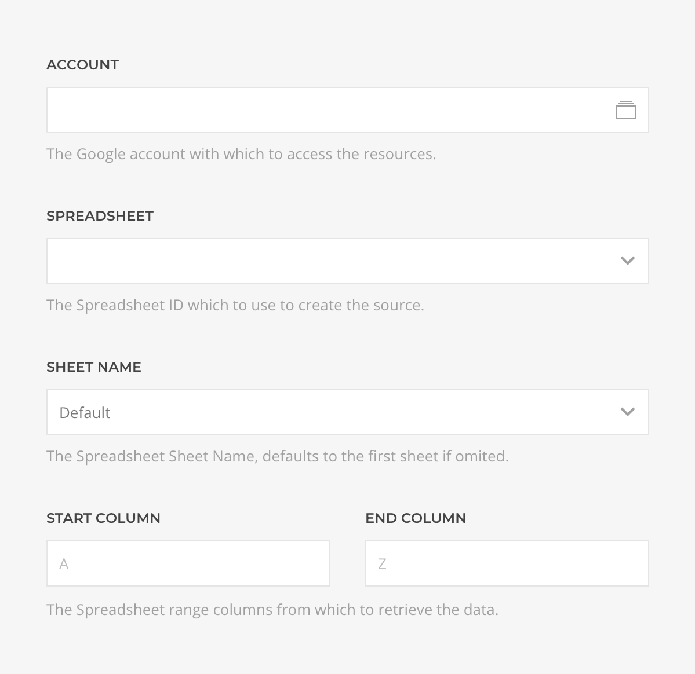
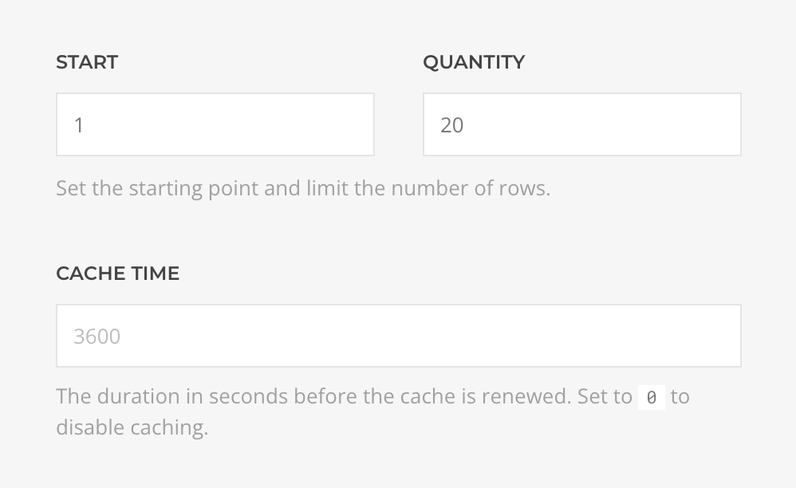

# Google Sheets Source Provider

    <!--@include: ../assets/provider-google-sheets.svg-->

The **Google Sheets Source** feeds data from [Google Sheets](https://www.google.com/sheets) supporting [Records](#records-query) query.

## Settings

<!--@include: ./_partials/common-provider-settings.md-->

| Setting        | Default   | Description                                                 | Required |
| -------------- | --------- | ----------------------------------------------------------- | :------: |
| _Account_      |           | The Google Account which to authenticate with.              | &#x2713; |
| _Spreadsheet_  |           | The spreadsheet which to retrieve the data from.            | &#x2713; |
| _Sheet_        | `Default` | The spreadsheet sheet which data to create the source with. |
| _Start Column_ | `A`       | The starting column to restrict the sheet data with.        |
| _End Column_   | `Z`       | The ending column to restrict the sheet data with.          |

## Records Query

Fetches records from the spreadsheet and resolves to a dynamically generated list of record type based on the sheet schema.

| Setting    | Default | Description                                                                        |
| ---------- | ------- | ---------------------------------------------------------------------------------- |
| _Start_    | `1`     | The offset applied to the query.                                                   |
| _Quantity_ | `20`    | The limit applied to the query.                                                    |
| _Cache_    | `3600`  | The duration in seconds before the cache is invalidated and the query re-executed. |
