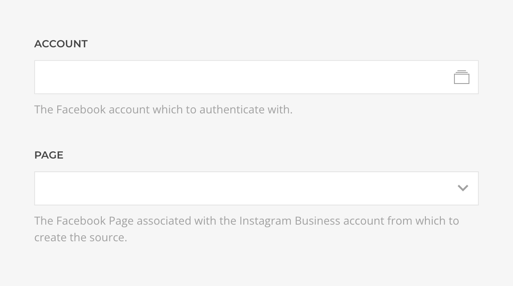
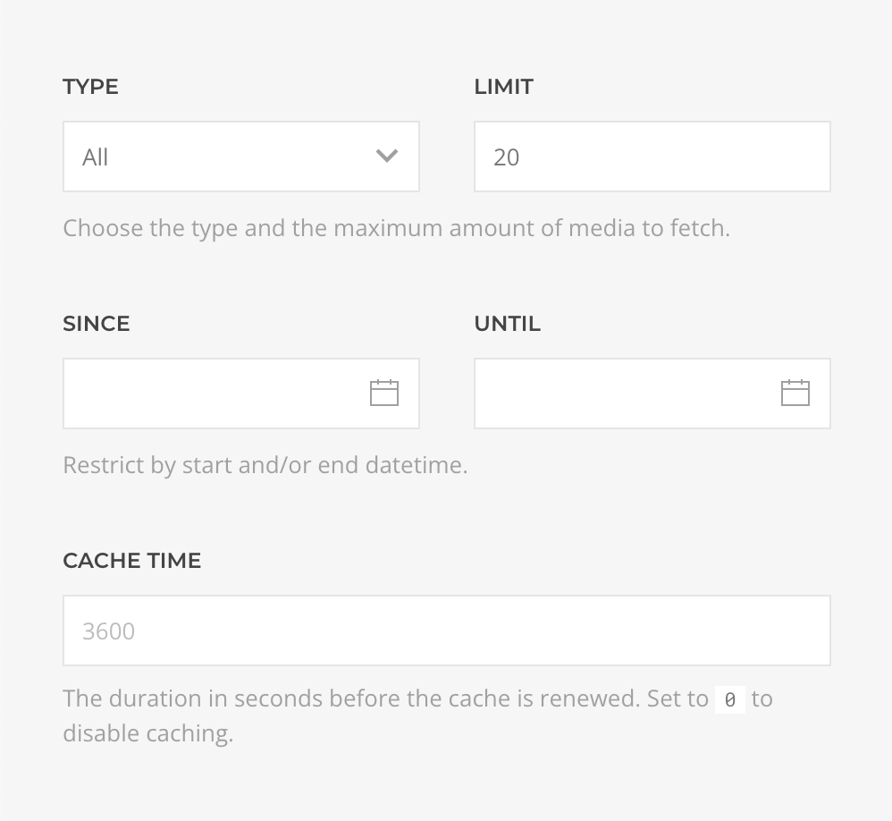
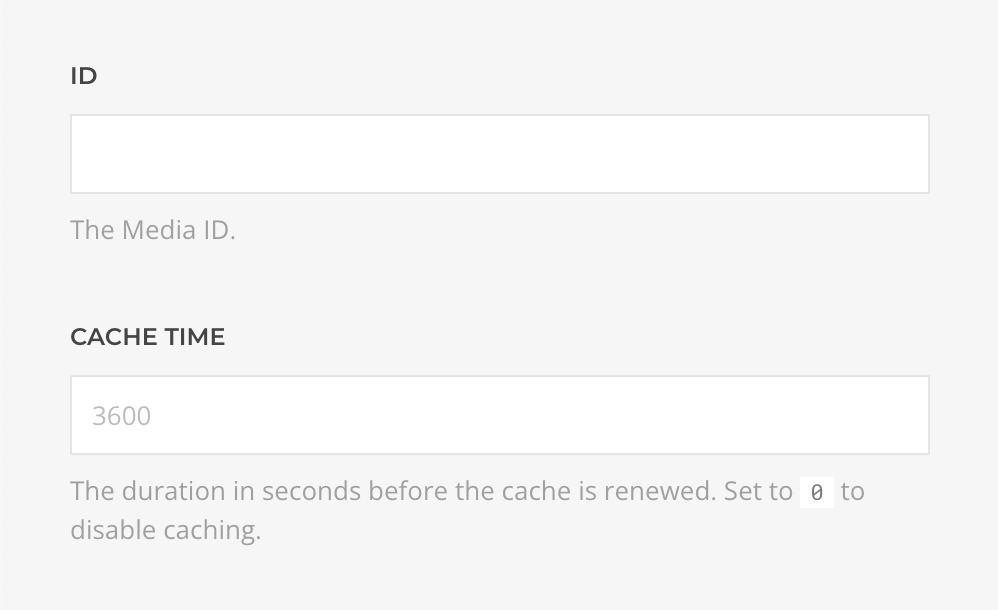
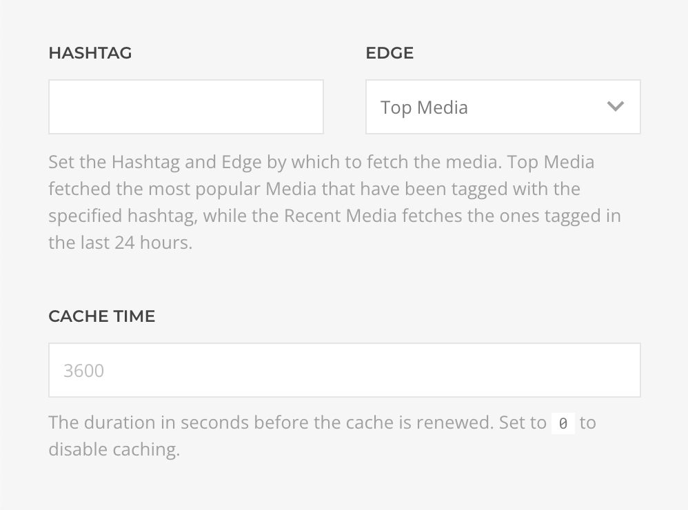
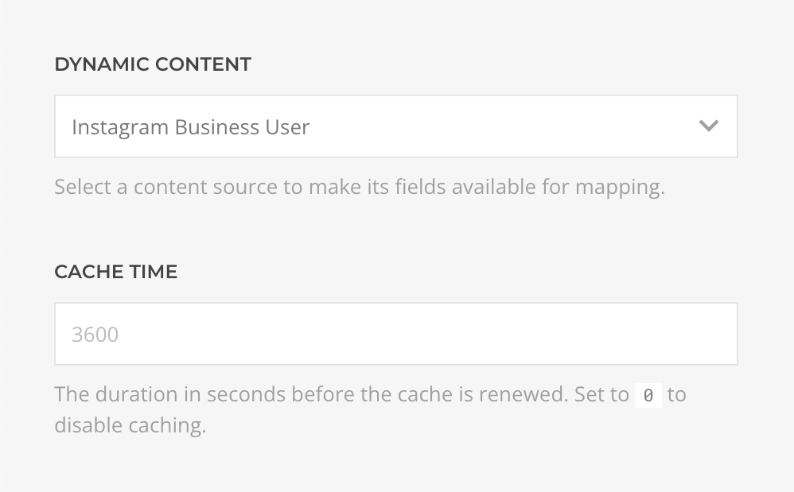
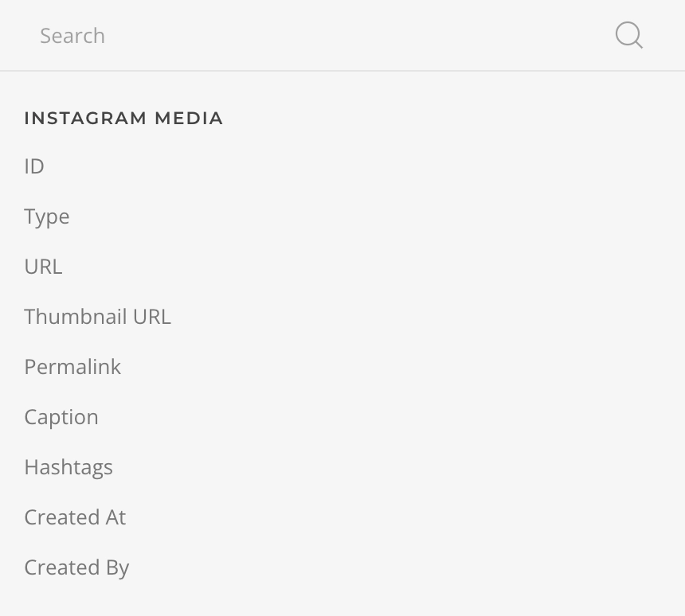
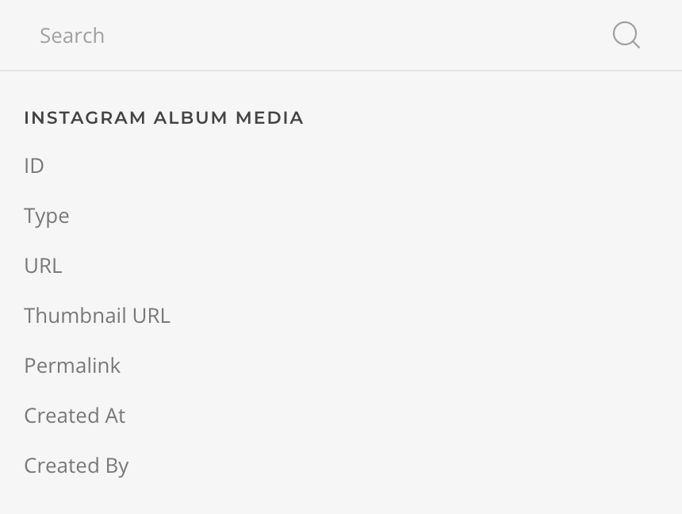
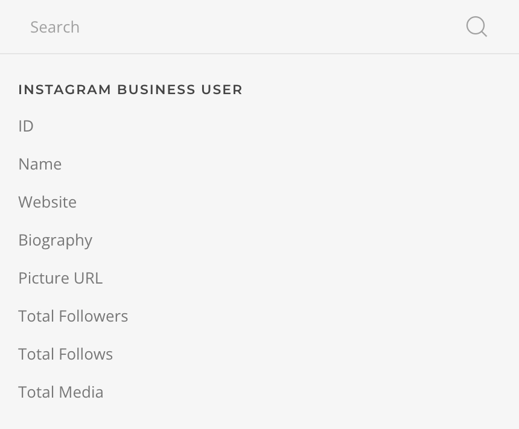

# Instagram Source Provider

    <!--@include: @essentials-for-yootheme-pro/assets/brands/instagram.svg-->

The **Instagram Source** feeds data from Personal and Business [Instagram](https://www.instagram.com/) accounts supporting [Media](#media-query), [Media Single](#media-single-query), [Hashtagged Media](#hashtagged-media-query) and [User](#user-query) queries.

## Settings

<!--@include: ./_partials/common-provider-settings.md-->

| Setting | Description |
| --- | --- |
| *Account* | The Instagram Account which to authenticate with. |
| *Page* | The Facebook Page associated with the Instagram Business account. Not applicable for Instagram Personal. |

## Media Query

Fetches media from the authenticated account and resolves to a list of [Media Type](#media-type).

| Setting | Description | Default | Dynamic |
| --- | --- | --- | :---: |
| *Type* | The type of media to fetch, _All_, _Image_, or _Video_. | `All` |
| *Offset* | The offset media to fetch. | `0` |  &#x2713; |
| *Limit* | The maximum amount of media to fetch. | `20` | &#x2713; |
| *Since/Until* | The `start` and/or `end` datetime the fetched media will be restricted to. | |  &#x2713; |
| *Cache* | The duration in seconds before the cache is invalidated and the query re-executed. | `3600` |

## Media Single Query

Fetches a single media from the authenticated account and resolves to a [Media Type](#media-type).

| Setting | Description | Default | Dynamic |
| --- | --- | --- | :---: |
| *ID* | Unique identifier of the media to retrieve. | | &#x2713; |
| *Cache* | The duration in seconds before the cache is invalidated and the query re-executed. | `3600` |

If the Media is of Album Type you can fetch it media with the Multi Items query which resolves to a list of [Album Media Type](#album-media-type).

| Setting | Description | Default | Dynamic |
| --- | --- | --- | :---: |
| *ID* | Unique identifier of the media to retrieve. | | &#x2713; |
| *Cache* | The duration in seconds before the cache is invalidated and the query re-executed. | `3600` |

### Hashtagged Media Query

Fetches top and recent hashtagged media from the authenticated business account and resolves to a list of [Media Type](#media-type).

| Setting | Description | Default | Dynamic |
| --- | --- | --- | :---: |
| *Hashtag* | The hashtag to query for. | | &#x2713; |
| *Edge* | Should the query look for _Top Media_ or _Recent Media_ hashtagged with. | `Top` |
| *Cache* | The duration in seconds before the cache is invalidated and the query re-executed. | `3600` |

::: warning Notice
Take into consideration that this query is available for Instagram **Business** Accounts only and that the API imposes the following limitations:

- Only returns public photos and videos.
- Will not return promoted/boosted/ads media.
- Responses will not always be in chronological order.
- Maximum of 30 unique hashtags within a 7 day period.
:::

### User Query

Fetches the user profile from the authenticated account and resolves to a [User Type](#user-type).

| Setting | Default | Description |
| --- | --- | --- |
| *Cache* | The duration in seconds before the cache is invalidated and the query re-executed. | `0` |

::: warning Notice
This query is only available for Instagram Business Accounts
:::

## Media Type

| Option | Description | Type | Filters |
| --- | --- | --- | --- |
| *ID* | Unique identifier of this media. | *String* |
| *Type* | The type of this media, _Album_, _Image_, or _Video_. | *String* |
| *Media URL* | The path to the locally cached media asset. | *String* |
| *Media Preview URL* | The path to the locally cached media preview asset. | *String* |
| *Permalink* | The Instagram Media URL, e.g. `www.instagram.com/p/CO9O62hnpR5nkt`. | *String* |
| *Caption* | The caption content. | *String* | *Limit* |
| *Hashtags* | The media hashtags as a custom formated string with _Separator_ argument. | *String* |
| *Created At* | The time this media was created. | *String* | *Date* |
| *Created By* | The username of the user who created this media. | *String* |

| Business Only Options | Description | Type |
| --- | --- | --- |
| *Total Comments* | Number of comments made one this media. | *Int* |
| *Total Likes* | Number of user that liked this media. | *Int* |

## Album Media Type

| Option | Description | Type | Filters |
| --- | --- | --- | --- |
| *ID* | Unique identifier of this media. | *String* |
| *Type* | The type of this media, _Album_, _Image_, or _Video_. | *String* |
| *URL* | The path to the locally cached media asset. | *String* |
| *Thumbnail URL* | The path to the locally cached media thumbnail asset. | *String* |
| *Permalink* | The Instagram Media URL, e.g. `www.instagram.com/p/CO9O62hnpR5nkt`. | *String* |
| *Created At* | The time this media was created. | *String* | *Date* |
| *Created By* | The username of the user who created this media. | *String* |

## User Type

| Option | Description | Type | Filters |
| --- | --- | --- | --- |
| *ID* | Unique identifier of this user. | *String* |
| *Name* | The name of this user. | *String* |
| *Website* | The website of this user profile. | *String* |
| *Biography* | The biography of this user profile. | *String* | *Limit* |
| *Picture URL* | The profile picture URL of this user. | *String* |
| *Total Followers* | Number of Instagram users following this user. | *Int* |
| *Total Follows* | Number of Instagram users this user follows. | *Int* |
| *Total Media* | Number of Instagram Media published on this user. | *Int* |
