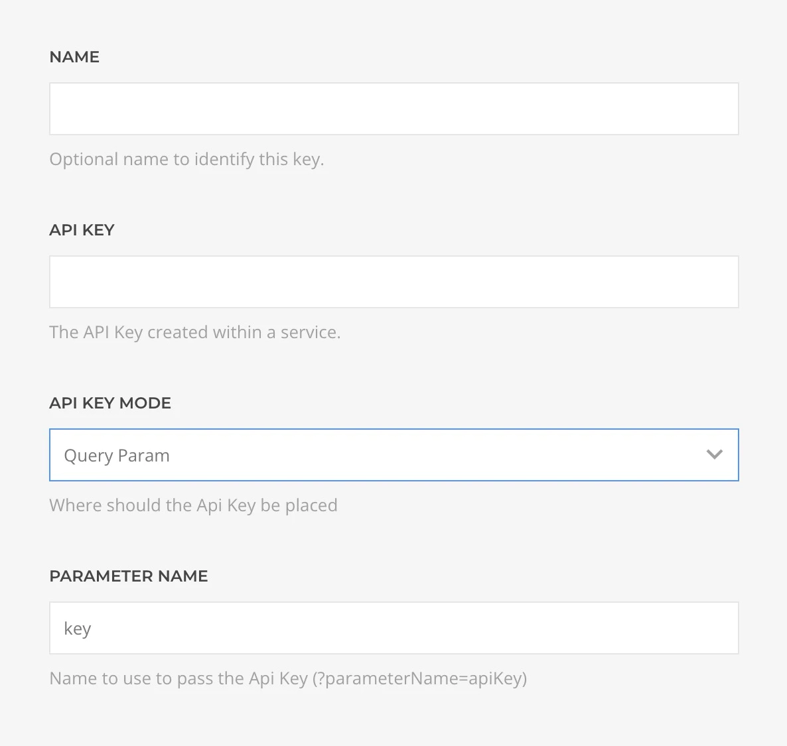

# Joomla API Source Provider

    <!--@include: ../assets/provider-joomla.svg-->

The **Joomla API Source** feeds data from [Joomla](https://www.joomla.org/) sites using the Joomla Web Services API, supporting [Article](#article-query), [Articles](#articles-query), [Category](#category-query), and [Categories](#categories-query) queries.

## Settings

<!--@include: ./_partials/common-provider-settings.md-->

| Setting | Description |
| --- | --- |
| *URL* | The base URL of the Joomla site API endpoint, e.g. `https://example.com/api/index.php/v1`. |
| *Requires Authentication* | Whether the API requires authentication. |
| *Authentication* | The authentication credentials to use. |

When authentication is enabled, you can specify the API key details:

| Setting | Description |
| --- | --- |
| *API Key* | The API Key created within a Joomla service. |
| *API Key Mode* | Where the key is set, in a header or in a query parameter. |
| *Parameter Name* | The name of the header or query parameter where the API key is set. |

## Article Query

Fetches a single article from the Joomla site and resolves to [Article Type](#article-type).

| Setting | Description | Default | Dynamic |
| --- | --- | --- | :---: |
| *Article ID* | The ID of the article to query. | | &#x2713; |
| *Cache* | The duration in seconds before the cache is invalidated and the query re-executed. | `3600` |

## Articles Query

Fetches articles from the Joomla site and resolves to a list of [Article Type](#article-type).

| Setting | Description | Default | Dynamic |
| --- | --- | --- | :---: |
| *Category ID* | Optional category ID to filter articles. | | &#x2713; |
| *Featured* | Filter by featured status: All, Featured only, or Not featured. | `All` |
| *State* | Filter by publication state: Published, Unpublished, Archived, or Trashed. | `Published` |
| *Start* | The offset applied to the query. | `0` | &#x2713; |
| *Limit* | The limit applied to the query. | `20` | &#x2713; |
| *Cache* | The duration in seconds before the cache is invalidated and the query re-executed. | `3600` |

## Category Query

Fetches a single category from the Joomla site and resolves to [Category Type](#category-type).

| Setting | Description | Default | Dynamic |
| --- | --- | --- | :---: |
| *Category ID* | The ID of the category to query. | | &#x2713; |
| *Cache* | The duration in seconds before the cache is invalidated and the query re-executed. | `3600` |

## Categories Query

Fetches categories from the Joomla site and resolves to a list of [Category Type](#category-type).

| Setting | Description | Default | Dynamic |
| --- | --- | --- | :---: |
| *Parent ID* | Optional parent category ID to filter categories. | | &#x2713; |
| *Level* | Optional level to filter categories. | | &#x2713; |
| *Start* | The offset applied to the query. | `0` | &#x2713; |
| *Limit* | The limit applied to the query. | `20` | &#x2713; |
| *Cache* | The duration in seconds before the cache is invalidated and the query re-executed. | `3600` |

## Article Type

Defines the mapping options of a Joomla Article object.

| Field | Description | Type | Filters |
| --- | --- | --- | --- |
| *ID* | The unique identifier of the article. | *String* |
| *Title* | The title of the article. | *String* | *Limit* |
| *Alias* | The URL-friendly alias of the article. | *String* |
| *Introtext* | The introduction text of the article. | *String* | *Limit* |
| *Fulltext* | The full text content of the article. | *String* | *Limit* |
| *State* | The publication state of the article (1 = published, 0 = unpublished, 2 = archived, -2 = trashed). | *Int* |
| *Category ID* | The ID of the category the article belongs to. | *String* |
| *Created* | The creation date and time of the article. | *String* | *Date* |
| *Created By* | The ID of the user who created the article. | *String* |
| *Created By Alias* | The alias of the article creator. | *String* |
| *Modified* | The last modification date and time of the article. | *String* | *Date* |
| *Modified By* | The ID of the user who last modified the article. | *String* |
| *Publish Up* | The start publishing date and time. | *String* | *Date* |
| *Publish Down* | The finish publishing date and time. | *String* | *Date* |
| *Hits* | The number of times the article has been viewed. | *Int* |
| *Featured* | Whether the article is featured (1 = featured, 0 = not featured). | *Int* |
| *Language* | The language code of the article. | *String* |
| *Metadata* | The article metadata. | [Metadata Type](#metadata-type) |
| *Images* | The article images data. | [Images Type](#images-type) |
| *URLs* | The article URLs data. | [URLs Type](#urls-type) |

## Category Type

Defines the mapping options of a Joomla Category object.

| Field | Description | Type | Filters |
| --- | --- | --- | --- |
| *ID* | The unique identifier of the category. | *String* |
| *Title* | The title of the category. | *String* | *Limit* |
| *Alias* | The URL-friendly alias of the category. | *String* |
| *Description* | The description of the category. | *String* | *Limit* |
| *Parent ID* | The ID of the parent category. | *String* |
| *Level* | The level of the category in the hierarchy. | *Int* |
| *Path* | The full path of the category. | *String* |
| *Extension* | The extension the category belongs to. | *String* |
| *Published* | The publication state of the category. | *Int* |
| *Language* | The language code of the category. | *String* |
| *Metadata* | The category metadata. | [Metadata Type](#metadata-type) |
| *Params* | The category parameters. | *String* |

## Metadata Type

Defines the mapping options of a Joomla Metadata object.

| Field | Description | Type | Filters |
| --- | --- | --- | --- |
| *Author* | The metadata author. | *String* | *Limit* |
| *Robots* | The robots meta tag value. | *String* |
| *Tags* | The metadata tags. | *String* | *Limit* |

## Images Type

Defines the mapping options of a Joomla Article Images object.

| Field | Description | Type | Filters |
| --- | --- | --- | --- |
| *Image Intro* | The intro image URL. | *String* |
| *Image Intro Alt* | The intro image alt text. | *String* | *Limit* |
| *Float Intro* | The intro image float position. | *String* |
| *Image Intro Caption* | The intro image caption. | *String* | *Limit* |
| *Image Fulltext* | The fulltext image URL. | *String* |
| *Image Fulltext Alt* | The fulltext image alt text. | *String* | *Limit* |
| *Float Fulltext* | The fulltext image float position. | *String* |
| *Image Fulltext Caption* | The fulltext image caption. | *String* | *Limit* |

## URLs Type

Defines the mapping options of a Joomla Article URLs object.

| Field | Description | Type | Filters |
| --- | --- | --- | --- |
| *URL A* | The first URL. | *String* |
| *URL A Text* | The first URL link text. | *String* | *Limit* |
| *Target A* | The first URL target window. | *String* |
| *URL B* | The second URL. | *String* |
| *URL B Text* | The second URL link text. | *String* | *Limit* |
| *Target B* | The second URL target window. | *String* |
| *URL C* | The third URL. | *String* |
| *URL C Text* | The third URL link text. | *String* | *Limit* |
| *Target C* | The third URL target window. | *String* |
