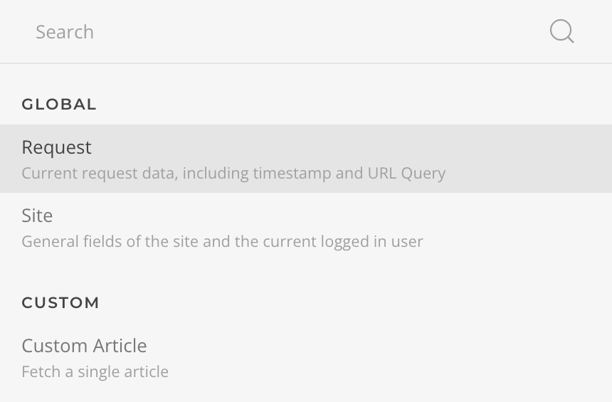
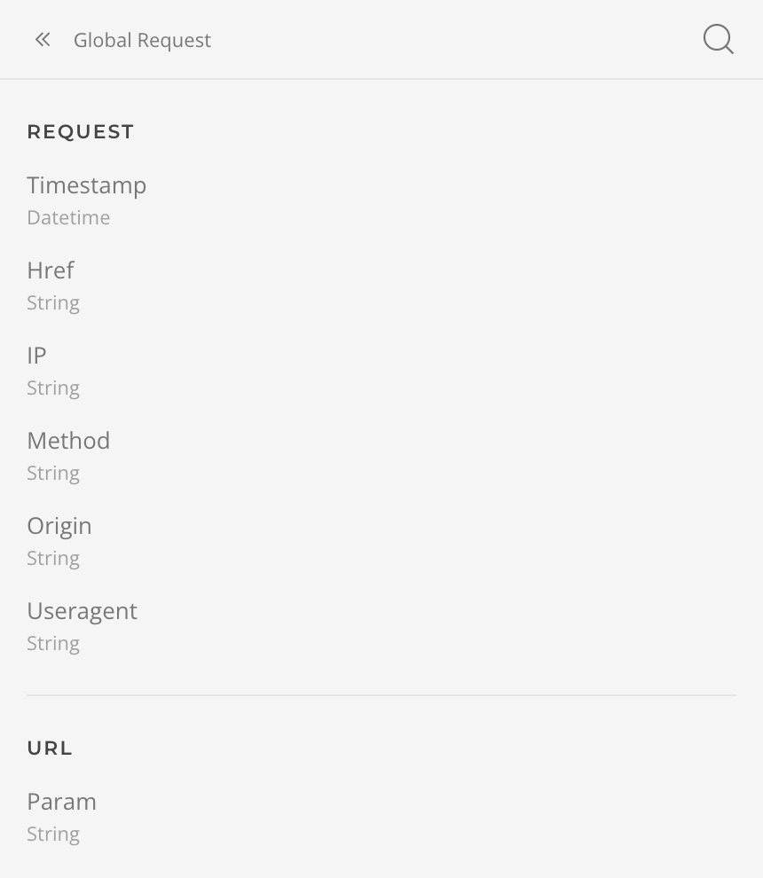

# Request Source

The **Request Source** is a global souce that expose the current page request with the following fields.

| Setting      | Description                                                                    |
| ------------ | ------------------------------------------------------------------------------ |
| **Request**  |
| _Timestamp_  | The date and time the page was requested, e.g. `2024-05-10 10:20`.             |
| _Href_       | The href tha was requested, e.g.`http://mysite.io/index.php`.                  |
| _IP_         | The IP from which the page was requested, e.g. `110.07.88.44`.                 |
| _Method_     | The method the pas was requested with , e.g. `GET`.                            |
| _Origin_     | The origin from which the page was requested, e.g. `http://mysite.io`.         |
| _User Agent_ | The agent from which the page was requested, e.g. `Mozilla/5.0 (Macintosh...`. |
| **URL**      |
| _Param_      | The URL query param specified by a name or path, e.g. `foo` or `foo.0`.        |
| _Query_      | The URL query, e.g. `?foo=bar&q=zoo`.                                          |
| _Scheme_     | The URL scheme, e.g. `http`.                                                   |
| _Host_       | The URL host, e.g. `mysite.io`.                                                |
| _Port_       | The URL port, e.g. `3360`.                                                     |
| _Path_       | The URL path, e.g. `/index.php`.                                               |
| _Fragment_   | The URL fragment, e.g. `#fragment`.                                            |
