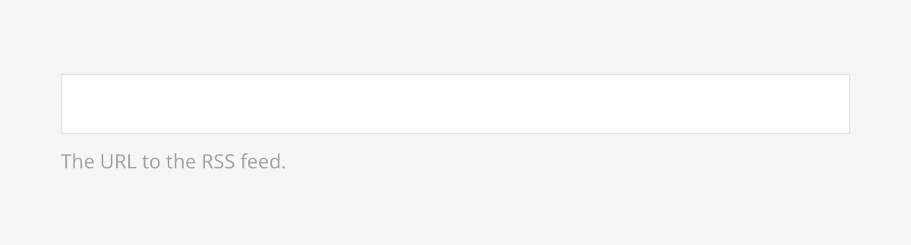
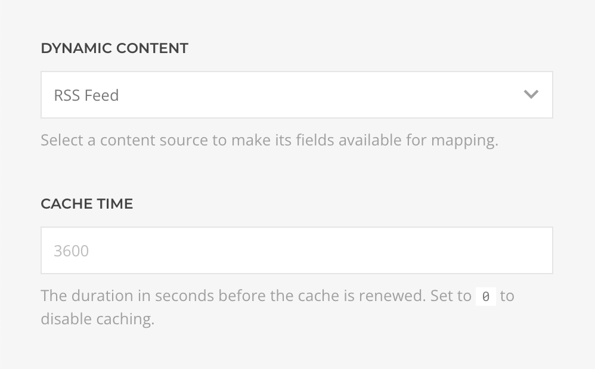
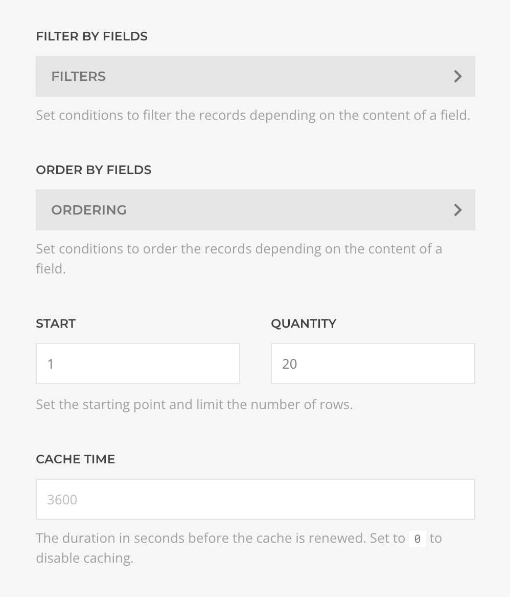

# RSS Source Provider

    <!--@include: @essentials-for-yootheme-pro/assets/brands/rss.svg-->

The **RSS Source** is a specialized version of the [XML Source](./xml.md) that feeds data from [RSS](https://en.wikipedia.org/wiki/RSS) 0.9, 1.0, 2.0, and Atom specifications supporting [Feed](#feed-query) and [Entries](#entries-query) queries.

## Settings

<!--@include: ./_partials/common-provider-settings.md-->

| Setting | Description                                             |
| ------- | ------------------------------------------------------- |
| _URL_   | The feed URL from which to generate the source content. |

## Feed Query

Fetches information from the feed and resolves to a dynamically generated feed type based on it schema.

| Setting | Description                                                                        | Default |
| ------- | ---------------------------------------------------------------------------------- | ------- |
| _Cache_ | The duration in seconds before the cache is invalidated and the query re-executed. | `3600`  |

## Entries Query

Fetches records from the feed and resolves to a list of dynamically generated record type based on the feed schema.

| Setting    | Description                                                                        | Default | Dynamic  |
| ---------- | ---------------------------------------------------------------------------------- | ------- | :------: |
| _Filters_  | The list of filter conditions applied to the query.                                | `[]`    | &#x2713; |
| _Ordering_ | The list of ordering conditions applied to the query.                              | `[]`    | &#x2713; |
| _Start_    | The offset applied to the query.                                                   | `1`     | &#x2713; |
| _Quantity_ | The limit applied to the query.                                                    | `20`    | &#x2713; |
| _Cache_    | The duration in seconds before the cache is invalidated and the query re-executed. | `3600`  |
