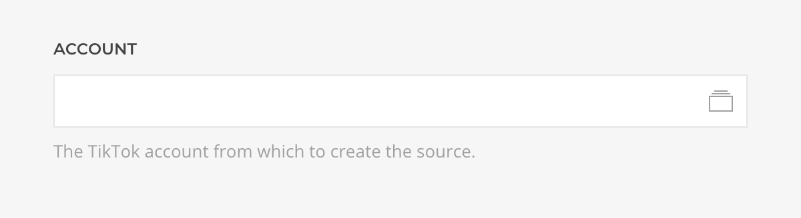
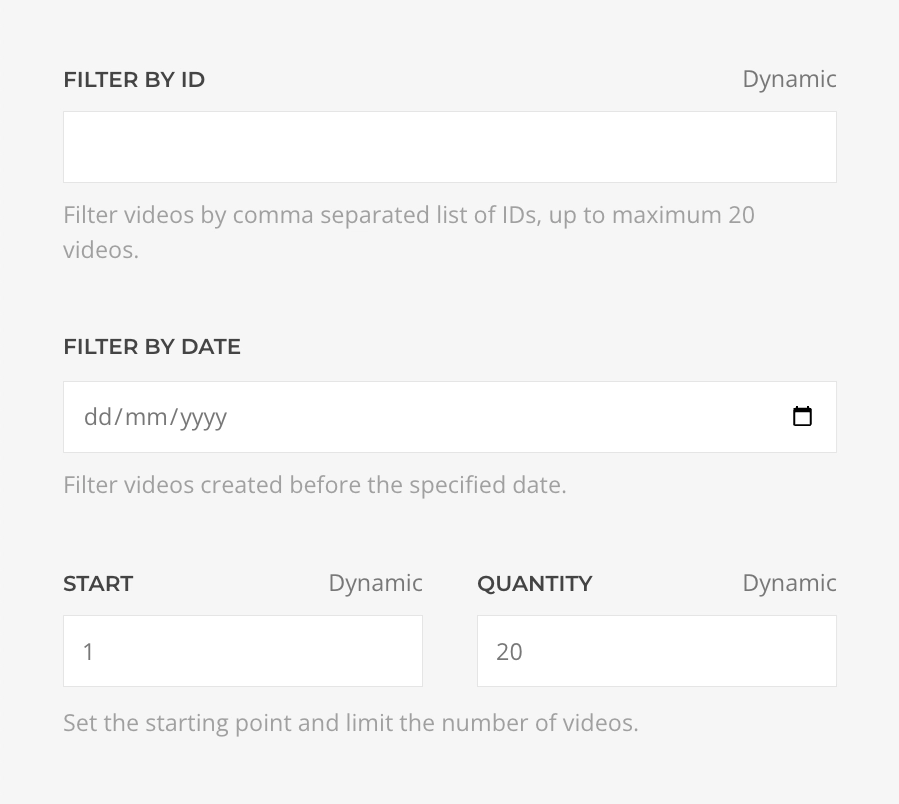
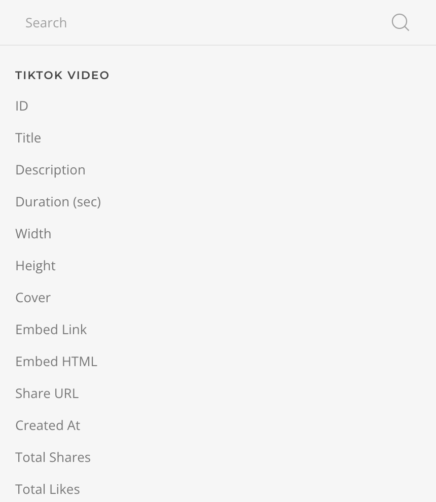

# TikTok Source Provider

    <!--@include: @essentials-for-yootheme-pro/assets/brands/tiktok.svg-->

The **TikTok Source** feeds media from [TikTok](https://www.vimeo.com) supporting [My Videos](#my-videos-query) query.

## Settings

<!--@include: ./_partials/common-provider-settings.md-->

| Setting   | Description                                    |
| --------- | ---------------------------------------------- |
| _Account_ | The TikTok Account which to authenticate with. |

## My Videos Query

Fetches videos from the authenticated account and resolves to a list of [Video Type](#video-type).

| Setting          | Description                                                                        | Default | Dynamic  |
| ---------------- | ---------------------------------------------------------------------------------- | ------- | :------: |
| _Filter by ID_   | Filter videos comma separated list of IDs, up to maximum 20 videos.                |         | &#x2713; |
| _Filter by date_ | Filter videos created before the specified date.                                   |         | &#x2713; |
| _Start_          | The starting point, e.g of a list of 20 videos start from the number 2.            | `1`     | &#x2713; |
| _Quantity_       | The maximum amount of videos to retrieve.                                          | `20`    | &#x2713; |
| _Cache_          | The duration in seconds before the cache is invalidated and the query re-executed. | `3600`  |

## Video Type

Defines the mapping options of a TikTok Video object.

| Option           | Description                                                                                               | Type     | Filters |
| ---------------- | --------------------------------------------------------------------------------------------------------- | -------- | ------- |
| _ID_             | The unique identifier of this video.                                                                      | _String_ |
| _Title_          | The title of this video, max length 150.                                                                  | _String_ | _Limit_ |
| _Description_    | The description for this video, max length 150.                                                           | _String_ | _Limit_ |
| _Duration_       | The duration of this video in seconds.                                                                    | _Int_    |
| _Width_          | The width of this video.                                                                                  | _Int_    |
| _Height_         | The height of this video.                                                                                 | _Int_    |
| _Cover_          | The path to the locally cached video cover.                                                               | _String_ |
| _Embed Link_     | The embed link of tiktok.com for this video.                                                              | _String_ |
| _Embed HTML_     | The HTML code for embedded video.                                                                         | _String_ |
| _Share URL_      | A shareable link for this video. Note that the website behaves differently on Mobile and Desktop devices. | _String_ |
| _Created At_     | The time this video was created.                                                                          | _String_ | _Date_  |
| _Total Shares_   | Number of times this video has been shared.                                                               | _Int_    |
| _Total Likes_    | Number of times this video has been liked.                                                                | _Int_    |
| _Total Comments_ | Number of times this video has been commented.                                                            | _Int_    |
| _Total Views_    | Number of times this video has been viewed.                                                               | _Int_    |
