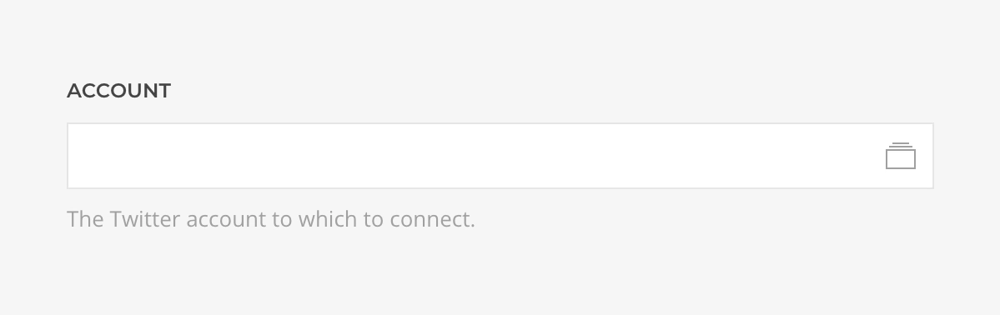
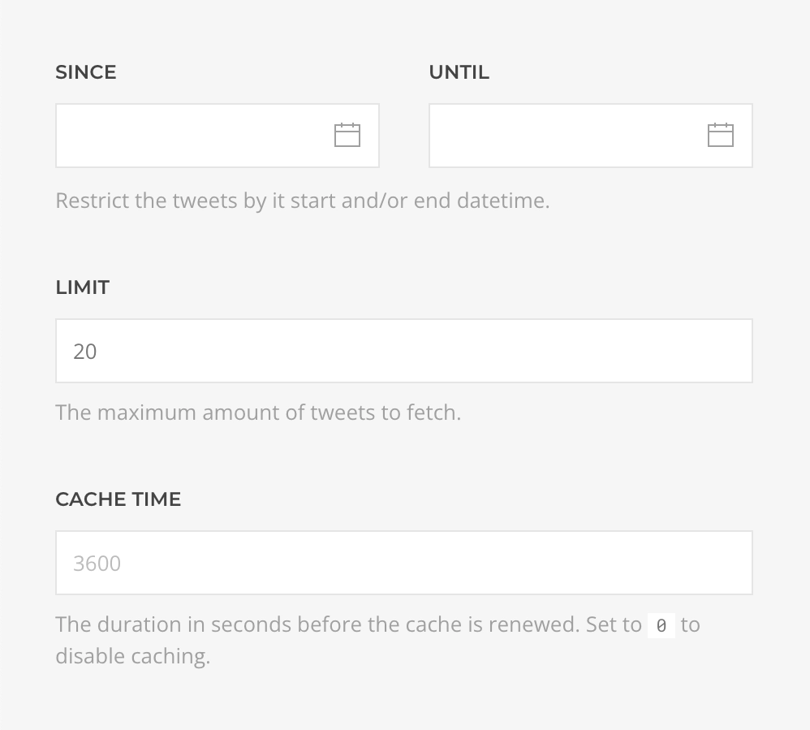
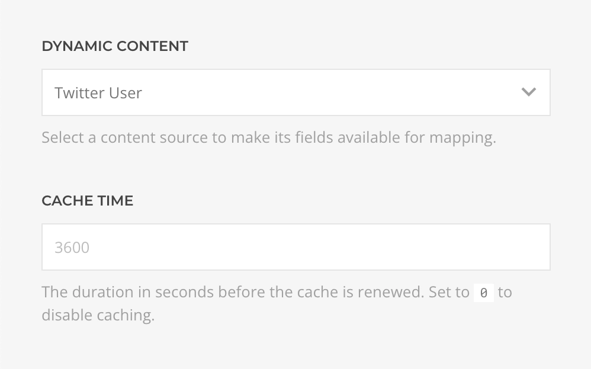
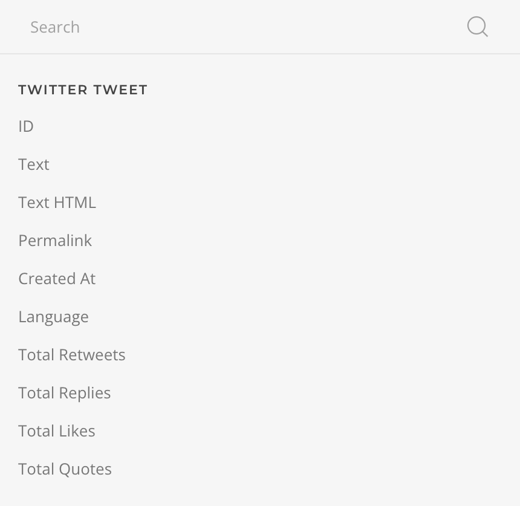
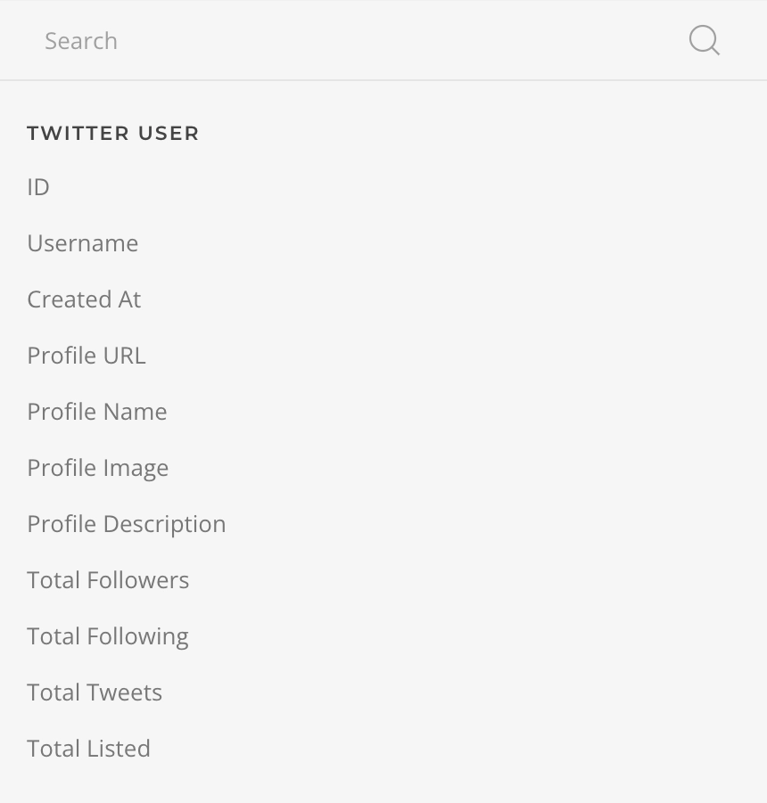

# Twitter Source Provider

    <!--@include: @essentials-for-yootheme-pro/assets/brands/twitter.svg-->

The **Twitter Source** feeds data from [Twitter](https://www.twitter.com) supporting [My Tweets](#my-tweets-query) and [User](#user-query) queries.

:::warning Twitter Dev App Required
Notice that this source requires a [Custom Twitter Dev App](/essentials-for-yootheme-pro/auths/custom-twitter-dev-app) for authentication.
:::

## Settings

<!--@include: ./_partials/common-provider-settings.md-->

| Setting   | Description                                     |
| --------- | ----------------------------------------------- |
| _Account_ | The Twitter Account which to authenticate with. |

### My Tweets Query

Fetches tweets from the authenticated account resolving to a list of [Tweet Type](#tweet-type).

| Setting       | Description                                                                        | Default | Dynamic  |
| ------------- | ---------------------------------------------------------------------------------- | ------- | :------: |
| _Since/Until_ | The `start` and/or `end` datetime the fetched tweets will be restricted to.        |         | &#x2713; |
| _Limit_       | The maximum amount of tweets to fetch.                                             | `20`    | &#x2713; |
| _Cache_       | The duration in seconds before the cache is invalidated and the query re-executed. | `3600`  |

## User Query

Fetches the authenticated user account resolving to a list of [User Type](#user-type).

| Setting | Description                                                                        | Default |
| ------- | ---------------------------------------------------------------------------------- | ------- |
| _Cache_ | The duration in seconds before the cache is invalidated and the query re-executed. | `3600`  |

## Tweet Type

Defines the mapping options of a Twitter Tweet object.

| Option           | Description                                                                         | Type     | Filters |
| ---------------- | ----------------------------------------------------------------------------------- | -------- | ------- |
| _ID_             | Unique identifier of this Tweet.                                                    | _String_ |
| _Text_           | The content of the Tweet.                                                           | _String_ | _Limit_ |
| _Text HTML_      | The content of the Tweet as HTML.                                                   | _String_ | _Limit_ |
| _Permalink_      | The Tweet URL, e.g. `twitter.com/Twitter/status/123456789`.                         | _String_ |
| _Created At_     | The time this Tweet was created.                                                    | _String_ | _Date_  |
| _Language_       | Language of the Tweet, if detected by Twitter. Returned as a BCP47 language tag.    | _String_ |
| _Total Retweets_ | Number of times this Tweet has been Retweeted.                                      | _Int_    |
| _Total Replies_  | Number of Replies of this Tweet.                                                    | _Int_    |
| _Total Likes_    | Number of Likes of this Tweet.                                                      | _Int_    |
| _Total Quotes_   | Number of times this Tweet has been Retweeted with a comment (also known as Quote). | _Int_    |

## User Type

Defines the mapping options of a Twitter User object.

| Option                | Description                                                                                 | Type     | Filters |
| --------------------- | ------------------------------------------------------------------------------------------- | -------- | ------- |
| _ID_                  | Unique identifier of this user.                                                             | _String_ |
| _Username_            | The Twitter handle (screen name) of this user.                                              | _String_ |
| _Created At_          | The time this user account was created.                                                     | _String_ | _Date_  |
| _Profile URL_         | The URL specified in the user's profile, if present.                                        | _String_ |
| _Profile Name_        | The friendly name of this user, as shown on their profile.                                  | _String_ |
| _Profile Image_       | The path to the locally cached profile image for this user, as shown on the user's profile. | _String_ |
| _Profile Description_ | The text of this user's profile description (also known as bio), if the user provided one.  | _String_ | _Limit_ |
| _Total Followers_     | Number of users who follows this user.                                                      | _Int_    |
| _Total Following_     | Number of users this user is following.                                                     | _Int_    |
| _Total Tweets_        | Number of Tweets (including Retweets) posted by this user.                                  | _Int_    |
| _Total Listed_        | Number of lists that include this user.                                                     | _Int_    |
