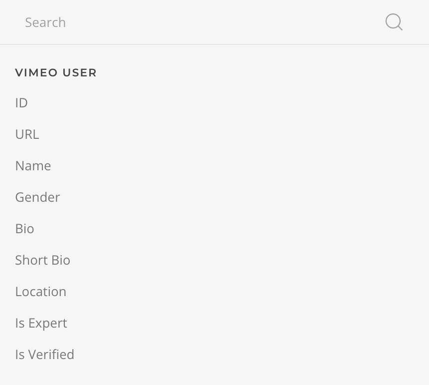

# Vimeo Source Provider

    <!--@include: @essentials-for-yootheme-pro/assets/brands/vimeo.svg-->

The Vimeo Source feeds media from [Vimeo](https://www.vimeo.com) supporting [My Videos](#my-videos-query), [My Folder Videos](#my-folder-videos-query) and [My Showcase Videos](#my-showcase-videos-query) queries.

## Settings

<!--@include: ./_partials/common-provider-settings.md-->

| Setting   | Description                                   |
| --------- | --------------------------------------------- |
| _Account_ | The Vimeo Account which to authenticate with. |

## My Videos Query

Fetches videos from the authenticated account and resolves to a list of [Video Type](#video-type).

| Setting     | Description                                                                                                                                      | Default      | Dynamic  |
| ----------- | ------------------------------------------------------------------------------------------------------------------------------------------------ | ------------ | :------: |
| _Query_     | The search term by which to filter the videos.                                                                                                   |              | &#x2713; |
| _Attribute_ | The video attribute by which to filter the videos, within _Featured_, _Live_, and _No Live_.                                                     |
| _Tags_      | Comma separated tags by which to filter the videos.                                                                                              |              | &#x2713; |
| _Sort_      | The order of the videos, within _Default_, _Alphabetical_, _Date_, _Modified_, _Duration_, _Last User Action_, _Total Plays_, and _Total Likes_. | `Default`    | &#x2713; |
| _Direction_ | The order direction of the videos, _Ascending_ or _Descending_.                                                                                  | `Descending` |
| _Page_      | The page number of the videos.                                                                                                                   | `1`          | &#x2713; |
| _Per Page_  | The number of videos to return on each page, up to a maximum of 100.                                                                             | `25`         | &#x2713; |
| _Cache_     | The duration in seconds before the cache is invalidated and the query re-executed.                                                               | `3600`       |

## My Folder Videos Query

Fetches videos from the authenticated account specific folder and resolves to a list of [Video Type](#video-type).

| Setting              | Description                                                                                            | Default      | Dynamic  |
| -------------------- | ------------------------------------------------------------------------------------------------------ | ------------ | :------: |
| _Folder ID_          | The unique identifier of the folder from which to retrieve the videos.                                 |              | &#x2713; |
| _Include Subfolders_ | Whether to include videos of all subfolders.                                                           |
| _Query_              | The search term by which to filter the videos.                                                         |              | &#x2713; |
| _Sort_               | The order of the videos, within _Default_, _Alphabetical_, _Date_, _Duration_, and _Last User Action_. | `Default`    |
| _Direction_          | The order direction of the videos, _Ascending_ or _Descending_.                                        | `Descending` |
| _Page_               | The page number of the videos.                                                                         | `1`          | &#x2713; |
| _Per Page_           | The number of videos to return on each page, up to a maximum of 100.                                   | `25`         | &#x2713; |
| _Cache_              | The duration in seconds before the cache is invalidated and the query re-executed.                     | `3600`       |

## My Showcase Videos Query

Fetches videos from the authenticated account specific showcase and resolves to a list of [Video Type](#video-type).

| Setting       | Description                                                                                            | Default      | Dynamic  |
| ------------- | ------------------------------------------------------------------------------------------------------ | ------------ | :------: |
| _Showcase ID_ | The unique identifier of the showcase from which to retrieve the videos.                               |              | &#x2713; |
| _Password_    | The password of the showcase in case it has one.                                                       |              | &#x2713; |
| _Query_       | The search term by which to filter the videos.                                                         |              | &#x2713; |
| _Sort_        | The order of the videos, within _Default_, _Alphabetical_, _Date_, _Duration_, and _Last User Action_. | `Default`    |
| _Direction_   | The order direction of the videos, _Ascending_ or _Descending_.                                        | `Descending` |
| _Page_        | The page number of the videos.                                                                         | `1`          | &#x2713; |
| _Per Page_    | The number of videos to return on each page, up to a maximum of 100.                                   | `25`         | &#x2713; |
| _Cache_       | The duration in seconds before the cache is invalidated and the query re-executed.                     | `3600`       |

## Video Type

Defines the mapping options of a Vimeo Video object.

| Option           | Description                                                                                                                                                        | Type     | Filters |
| ---------------- | ------------------------------------------------------------------------------------------------------------------------------------------------------------------ | -------- | ------- |
| _ID_             | The unique identifier of this video.                                                                                                                               | _String_ |
| _URL_            | The URL of this video, e.g. `vimeo.com/123456789`.                                                                                                                 | _String_ |
| _Custom URL_     | The custom URL of this video.                                                                                                                                      | _String_ |
| _Type_           | The type of this video, _live_ (is or was a live event), _stock_ (is a Vimeo Stock video), or _video_ (standard Vimeo video).                                      | _String_ |
| _Title_          | The title of this video.                                                                                                                                           | _String_ | _Limit_ |
| _Description_    | A brief explanation of this video's content.                                                                                                                       | _String_ | _Limit_ |
| _Duration_       | The duration of this video in seconds.                                                                                                                             | _Int_    |
| _Language_       | The primary language of this video.                                                                                                                                | _String_ |
| _License_        | The [Creative Commons](https://creativecommons.org/licenses/) license given to this video under _BY_, _BY-NC_, _BY-NC-ND_, _BY-NC-SA_, _BY-ND_, _BY-SA_, or _CC0_. | _String_ |
| _Thumbnail_      | The path to the locally cached video picture.                                                                                                                      | _String_ |
| _Width_          | The width of this video in pixels.                                                                                                                                 | _Int_    |
| _Height_         | The height of this video in pixels.                                                                                                                                | _Int_    |
| _Tags_           | A formated list of all tags assigned to this video, joined with a custom separator.                                                                                | _String_ |
| _Categories_     | A formated list of all categories this video belongs to, joined with a custom separator, optional link and style.                                                  | _String_ |
| _Created At_     | The time this video was created.                                                                                                                                   | _String_ | _Date_  |
| _Released At_    | The time this video was released.                                                                                                                                  | _String_ | _Date_  |
| _Modified At_    | The time this video was modified.                                                                                                                                  | _String_ | _Date_  |
| _Total Plays_    | Number of times this video has been played.                                                                                                                        | _Int_    |
| _Total Comments_ | Number of times this video has been commented.                                                                                                                     | _Int_    |

## User Type

Defines the mapping options of a Vimeo User object.

| Option      | Description                                                                           | Type     | Filters |
| ----------- | ------------------------------------------------------------------------------------- | -------- | ------- |
| _ID_        | The unique identifier of this user.                                                   | _String_ |
| _URL_       | The absolute URL of this user profile page.                                           | _String_ |
| _Name_      | The display name of this user.                                                        | _String_ |
| _Gender_    | The gender of this user.                                                              | _String_ |
| _Bio_       | The long bio text of this user.                                                       | _String_ | _Limit_ |
| _Bio Short_ | The short bio text of this user.                                                      | _String_ | _Limit_ |
| _Location_  | The location of this user.                                                            | _String_ |
| _Is Expert_ | Whether the creator enrolled in and successfully completed the Vimeo Experts program. | _String_ |
