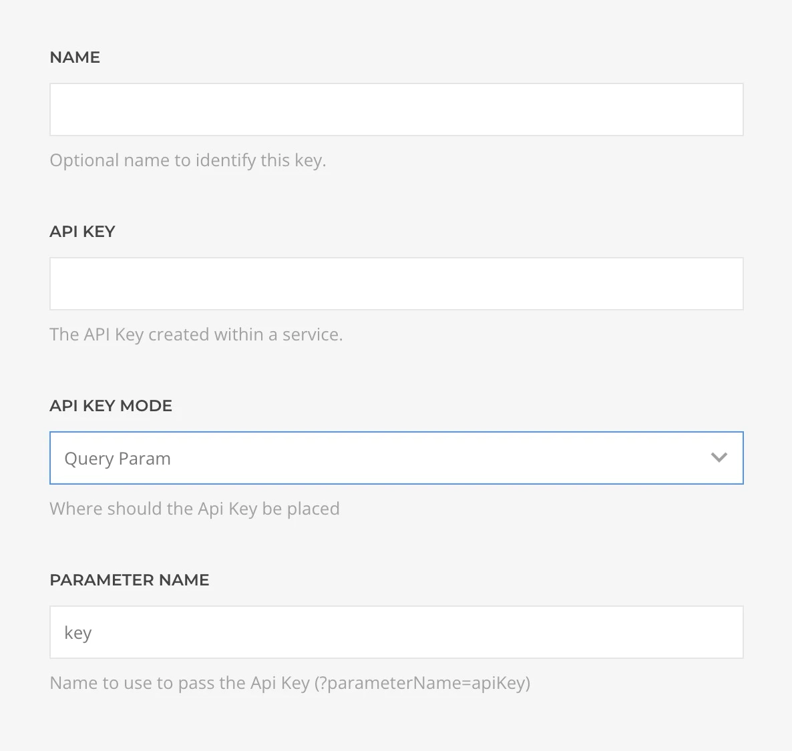

# XML Source Provider

    <!--@include: @essentials-for-yootheme-pro/assets/brands/xml.svg-->

The **XML Source** feeds data from any [XML](https://en.wikipedia.org/wiki/XML) URL or local file, reading its structure and building a dedicated query and source types to the best of its abilities.

## Settings

<!--@include: ./_partials/common-provider-settings.md-->

If the source is a remote file, the URL and an optional API key-based authentication are required:

| Setting                   | Description                                             |
| ------------------------- | ------------------------------------------------------- |
| _URL_                     | The feed URL from which to generate the source content. |
| _Requires Authentication_ | If the URL is protected by authorization.               |
| _Authentication_          | The authentication details to use.                      |

When authentication is present, you can specify its details. Currently, only the API key method is supported, either via a header or a query parameter.

| Setting          | Description                                                                |
| ---------------- | -------------------------------------------------------------------------- |
| _API Key_        | The API key to use.                                                        |
| _API Key Mode_   | Where the key is set, in a header or in a query parameter.                 |
| _Parameter Name_ | The name of the header or of the query parameter where the API key is set. |

If the source is a local file, the file path is required.

| Setting | Description                                                       |
| ------- | ----------------------------------------------------------------- |
| _File_  | The relative or absolute local path to the file to use as source. |

Optionally, an [XPath filter](https://en.wikipedia.org/wiki/XPath) can be set, which will allow narrowing down your XML file if needed. It's also possible to map some of the result item properties to dedicated types, to make better use of YOOtheme Pro filters, such as dates or numbers.

| Setting        | Description                              |
| -------------- | ---------------------------------------- |
| _XPath Filter_ | Optional XPath filter, like `/jobs/job`. |
| _Data Types_   | Data type mapping for each field.        |

## XML Query

Fetches records from the XML file and resolves to a list of dynamically generated record types based on the feed schema.

| Setting    | Description                                                                        | Default | Dynamic  |
| ---------- | ---------------------------------------------------------------------------------- | ------- | :------: |
| _Start_    | The offset applied to the query.                                                   | `1`     | &#x2713; |
| _Quantity_ | The limit applied to the query.                                                    | `20`    | &#x2713; |
| _Cache_    | The duration in seconds before the cache is invalidated and the query re-executed. | `3600`  |
