# YouTube Source Provider

    <!--@include: @essentials-for-yootheme-pro/assets/brands/youtube.svg-->

The YouTube Source feeds data from [YouTube](https://www.youtube.com/) supporting [Videos](#videos-query), [My Channel](#my-channel-query), [My Channel Video](#my-channel-video-query), [My Channel Videos](#my-channel-videos-query), [My Channel Playlist](#my-channel-playlist-query), [My Channel Playlist Videos](#my-channel-playlist-videos-query), [My Playlist Video](#my-playlist-video-query) and [My Playlist Videos](#my-playlist-videos-query) queries.

## Settings

<!--@include: ./_partials/common-provider-settings.md-->

If the source is based on a YouTube channel or playlist an oAuth authentication is required.

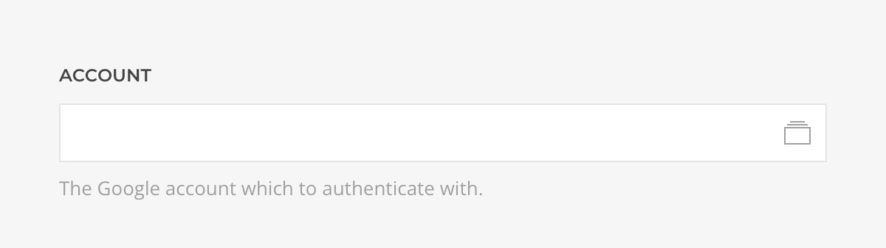

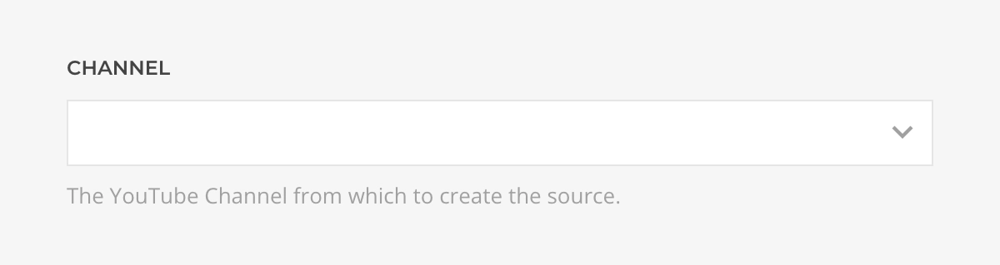

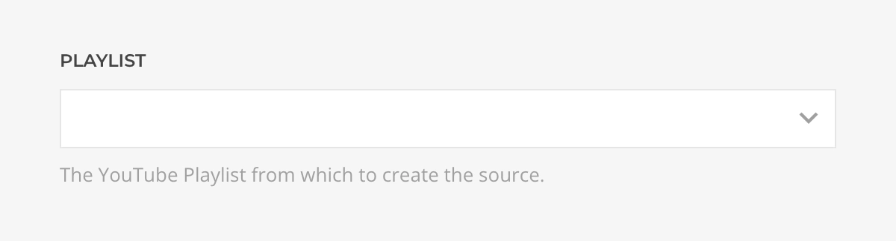

| Setting    | Description                                           |
| ---------- | ----------------------------------------------------- |
| _Account_  | The Google Account which to authenticate with.        |
| _Channel_  | The YouTube Channel from which to create the source.  |
| _Playlist_ | The YouTube Playlist from which to create the source. |

If the source is based on YouTube videos an API Key is required instead.

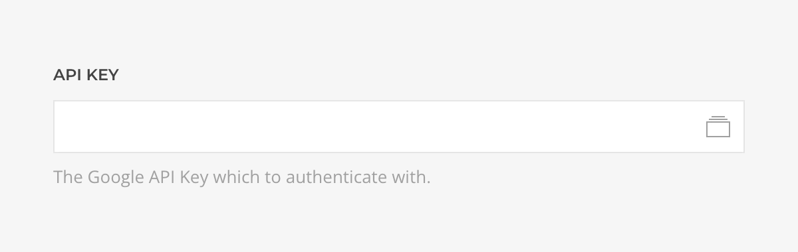

| Setting   | Description                                    |
| --------- | ---------------------------------------------- |
| _API Key_ | The Google API Key which to authenticate with. |

## Videos Query

Fetches public videos with advanced query params resolving to a list of [Video Type](#video-type).

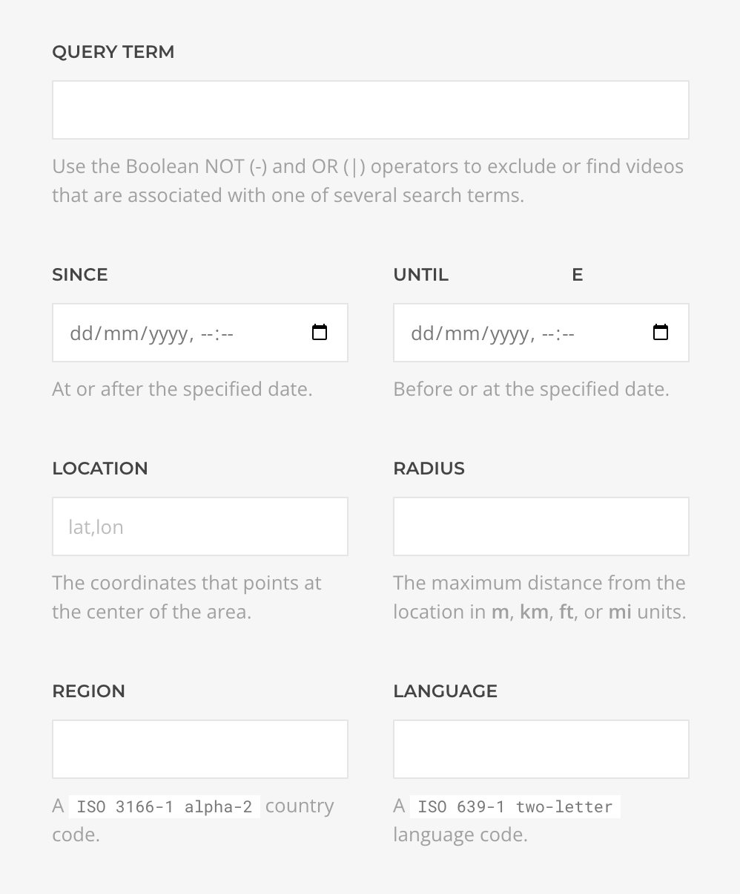

| Setting           | Description                                                                                                                                                                                                                                                                                                                                                                                                                              | Default     | Dynamic  |
| ----------------- | ---------------------------------------------------------------------------------------------------------------------------------------------------------------------------------------------------------------------------------------------------------------------------------------------------------------------------------------------------------------------------------------------------------------------------------------- | ----------- | :------: |
| _Videos ID_       | Restricts the results to videos created by a specific channel ID.                                                                                                                                                                                                                                                                                                                                                                        |             | &#x2713; |
| _Channel ID_      | Restricts the results to videos created by a specific channel ID.                                                                                                                                                                                                                                                                                                                                                                        |             | &#x2713; |
| _Query Term_      | The list of terms the videos should be associated with. Use the Boolean NOT (`-`) and OR (`\|`) operators to exclude or find videos that are associated with one of several search terms. For example, to match either "boating" or "sailing", set as `boating\|sailing`. Similarly, to exclude "fishing", set as `boating\|sailing -fishing`.                                                                                           |             | &#x2713; |
| _Since/Until_     | Restricts the results to videos that have been published within the specified range of dates.                                                                                                                                                                                                                                                                                                                                            |             | &#x2713; |
| _Location/Radius_ | Location in conjunction with radius, defines a circular geographic area to which to restrict the videos. The location points the center of the area with latitude/longitude coordinates e.g. `37.42307,-122.08427`, while the radius is the maximum distance from the location in `m`, `km`, `ft`, or `mi` units, e.g `5km`.                                                                                                             |             | &#x2713; |
| _Region_          | Restricts the results to videos that can be viewed in the specified country. The value is an [ISO 3166-1 alpha-2](https://www.iso.org/iso-3166-country-codes.html) country code, e.g `ES`.                                                                                                                                                                                                                                               |             | &#x2713; |
| _Language_        | Restricts the results to videos that are most relevant to the specified language. The value is typically an [ISO 639-1 two-letter](https://www.loc.gov/standards/iso639-2/php/code_list.php) language code, however, you should use the values `zh-Hans` for simplified Chinese and `zh-Hant` for traditional Chinese. Note that results in other languages will still be returned if they are highly relevant to the search query term. |             | &#x2713; |
| _Definition_      | Restricts the results based on the videos quality, either _High Definition_, _Standard Definition_, or _Any_. HD videos are available for playback in at least 720p, though higher resolutions, like 1080p, might also be available.                                                                                                                                                                                                     | `Any`       |
| _Duration_        | Restricts the results based on the videos duration, either _Long_, longer than 20 minutes, `Medium`, between four and 20 minutes, _Short_, less than four minutes, or _Any_.                                                                                                                                                                                                                                                             | `Any`       |
| _Start_           | The starting point, e.g of a list of 20 videos start from the number 2.                                                                                                                                                                                                                                                                                                                                                                  | `1`         | &#x2713; |
| _Quantity_        | The maximum amount of videos to retrieve.                                                                                                                                                                                                                                                                                                                                                                                                | `20`        | &#x2713; |
| _Order_           | The order in which the videos will be returned, within _Date_, reverse chronological order based on the date the videos were created, _Rating_, from highest to lowest rating, _Relevance_, based on their relevance to the search query, _Title_, alphabetically by title, or _View Count_, from highest to lowest number of views.                                                                                                     | `Relevance` |
| _Cache_           | The duration in seconds before the cache is invalidated and the query re-executed.                                                                                                                                                                                                                                                                                                                                                       | `3600`      |

## My Channel Query

Fetches the channel content resolving to a [Channel Type](#channel-type).

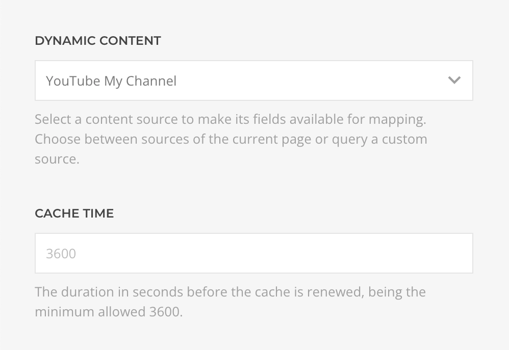

| Setting | Description                                                                        | Default |
| ------- | ---------------------------------------------------------------------------------- | ------- |
| _Cache_ | The duration in seconds before the cache is invalidated and the query re-executed. | `3600`  |

## My Channel Video Query

Fetches a single video from the channel resolving to a [Video Type](#video-type).

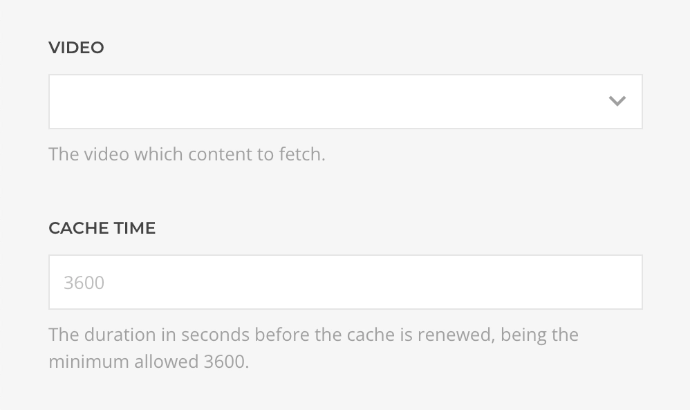

| Setting | Description                                                                        | Default | Dynamic  |
| ------- | ---------------------------------------------------------------------------------- | ------- | :------: |
| _Video_ | The playlist video which content to fetch.                                         |         | &#x2713; |
| _Cache_ | The duration in seconds before the cache is invalidated and the query re-executed. | `3600`  |

## My Channel Videos Query

Fetches videos from the channel resolving to a list of [Video Type](#video-type).

| Setting    | Description                                                                        | Default | Dynamic  |
| ---------- | ---------------------------------------------------------------------------------- | ------- | :------: |
| _Start_    | The starting position to retrieve the videos at.                                   | `1`     | &#x2713; |
| _Quantity_ | The maximum amount of videos to fetch.                                             | `20`    | &#x2713; |
| _Cache_    | The duration in seconds before the cache is invalidated and the query re-executed. | `3600`  |

## My Channel Playlist Query

Fetches a single playlist from the channel resolving to a [Playlist Type](#playlist-type).

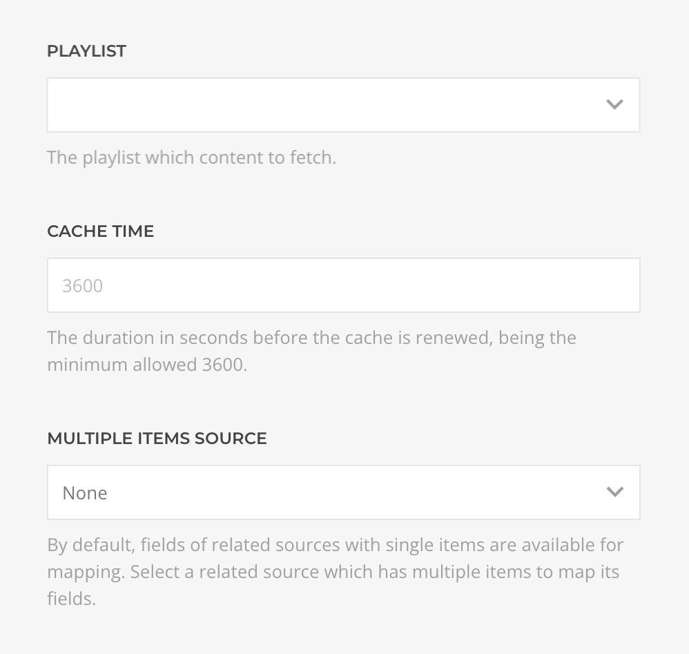

| Setting       | Description                                                                        | Default | Dynamic  |
| ------------- | ---------------------------------------------------------------------------------- | ------- | :------: |
| _Playlist_    | The YouTube Playlist which content to fetch.                                       |         | &#x2713; |
| _Cache_       | The duration in seconds before the cache is invalidated and the query re-executed. | `3600`  |
| _Multi Items_ | The related multi-items content to query instead with _Videos_ as the only option. |

## My Channel Playlist Videos Query

Fetches videos from the playlist resolving to a list of [Video Type](#video-type).

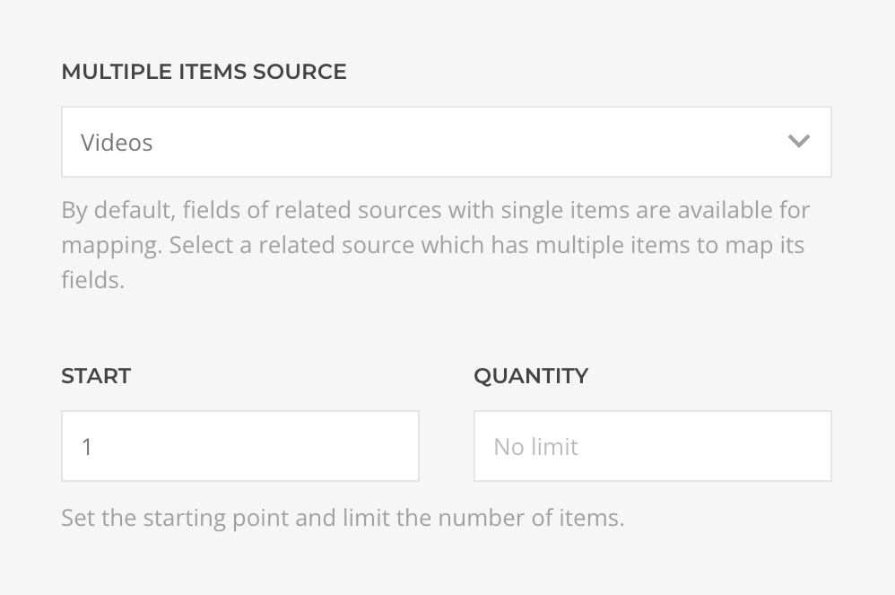

| Setting    | Description                                      | Default | Dynamic  |
| ---------- | ------------------------------------------------ | ------- | :------: |
| _Start_    | The starting position to retrieve the videos at. | `1`     | &#x2713; |
| _Quantity_ | The maximum amount of videos to fetch.           | `20`    | &#x2713; |

## My Playlist Video Query

Fetches a single video from the playlist resolving to a [Video Type](#video-type).

| Setting | Description                                                                        | Default | Dynamic  |
| ------- | ---------------------------------------------------------------------------------- | ------- | :------: |
| _Video_ | The playlist video which content to fetch.                                         |         | &#x2713; |
| _Cache_ | The duration in seconds before the cache is invalidated and the query re-executed. | `3600`  |

## My Playlist Videos Query

Fetches videos from the playlist resolving to a list of [Video Type](#video-type).

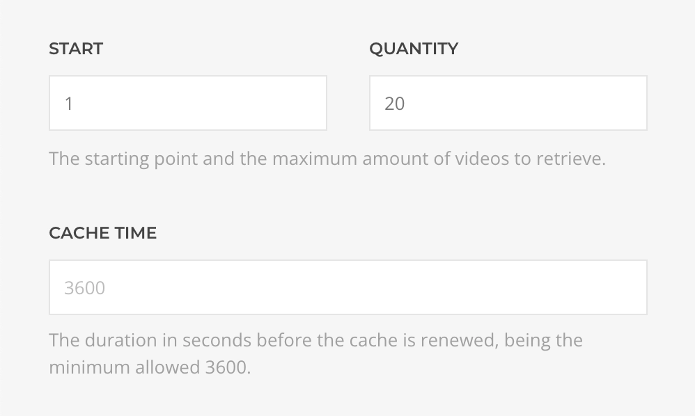

| Setting    | Description                                                                        | Default | Dynamic  |
| ---------- | ---------------------------------------------------------------------------------- | ------- | :------: |
| _Start_    | The starting position to retrieve the videos at.                                   | `1`     | &#x2713; |
| _Quantity_ | The maximum amount of videos to fetch.                                             | `20`    | &#x2713; |
| _Cache_    | The duration in seconds before the cache is invalidated and the query re-executed. | `3600`  |

## Video Type

Defines the mapping options of a YouTube Video object.

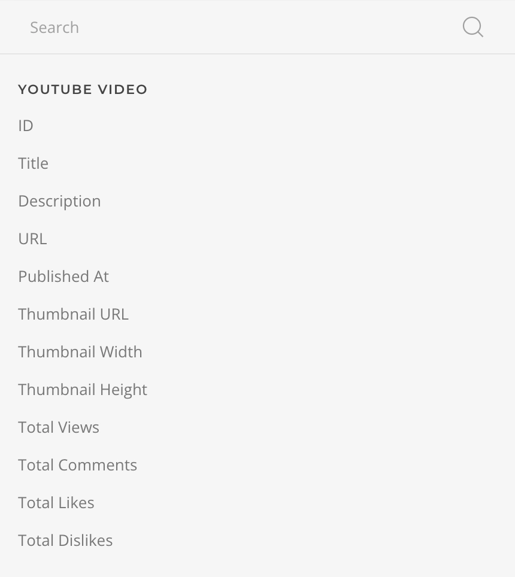

| Option             | Description                                                                                                                                  | Type     | Filters |
| ------------------ | -------------------------------------------------------------------------------------------------------------------------------------------- | -------- | ------- |
| _ID_               | The unique identifier of this video.                                                                                                         | _String_ |
| _Title_            | The title of this video.                                                                                                                     | _String_ | _Limit_ |
| _Description_      | The description of this video.                                                                                                               | _String_ | _Limit_ |
| _URL_              | The YouTube public URL, e.g. `www.youtube.com/watch?v=c2pz2mlSfXA`.                                                                          | _String_ |
| _Iframe Player_    | Generates an HTML embed video player with several configuration settings.                                                                    | _String_ |
| _Published At_     | The date this video was published.                                                                                                           | _String_ | _Date_  |
| _Thumbnail URL_    | The URL to this video thumbnail with different size options, _Low_, _Medium_ (default), _High Resolution_, _Standard_, and `Max Resolution\* | _String_ |
| _Thumbnail Width_  | The width of this video thumbnail with same size options as for URL.                                                                         | _String_ |
| _Thumbnail Height_ | The height of this video thumbnail with same size options as for URL.                                                                        | _String_ |
| _Total Views_      | Number of times this video has been viewed.                                                                                                  | _Int_    |
| _Total Comments_   | Number of comments for this video.                                                                                                           | _Int_    |
| _Total Likes_      | Number of users that have indicated they like this video.                                                                                    | _Int_    |
| _Total Dislikes_   | Number of users that have indicated they dislike this video.                                                                                 | _Int_    |

## Channel Type

Defines the mapping options of a YouTube Channel object.

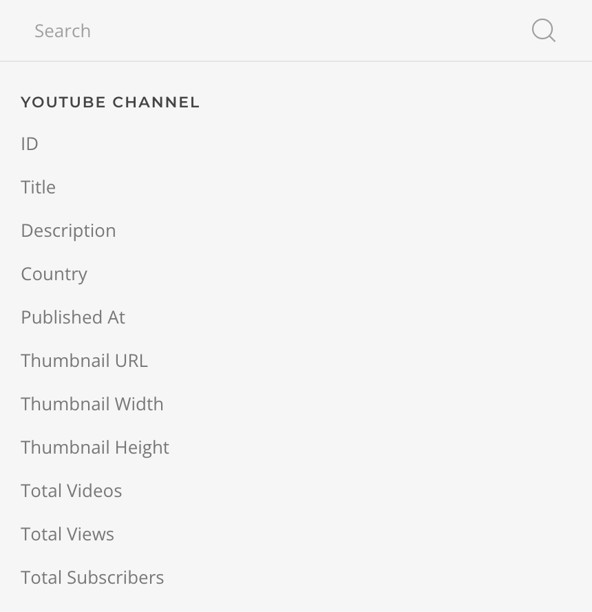

| Option              | Description                                                                                                                                   | Type     | Filters |
| ------------------- | --------------------------------------------------------------------------------------------------------------------------------------------- | -------- | ------- |
| _ID_                | The unique identifier of this channel.                                                                                                        | _String_ |
| _Title_             | The title of this channel.                                                                                                                    | _String_ | _Limit_ |
| _Description_       | The description of this channel.                                                                                                              | _String_ | _Limit_ |
| _Country_           | The country with which this channel is associated.                                                                                            | _String_ |
| _Published At_      | The date this channel was published.                                                                                                          | _String_ | _Date_  |
| _Thumbnail URL_     | The URL to this channel thumbnail with different size options, _Low_, _Medium_ (default), _High Resolution_, _Standard_, and _Max Resolution_ | _String_ |
| _Thumbnail Width_   | The width of this channel thumbnail with same size options as for URL.                                                                        | _String_ |
| _Thumbnail Height_  | The height of this channel thumbnail with same size options as for URL.                                                                       | _String_ |
| _Total Views_       | Number of times this channel has been viewed.                                                                                                 | _Int_    |
| _Total Videos_      | Number of public videos uploaded to this channel.                                                                                             | _Int_    |
| _Total Subscribers_ | Number of subscribers this channel has, the value is rounded down to three significant figures.                                               | _Int_    |

## Playlist Type

Defines the mapping options of a YouTube Playlist object.

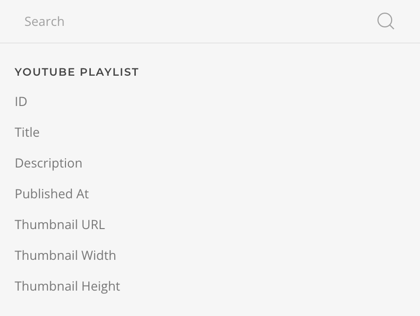

| Option             | Description                                                                                                                                    | Type     | Filters |
| ------------------ | ---------------------------------------------------------------------------------------------------------------------------------------------- | -------- | ------- |
| _ID_               | The unique identifier of this playlist.                                                                                                        | _String_ |
| _Title_            | The title of this playlist.                                                                                                                    | _String_ | _Limit_ |
| _Description_      | The description of this playlist.                                                                                                              | _String_ | _Limit_ |
| _Iframe Player_    | Generates an HTML embed playlist player with several configuration settings.                                                                   | _String_ |
| _Published At_     | The date this playlist was published.                                                                                                          | _String_ | _Date_  |
| _Thumbnail URL_    | The URL to this playlist thumbnail with different size options, _Low_, _Medium_ (default), _High Resolution_, _Standard_, and _Max Resolution_ | _String_ |
| _Thumbnail Width_  | The width of this playlist thumbnail with same size options as for URL.                                                                        | _String_ |
| _Thumbnail Height_ | The height of this playlist thumbnail with same size options as for URL.                                                                       | _String_ |
