# YouTube Source Provider

    <!--@include: ../../../integrations/assets/brands/youtube.svg-->

The YouTube Source feeds data from [YouTube](https://www.youtube.com/) supporting [Videos](#videos-query), [My Channel](#my-channel-query), [My Channel Video](#my-channel-video-query), [My Channel Videos](#my-channel-videos-query), [My Channel Playlist](#my-channel-playlist-query), [My Channel Playlist Videos](#my-channel-playlist-videos-query), [My Playlist Video](#my-playlist-video-query) and [My Playlist Videos](#my-playlist-videos-query) queries.

For setup details, see the [YouTube Integration](../../../integrations/youtube).

## Settings

<!--@include: ./_partials/common-provider-settings.md-->

If the source is based on a YouTube channel or playlist an oAuth authentication is required.

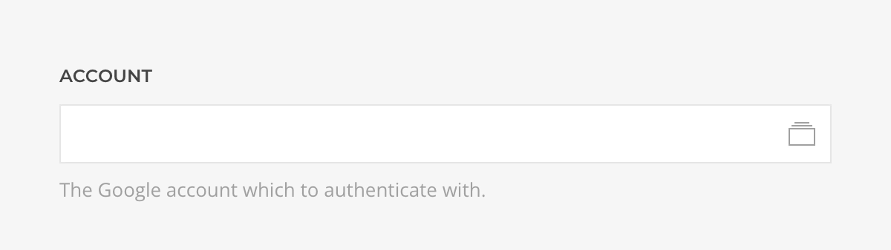

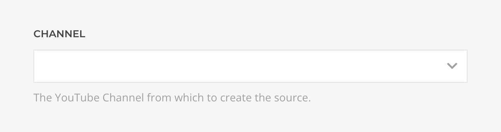

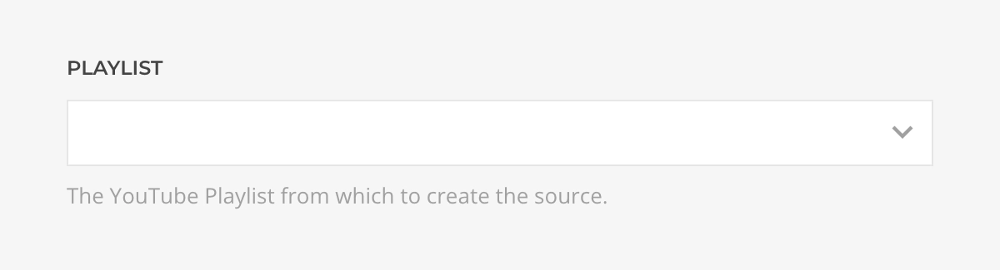

| Setting | Description |
| --- | --- |
| *Account* | The Google Account which to authenticate with. |
| *Channel* | The YouTube Channel from which to create the source. |
| *Playlist* | The YouTube Playlist from which to create the source. |

If the source is based on YouTube videos an API Key is required instead.

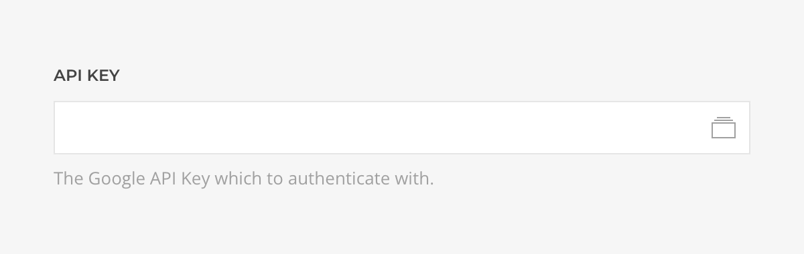

| Setting | Description |
| --- | --- |
| *API Key* | The Google API Key which to authenticate with. |

## Videos Query

Fetches public videos with advanced query params resolving to a list of [Video Type](#video-type).

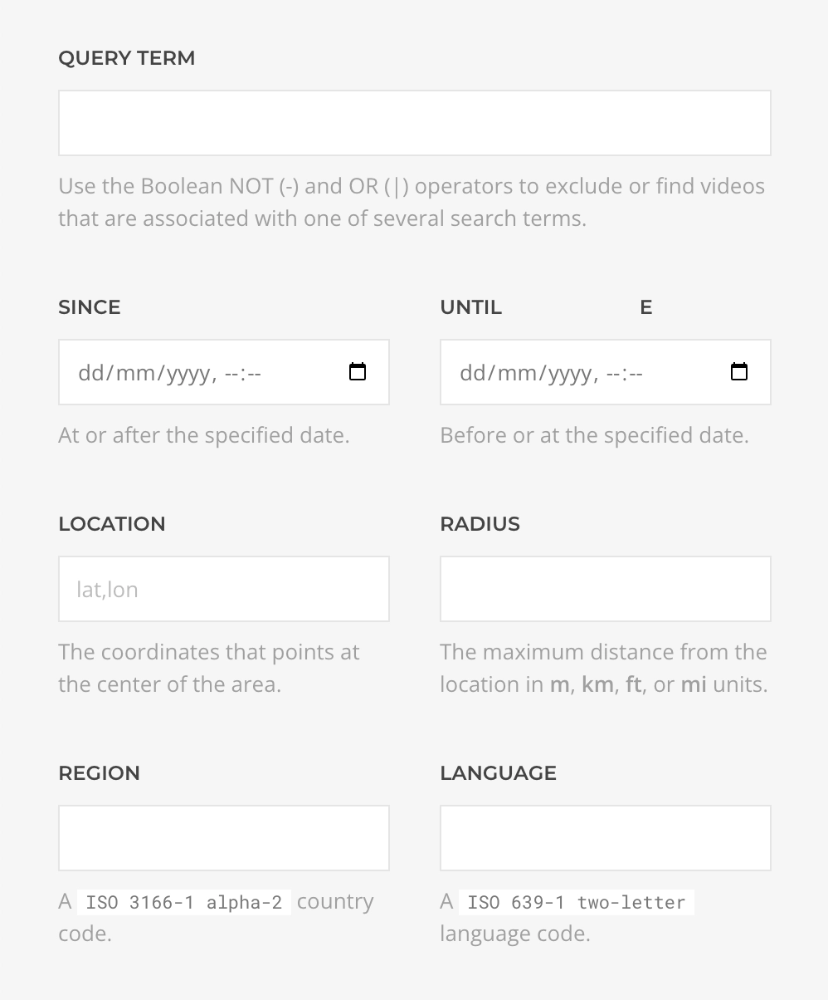

| Setting | Description | Default | Dynamic |
| --- | --- | --- | :---: |
| *Playable* | Restricts results to videos that can be played outside YouTube. | `true` | |
| *Embeddable* | Restricts results to videos that can be embedded in external sites. | `true` | |
| *Videos ID* | Set videos ID separated by comma, or use below filters to specify which videos should be loaded. | | &#x2713; |
| *Channel ID* | Restricts the results to videos created by a specific channel ID. | | &#x2713; |
| *Category ID* | Restricts results to a particular video category. | | &#x2713; |
| *Topic ID* | Restricts search results to only include resources associated with the specified topic. | | &#x2713; |
| *Query Term* | The list of terms the videos should be associated with. Use the Boolean NOT (`-`) and OR (`\|`) operators to exclude or find videos that are associated with one of several search terms. For example, to match either "boating" or "sailing", set as `boating\|sailing`. Similarly, to exclude "fishing", set as `boating\|sailing -fishing`. | | &#x2713; |
| *Captions* | Restricts results based on caption availability. Options are _With Captions_ (`closedCaption`) or _Without Captions_ (`none`). | | &#x2713; |
| *Safe Search* | Content filtering level, either _Moderate_ (`moderate`), _Strict_ (`strict`), or _None_ (`none`). | | &#x2713; |
| *Video Type* | Restricts results to a particular video type. Options are _Movie_ (`movie`) or _Episode_ (`episode`). | | &#x2713; |
| *Broadcast* | Restricts results to a particular event type. Options are _Live_ (`live`), _Upcoming_ (`upcoming`), or _Completed_ (`completed`). | | &#x2713; |
| *Since* | Restricts results to videos published at or after the specified date. | | &#x2713; |
| *Until* | Restricts results to videos published before or at the specified date. | | &#x2713; |
| *Location* | The coordinates (latitude,longitude) that point at the center of the area, e.g. `37.42307,-122.08427`. | | &#x2713; |
| *Radius* | The maximum distance from the location in `m`, `km`, `ft`, or `mi` units, e.g. `5km`. | | &#x2713; |
| *Region* | Restricts the results to videos that can be viewed in the specified country. The value is an [ISO 3166-1 alpha-2](https://www.iso.org/iso-3166-country-codes.html) country code, e.g. `ES`. | | &#x2713; |
| *Language* | Restricts the results to videos that are most relevant to the specified language. The value is typically an [ISO 639-1 two-letter](https://www.loc.gov/standards/iso639-2/php/code_list.php) language code, however, you should use the values `zh-Hans` for simplified Chinese and `zh-Hant` for traditional Chinese. Note that results in other languages will still be returned if they are highly relevant to the search query term. | | &#x2713; |
| *Definition* | Restricts the results based on the videos quality, either _High (HD)_, _Standard (SD)_, or _Any_. | `Any` | |
| *Duration* | Restricts the results based on the videos duration, either _Longer than 20m_, _Between 4 and 20m_, _Shorter than 4m_, or _Any_. | `Any` | |
| *Start* | The starting point from which to retrieve videos. | `1` | &#x2713; |
| *Quantity* | The maximum amount of videos to retrieve. | `20` | &#x2713; |
| *Order* | The order in which the videos will be returned, within _Relevance_, _Rating Descendant_, _Created Date Reversed_, _Title Alphabetical_, or _View Count Descendant_. | `Relevance` | |
| *Cache* | The duration in seconds before the cache is invalidated and the query re-executed. | `3600` | |

## My Channel Query

Fetches the channel content resolving to a [Channel Type](#channel-type).

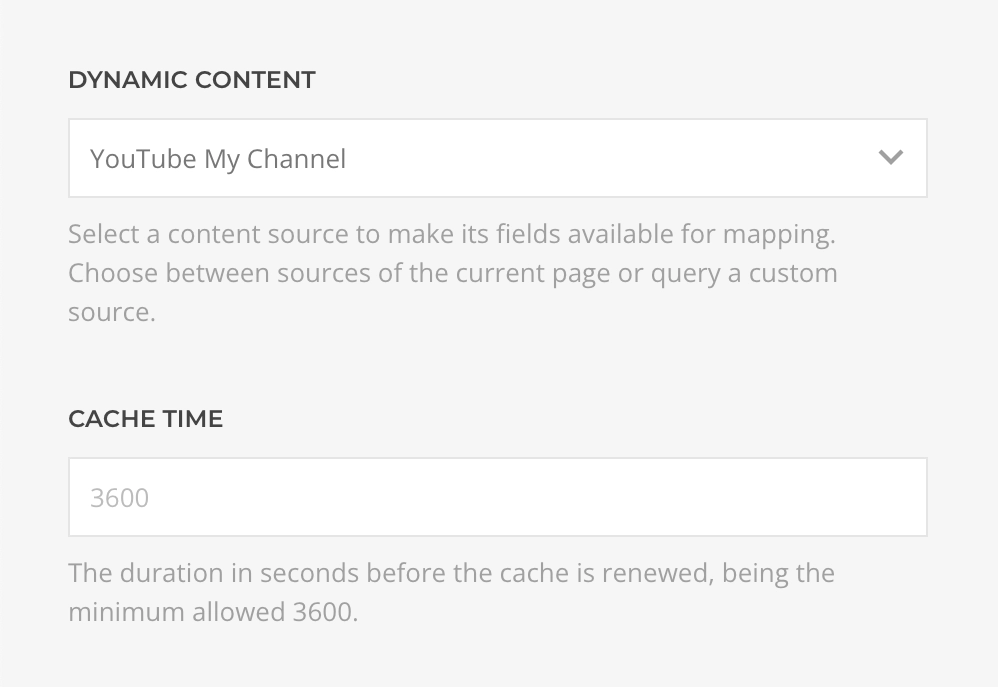

| Setting | Description | Default |
| --- | --- | --- |
| *Cache* | The duration in seconds before the cache is invalidated and the query re-executed. | `3600` |

## My Channel Video Query

Fetches a single video from the channel resolving to a [Video Type](#video-type).

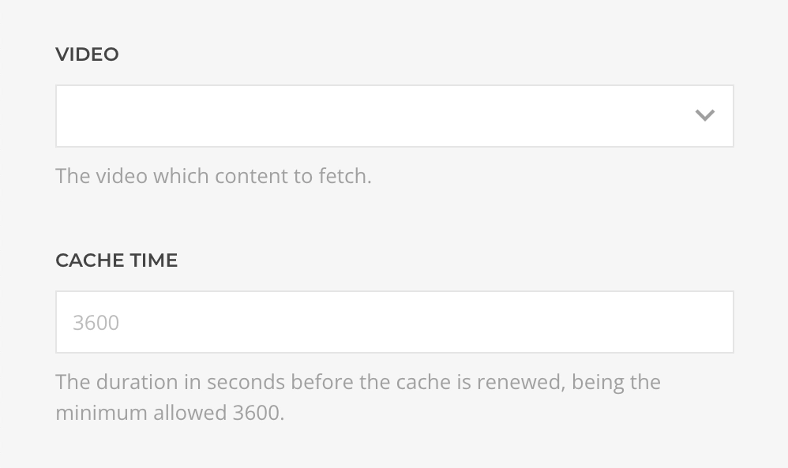

| Setting | Description | Default | Dynamic |
| --- | --- | --- | :---: |
| *Video* | The playlist video which content to fetch. | | &#x2713; |
| *Cache* | The duration in seconds before the cache is invalidated and the query re-executed. | `3600` |

## My Channel Videos Query

Fetches videos from the channel resolving to a list of [Video Type](#video-type).

| Setting | Description | Default | Dynamic |
| --- | --- | --- | :---: |
| *Start* | The starting position to retrieve the videos at. | `1` | &#x2713; |
| *Quantity* | The maximum amount of videos to fetch. | `20` | &#x2713; |
| *Cache* | The duration in seconds before the cache is invalidated and the query re-executed. | `3600` |

## My Channel Playlist Query

Fetches a single playlist from the channel resolving to a [Playlist Type](#playlist-type).

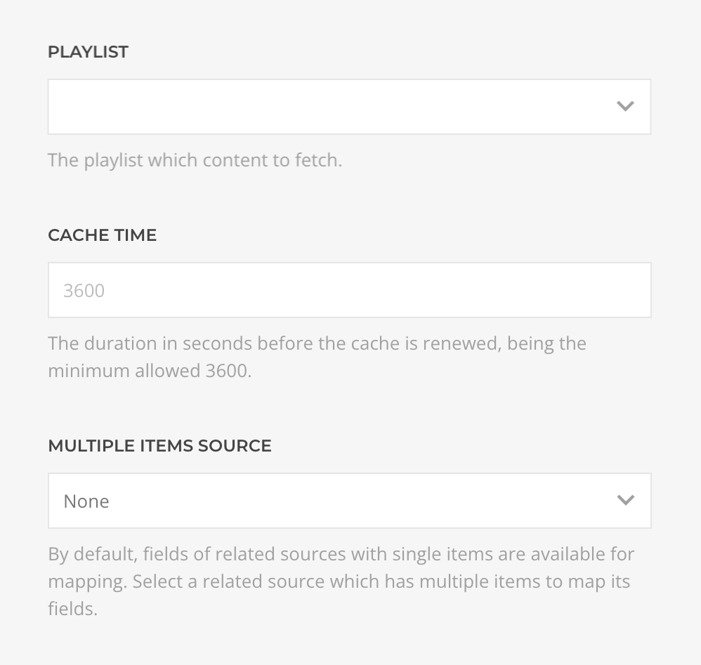

| Setting | Description | Default | Dynamic |
| --- | --- | --- | :---: |
| *Playlist* | The YouTube Playlist which content to fetch. | | &#x2713; |
| *Cache* | The duration in seconds before the cache is invalidated and the query re-executed. | `3600` |
| *Multi Items* | The related multi-items content to query instead with _Videos_ as the only option. |

## My Channel Playlist Videos Query

Fetches videos from the playlist resolving to a list of [Video Type](#video-type).

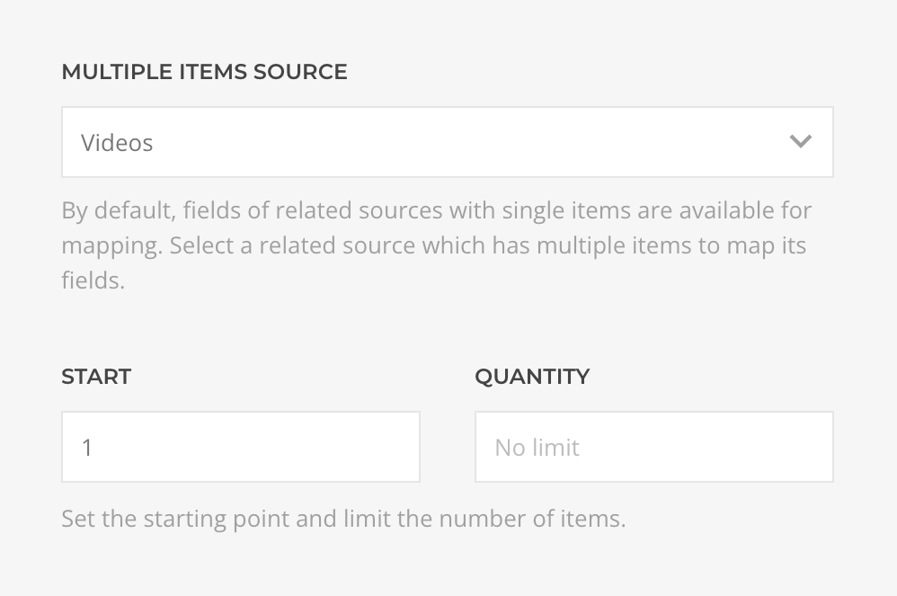

| Setting | Description | Default | Dynamic |
| --- | --- | --- | :---: |
| *Start* | The starting position to retrieve the videos at. | `1` | &#x2713; |
| *Quantity* | The maximum amount of videos to fetch. | `20` | &#x2713; |

## My Playlist Video Query

Fetches a single video from the playlist resolving to a [Video Type](#video-type).

| Setting | Description | Default | Dynamic |
| --- | --- | --- | :---: |
| *Video* | The playlist video which content to fetch. | | &#x2713; |
| *Cache* | The duration in seconds before the cache is invalidated and the query re-executed. | `3600` |

## My Playlist Videos Query

Fetches videos from the playlist resolving to a list of [Video Type](#video-type).

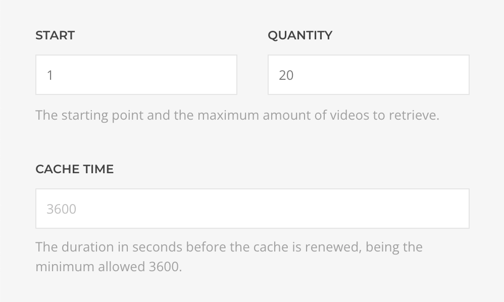

| Setting | Description | Default | Dynamic |
| --- | --- | --- | :---: |
| *Start* | The starting position to retrieve the videos at. | `1` | &#x2713; |
| *Quantity* | The maximum amount of videos to fetch. | `20` | &#x2713; |
| *Cache* | The duration in seconds before the cache is invalidated and the query re-executed. | `3600` |

## Video Type

Defines the mapping options of a YouTube Video object.

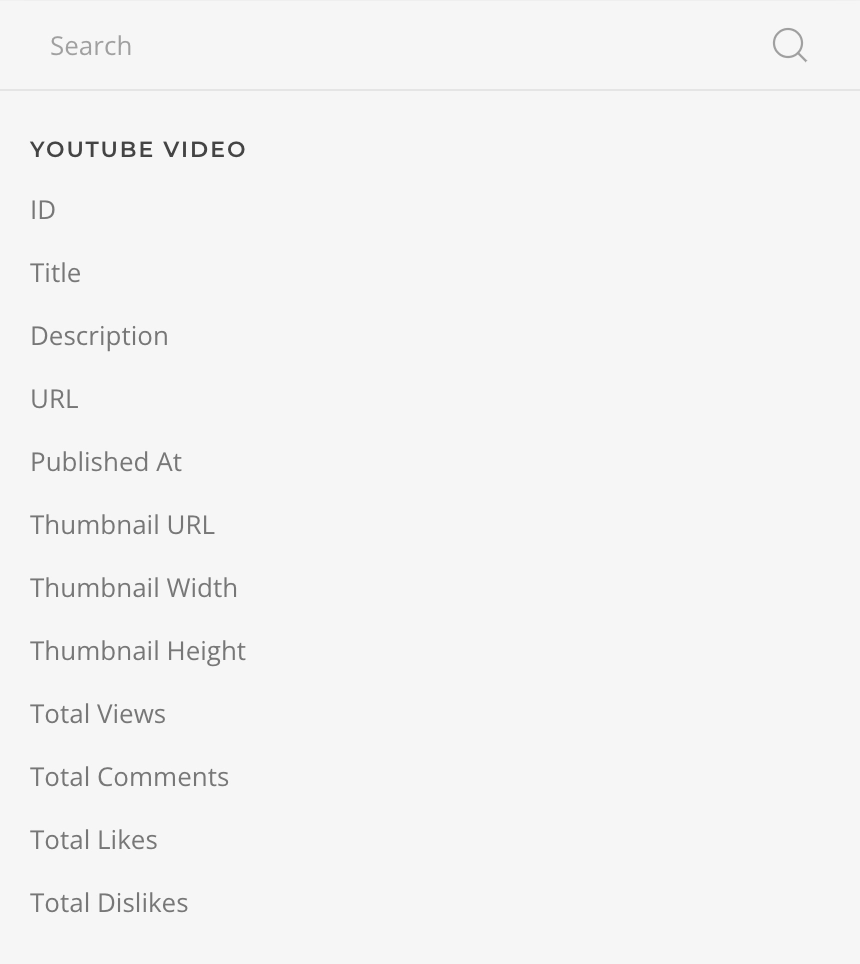

| Option | Description | Type | Filters |
| --- | --- | --- | --- |
| *ID* | The unique identifier of this video. | *String* |
| *Title* | The title of this video. | *String* | *Limit* |
| *Description* | The description of this video. | *String* | *Limit* |
| *URL* | The YouTube public URL, e.g. `www.youtube.com/watch?v=c2pz2mlSfXA`. | *String* |
| *Iframe Player* | Generates an HTML embed video player with several configuration settings. | *String* |
| *Published At* | The date this video was published. | *String* | *Date* |
| *Thumbnail URL* | The URL to this video thumbnail with different size options, _Low_, _Medium_ (default), _High Resolution_, _Standard_, and `Max Resolution* | *String* |
| *Thumbnail Width* | The width of this video thumbnail with same size options as for URL. | *String* |
| *Thumbnail Height* | The height of this video thumbnail with same size options as for URL. | *String* |
| *Total Views* | Number of times this video has been viewed. | *Int* |
| *Total Comments* | Number of comments for this video. | *Int* |
| *Total Likes* | Number of users that have indicated they like this video. | *Int* |
| *Total Dislikes* | Number of users that have indicated they dislike this video. | *Int* |

## Channel Type

Defines the mapping options of a YouTube Channel object.

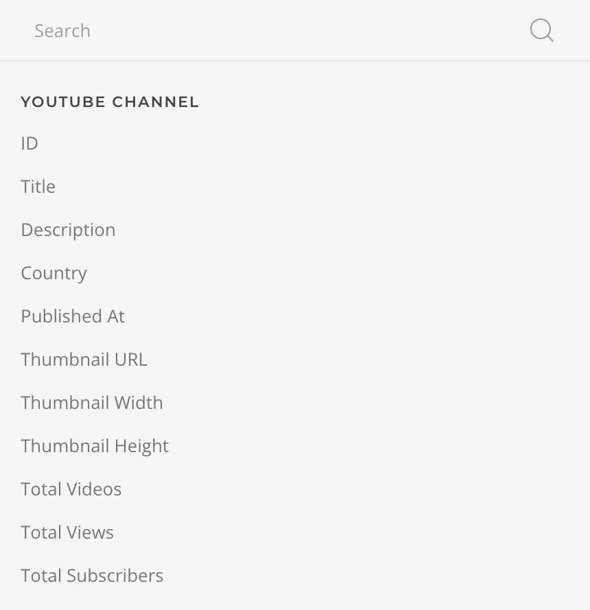

| Option | Description | Type | Filters |
| --- | --- | --- | --- |
| *ID* | The unique identifier of this channel. | *String* |
| *Title* | The title of this channel. | *String* | *Limit* |
| *Description* | The description of this channel. | *String* | *Limit* |
| *Country* | The country with which this channel is associated. | *String* |
| *Published At* | The date this channel was published. | *String* | *Date* |
| *Thumbnail URL* | The URL to this channel thumbnail with different size options, _Low_, _Medium_ (default), _High Resolution_, _Standard_, and _Max Resolution_ | *String* |
| *Thumbnail Width* | The width of this channel thumbnail with same size options as for URL. | *String* |
| *Thumbnail Height* | The height of this channel thumbnail with same size options as for URL. | *String* |
| *Total Views* | Number of times this channel has been viewed. | *Int* |
| *Total Videos* | Number of public videos uploaded to this channel. | *Int* |
| *Total Subscribers* | Number of subscribers this channel has, the value is rounded down to three significant figures. | *Int* |

## Playlist Type

Defines the mapping options of a YouTube Playlist object.

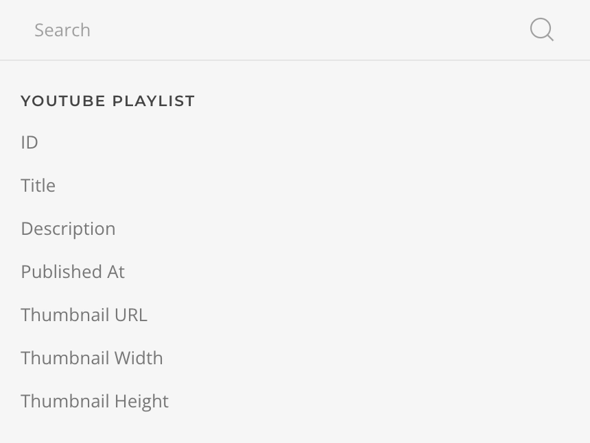

| Option | Description | Type | Filters |
| --- | --- | --- | --- |
| *ID* | The unique identifier of this playlist. | *String* |
| *Title* | The title of this playlist. | *String* | *Limit* |
| *Description* | The description of this playlist. | *String* | *Limit* |
| *Iframe Player* | Generates an HTML embed playlist player with several configuration settings. | *String* |
| *Published At* | The date this playlist was published. | *String* | *Date* |
| *Thumbnail URL* | The URL to this playlist thumbnail with different size options, _Low_, _Medium_ (default), _High Resolution_, _Standard_, and _Max Resolution_ | *String* |
| *Thumbnail Width* | The width of this playlist thumbnail with same size options as for URL. | *String* |
| *Thumbnail Height* | The height of this playlist thumbnail with same size options as for URL. | *String* |
