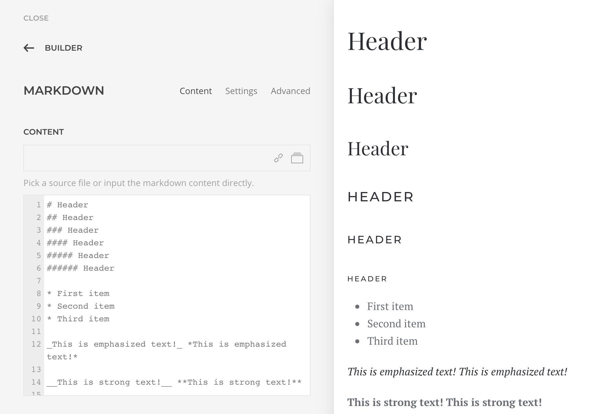

# Elements

Essentials Addons for YOOtheme Pro adds a collection of elements of it own, available under the group `ZOOlanders`. Their integration with the Builder is as native, using the YOOtheme Pro [elements settings](https://yootheme.com/support/yootheme-pro/joomla/element-settings) and other conventions.

## Chart

Based on [Chart.js](https://www.chartjs.org/) this element will make your data fun to set and fun to watch.

## Social Sharing

This element will make your content sharable on Twitter, Facebook, WhatsApp, or a custom preset network.

## Markdown

This element will parse the selected markdown file and cache it HTML version for fast and easy content rendering.

