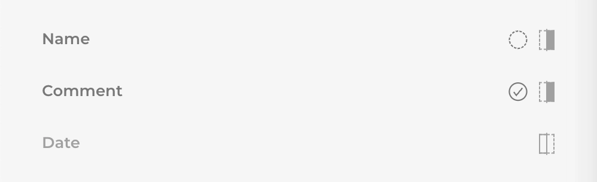
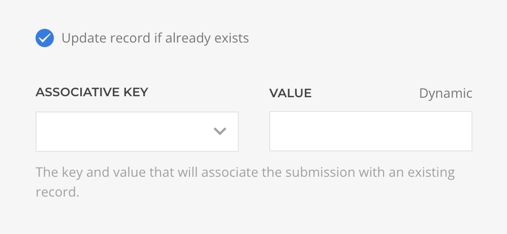

# Actions

After Submit Actions, or simply actions, are [multi-instance](#multi-instance) functions that will run sequentially, after a form has been successfully submitted, as long as the chain is not disrupted by an error. These are crucial for the form workflow, as submission data is not processed or logged unless there is an action set for the task.

Actions are configured in the [Form Area Configuration](./form-area#configuration) and tipically involves sending an email or saving the submission data to the database. For a full overview of available actions and their capabilities, consult the [actions reference](./actions/) section.

## Multi-Instance

In computing, "multi-instance" refers to the ability to have multiple identical instances running in parallel or in sequence to each other. In the context of actions, a multi-instance action setup means that it is possible to set up multiple actions of the same type, each with its own configuration and content.

## Conditional Execution

Actions can be manually disabled by setting their status to `disabled`, or dynamically by composing an Execution Condition in the Advanced Tab. The condition supports Dynamic Content, including [submission data](./dynamic-workflow#submission-data-source), which enables advanced workflows, e.g. subscribing to a newsletter only if it has been indicated in the form submission.

## Data Action

The **Data Action** adds or alters the submission data allowing a wide range of use cases.

- Duplicate a submitted date with a custom format for consequent actions use.
- Add context information to the Submission, e.g. the `Request -> Timestamp` (current date & time) or IP.
- Add sensitive data without the need to expose it in a hidden input.

::: warning Order is important
Notice that this action must be executed before any other action that might rely on it altered data.
:::

### Settings

| Setting | Description | Placeholder | Dynamic | Required |
| --- | --- | :---: | :---: | :---: |
| *Data* | The list of data entries to add to the submission. | | | &#x2713; |
| *Data.Name* | The name or key for the data entry, if data already exists it value will be overwritten. | | | &#x2713; |
| *Data.Value* | The value for the data entry. |  &#x2713; | &#x2713; | &#x2713; |
<!--@include: ./_shared/action-common-settings-->

## Email Action

The **Email Action** sends preset emails with support for [Dynamic Workflow](./dynamic-workflow) and [Attachments](#attachments). Use it to send a _Thank You_ email to the submitter, a transactional email to the site owner, etc.

### Settings

| Setting | Description | Placeholder | Dynamic | Required |
| --- | --- | :---: | :---: | :---: |
| *Body* | The main content of the email. |  &#x2713; | &#x2713; | &#x2713; |
| *Subject* | The subject of the email. |  &#x2713; | &#x2713; | &#x2713; |
| *Recipients* | The list of addresses to which the email will be sent, separated by a comma. |  &#x2713; | &#x2713; | &#x2713; |
| *From Name/Email* | The name and email address of the email sender, defaults to the site configuration one. |  &#x2713; | &#x2713; |
| *Reply To* | The list of addresses to which the recipient will be replying, separated by a comma. |  &#x2713; | &#x2713; |
| *CCs* | The list of addresses to which the email will be sent as a Carbon Copy, separated by a comma. |  &#x2713; | &#x2713; |
| *BCCs* | The list of addresses to which the email will be sent as a Blind Carbon Copy, separated by a comma. |  &#x2713; | &#x2713; |
| *Send as HTML* | Should the email content be sent as HTML instead of plain text. |
<!--@include: ./_shared/action-common-settings-->

### Content

The main content of the email is set in the Body setting where [Dynamic Workflow](./dynamic-workflow) can be used to compose a template.

### Attachments

Attachments can be set as **static** file from the local server or as a **dynamic** file submitted by the user. Each dynamic entry is a reference to a Form Area [Upload Field](./field-elements#upload-element).

::: warning Submitted Attachments
When a file is submitted by the user, the [Data Placeholder](./dynamic-workflow#data-placeholders) of the uploaded file holds just the name of the file, if you would like to send that file within the email must be set as a Dynamic Attachment instead.
:::

## Message Action

The **Message Action** displays a custom message in a modal. Use it to show the submitter a _Thank You_ message or additional information.

### Settings

| Setting | Description | Placeholder | Dynamic | Required |
| --- | --- | :---: | :---: | :---: |
| *Message* | The content to display in the modal. |  &#x2713; | &#x2713; | &#x2713; |
<!--@include: ./_shared/action-common-settings-->

## Download Action

The **Download Action** triggers a download of a specified file. Use it to provide the submitter with an asset only after a validated submission.

### Settings

| Setting | Description | Placeholder | Dynamic | Required |
| --- | --- | :---: | :---: | :---: |
| *File* | The path to the file which download to trigger. |  &#x2713; | &#x2713; | &#x2713; |
<!--@include: ./_shared/action-common-settings-->

## Redirect Action

The **Redirect Action** redirects the browser to a specified URL, with an optional message that will be displayed using the Joomla or WordPress core message display system.

### Settings

| Setting | Description | Placeholder | Dynamic | Required |
| --- | --- | :---: | :---: | :---: |
| *Redirect To* | The URL where to redirect the browser to. |  &#x2713; | &#x2713; | &#x2713; |
| *New Window* | Should the redirection happen in a new window instead. |
| *Timeout* | The seconds to wait before triggering the redirect. |
<!--@include: ./_shared/action-common-settings-->

## Validate Action

The **Validate Action** validates the submitted data with custom condition rules, if the validation fails no further actions will be executed.

### Settings

| Setting | Description | Placeholder | Dynamic | Required |
| --- | --- | :---: | :---: | :---: |
| *Validate* | The list of data entries to add to the submission. | | | &#x2713; |
| *Validate.Name* | The name or key for the data entry, if data already exists it value will be overwritten. | | | &#x2713; |
| *Validate.Value* | The value for the data entry. |  &#x2713; | &#x2713; | &#x2713; |
<!--@include: ./_shared/action-common-settings-->

## Save to CSV Action

The **SaveToCSV Action** saves each submission data as a new record in the specified local CSV or TSV file. Use it to store data or log submissions.

::: tip Pre-formatted CSV File
To use the SaveToCSV action, you must provide a pre-existing and pre-formatted CSV file. The action won't create or format the file by itself. The CSV file can be as basic as a list of column headers separated by commas set in the very first line, as for example `Name,Comment,Date`.
:::

### Settings

| Setting | Description | Required |
| --- | --- | :---: |
| *File* | The path to the pre-existing and pre-formatted file where the data will be appended. | &#x2713; |
| *Delimeter* | The character used to separate columns data, defaults to a comma (`,`). |
| *Enclosure* | The character used to enclose columns data, defaults to a double-quote (`"`). |
<!--@include: ./_shared/action-common-settings-->

### Content Mapping

Once a CSV file has been chosen, a list of fields will be loaded for each column of the file. By default, the columns are disabled, and no content is saved, resulting in a blank row being appended. Therefore, it is essential to enable all columns that should contain data and set a static or dynamic value in their configuration panel.

The first icon from the right toggles the column configuration as `enabled` or `disabled`. A disabled column will be greyed out and it content will result in an empty string.

The second icon from the right indicates wheter the column has a content set or is empty.

## Save To Database Action

The **Save To Database Action** stores each submission data as a new record in a local or external Database Table. Use it to store data or log submissions.

### Settings

| Setting | Description | Required |
| --- | --- | :---: |
| *Database* | The name of the database to which to connect. | &#x2713; |
| *Table* | The name of the database Table to which to connect. | &#x2713; |
| *Content* | The mapping configuration of the submission data to the table columns. | &#x2713; |
| *Custom Connection* | Should the connection be manually inputed instead of inherited from the system. |
<!--@include: ./_shared/action-common-settings-->
### Connection

The connection to the Database is by default system inherited with the possibility for manual override.

| Setting | Description |
| --- | --- |
| *Host* | The server host IP or address to which to connect, e.g. `127.0.0.1`. |
| *Port* | The port to use for the connection, e.g. `3306`. |
| *Username / Password* | The username & password which to use for the connection. |

### Update Record

When the Update Record setting is enabled the Submission Data will override an existing table record which will be determined by the association configuration. If no associated record is found, a new record will be appended instead.

| Setting | Description | Dynamic | Required |
| --- | --- | :---: | :---: |
| *Update Record* | Should a record be updated instead of appended. |
| *Associative Key* | The table column key that will be used to associate the record. | | &#x2713; |
| *Associative Value* | The table column value that will be used to associate the record. | &#x2713; | &#x2713; |

An example to understand the association is to think of a `Users Table` with an `ID` column as its primary key. In such a scenario, the submission data should contain the `user_id` value representing the user row being updated, the _Associative Key_ should be set as `ID`, and the _Associative Value_ mapped to the Form Submission `user_id`.

### Content Mapping

Once the table has been chosen, its columns will appear in the Content field ready to be mapped, being the column configuration pre-established by the table schema. The mapping will determine what value will be saved at what column of the record that is being saved or updated.

Not all columns require a value, in fact, mapping is disabled by default and must be enabled for each column independently. Once enabled, the value can be inputted manually or dynamically with the use of the [Dynamic Workflow](./dynamic-workflow).

## Save To Google Sheet

The **Save To Google Sheet Action** stores each submission data as a new record in the specified Google Drive Spreadsheet. Use it to store data or log submissions.

### Settings

| Setting | Description | Required |
| --- | --- | :---: |
| *Account* | The Google account used to connect to Google Drive via OAuth. | &#x2713; |
| *Spreadsheet* | The Google Drive Spreadsheet to which to connect. | &#x2713; |
| *Sheet* | The Spreadsheet Sheet to use as the data destination, defaults to the first sheet. |
| *Value Input Option* | Defines how the data will be interpreted when saved to the spreadsheet. `Raw`, the values will be stored as-is, or `User Entered`, the values will be parsed as if were typed into the UI. |
<!--@include: ./_shared/action-common-settings-->

### Content Mapping

Once the spreadsheet has been chosen, its columns will appear in the Content field ready to be mapped, being the column configuration pre-established by the sheet's first-row schema. The mapping will determine what value will be saved at what column of the record that is being saved or updated.

Not all columns require a value, in fact, mapping is disabled by default and must be enabled for each column independently. Once enabled the value can be inputted manually or dynamically with the use of the [Dynamic Workflow](./dynamic-workflow).

## Airtable Action

### Create or Update Record

| Setting | Description | Required |
| --- | --- | :---: |
| *Authentication* | The Airtable authentication credentials. | &#x2713; |
| *Base* | The Airtable base which to connect to. | &#x2713; |
| *Table* | The Airtable table which to connect to. | &#x2713; |
| *Record* | The Airtable record ID which to update. If left empty, a new record will be created instead. |
| *Fields* | Data mapping for the record fields. | &#x2713; |
| *Type Cast* | When enabled, Airtable API will perform best-effort for automatic data conversion. E.g. from a string to integer. |
| *Replace* | When enabled, Airtable API will replace the entire record instead of patch it. |
<!--@include: ./_shared/action-common-settings-->

### Delete Record

| Setting | Description | Required |
| --- | --- | :---: |
| *Authentication* | The Airtable authentication credentials. | &#x2713; |
| *Base* | The Airtable base which to connect to. | &#x2713; |
| *Table* | The Airtable table which to connect to. | &#x2713; |
| *Record* | The Airtable record ID which to delete. | &#x2713; |
