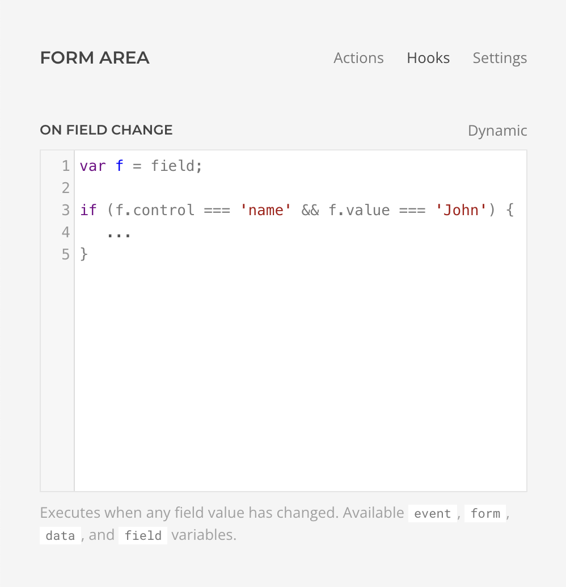

# Conditional Logic

Conditional logic is a powerful tool that allows you to create dynamic and responsive forms. It works by setting up rules that control which fields or sections are displayed to the user based on their previous answers.

## Show and Hide Fields

Essentials Form Builder doesn't have built-in functionality to hide or show fields based on the form's current state. However, it provides a [Form Area](form-area#hooks) setting that allows you to hook into the change event and implement this and many other behaviors.



For example, you could show a hidden fieldset when a select field has a specific value selected, or hide it otherwise.

```js
// on field-change hook set in the form area settings
if (field.name === 'select') {
  if (field.value === 'foo') {
    UIkit.util.removeClass(field, 'uk-hidden');
  } else {
    UIkit.util.addClass(field, 'uk-hidden');
  }
}
```

## Execute Actions Conditionally

Each action includes an Execution Condition setting in its _Advanced Panel_. This setting allows you to define rules and evaluate whether the action should be executed based on the submitted form data and dynamic content. Utilize this feature to customize who receives responses, display different success messages depending on form selections, set conditional redirect destinations, and much more.
