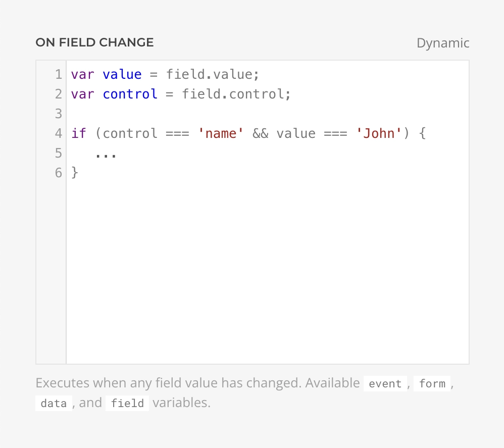

# Conditional Logic

Essentials Form Builder doesn't include native conditional logic functionality. However, it provides powerful [JavaScript Hooks](form-element#hooks) that allow you to implement conditional field visibility, dynamic validation, and other interactive behaviors based on form state changes.

## Implementation Approach

Conditional logic is implemented using the **On Field Change** hook in the Form Element settings. This hook executes whenever any field value changes, providing access to the changed field and the complete form data.



## Available Context

When using the On Field Change hook, you have access to the following variables:

| Variable | Type | Description |
|----------|------|-------------|
| `event` | Object | The change event object |
| `form` | Element | The form DOM element |
| `field` | Object | Contains `name` and `value` of the changed field |
| `data` | Object | Contains all current form data |

## Basic Example: Show/Hide Fields

The most common use case is showing or hiding fields based on another field's value. Here's how to toggle a fieldset's visibility:

```js
// Target the element to show/hide (use its ID or class)
var conditionalFieldset = UIkit.util.$('#additional-info', form);

// Check if the trigger field changed
if (field.name === 'contact-preference') {
    // Show fieldset when specific value is selected
    if (field.value === 'email') {
        UIkit.util.removeClass(conditionalFieldset, 'uk-hidden');
    } else {
        UIkit.util.addClass(conditionalFieldset, 'uk-hidden');
    }
}
```

::: warning Element Identification
Ensure your target elements have unique IDs or classes set in their settings. The selector must be specific enough to target the correct element within the form context.
:::

## Multiple Conditions

Handle multiple field dependencies with additional condition checks:

```js
var emailFields = UIkit.util.$('#email-fields', form);
var phoneFields = UIkit.util.$('#phone-fields', form);

if (field.name === 'contact-method') {
    // Hide all conditional sections first
    UIkit.util.addClass(emailFields, 'uk-hidden');
    UIkit.util.addClass(phoneFields, 'uk-hidden');

    // Show only the relevant section
    if (field.value === 'email') {
        UIkit.util.removeClass(emailFields, 'uk-hidden');
    } else if (field.value === 'phone') {
        UIkit.util.removeClass(phoneFields, 'uk-hidden');
    }
}
```

## Dependent Field Logic

Create cascading dependencies where one field's visibility depends on multiple conditions:

```js
var companyFields = UIkit.util.$('#company-details', form);
var vatField = UIkit.util.$('#vat-number', form);

// Show company fields when business account is selected
if (field.name === 'account-type') {
    if (field.value === 'business') {
        UIkit.util.removeClass(companyFields, 'uk-hidden');
    } else {
        UIkit.util.addClass(companyFields, 'uk-hidden');
        UIkit.util.addClass(vatField, 'uk-hidden');
    }
}

// Show VAT field only when EU country is selected (and business account is active)
if (field.name === 'country' && data['account-type'] === 'business') {
    var euCountries = ['DE', 'FR', 'IT', 'ES', 'NL', 'BE'];

    if (euCountries.includes(field.value)) {
        UIkit.util.removeClass(vatField, 'uk-hidden');
    } else {
        UIkit.util.addClass(vatField, 'uk-hidden');
    }
}
```

## Dynamic Field Requirements

Change field validation requirements based on conditions by manipulating the `required` attribute:

```js
var phoneField = UIkit.util.$('input[name="phone"]', form);

if (field.name === 'contact-method') {
    if (field.value === 'phone') {
        phoneField.setAttribute('required', 'required');
    } else {
        phoneField.removeAttribute('required');
    }
}
```

## Checkbox and Radio Button Logic

Handle multiple selections with checkboxes or radio buttons:

```js
var shippingAddress = UIkit.util.$('#shipping-address', form);

if (field.name === 'different-shipping') {
    // Checkbox fields return "1" when checked, empty string when unchecked
    if (field.value === '1') {
        UIkit.util.removeClass(shippingAddress, 'uk-hidden');
    } else {
        UIkit.util.addClass(shippingAddress, 'uk-hidden');
    }
}
```

## Best Practices

1. **Initialize Hidden State**: Set initial visibility using the `uk-hidden` class in your element's settings or CSS
2. **Use Specific Selectors**: Always use IDs or unique classes to avoid targeting wrong elements
3. **Consider Form Data**: Use the `data` object to check multiple field values for complex conditions
4. **Clear Conditional Fields**: Consider clearing values of hidden fields to prevent submitting stale data
5. **Test Edge Cases**: Verify behavior when users change values multiple times
6. **Performance**: For complex forms with many conditions, consider debouncing or optimizing your logic

::: tip Alternative Approach
For more complex scenarios or global form event handling, consider using [Form Events](./form-events) to set up listeners in a custom script instead of inline hooks.
:::
